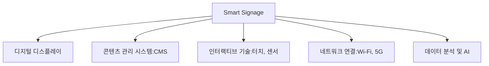
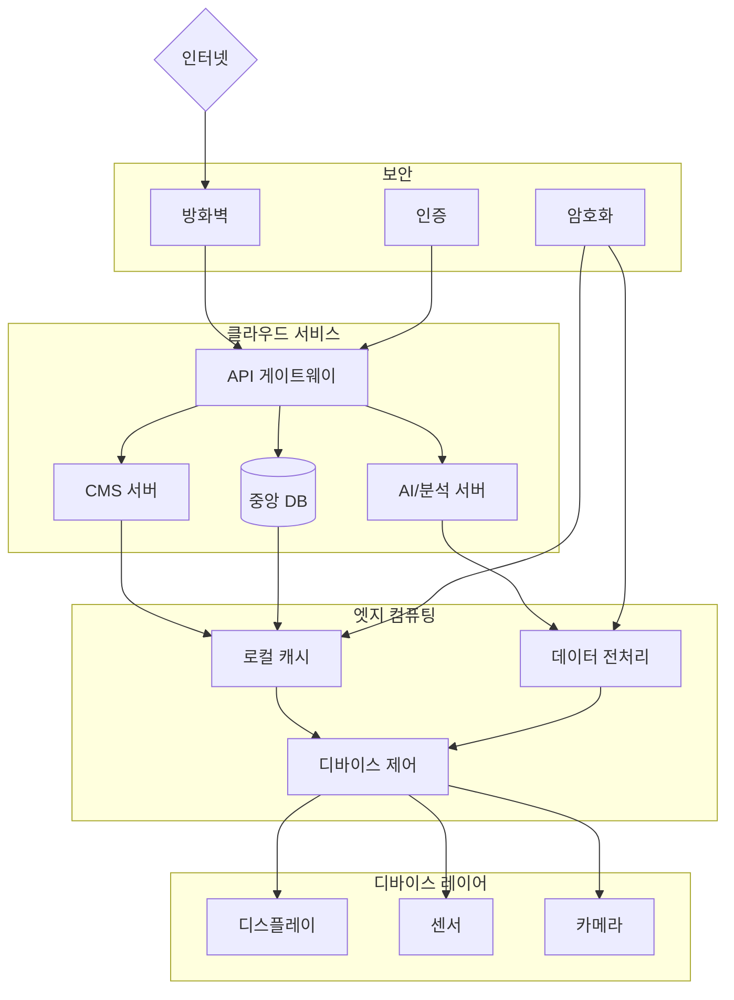

# 스마트 사이니지 (Smart Signage): 디지털 시대의 혁신적인 광고 및 정보 전달 시스템

<!-- mtoc-start -->

- [정의 및 개념](#정의-및-개념)
- [주요 특징](#주요-특징)
- [스마트 사이니지 구성 요소](#스마트-사이니지-구성-요소)
- [스마트 사이니지 Network Architecture](#스마트-사이니지-network-architecture)
- [활용 사례](#활용-사례)
- [기대 효과 및 필요성](#기대-효과-및-필요성)
- [마무리](#마무리)
- [Keywords](#keywords)

<!-- mtoc-end -->

디지털 기술의 발전과 함께 전통적인 광고 및 정보 전달 방식이 변화하고 있다. 스마트 사이니지(Smart Signage)는 디지털 디스플레이와 네트워크 기술을 결합하여 실시간으로 콘텐츠를 제공하고 사용자와 상호작용하는 첨단 솔루션이다. 광고, 공공 안내, 매장 내 정보 제공 등 다양한 용도로 활용되며, 고객 경험을 향상시키고 브랜드의 가치를 극대화하는 데 기여한다.

## 정의 및 개념

스마트 사이니지(Smart Signage)는 네트워크에 연결된 디지털 디스플레이 시스템으로, 광고 및 정보를 실시간으로 제공하고 사용자와 상호작용할 수 있는 디지털 솔루션.

- **특징**: 실시간 콘텐츠 업데이트, 네트워크 연결, 사용자 맞춤형 정보 제공
- **목적**: 효과적인 정보 전달, 브랜드 인지도 향상, 사용자 경험 개선
- **필요성**: 기존 인쇄 광고 및 정적 디스플레이의 한계를 극복하고, 동적인 콘텐츠 제공을 통한 효과 극대화

## 주요 특징

1. **실시간 콘텐츠 업데이트**: 클라우드 기반 관리 시스템을 통해 원격으로 콘텐츠 변경 가능
2. **인터랙티브 기능 지원**: 터치스크린, 센서, QR 코드 등을 활용하여 사용자와 상호작용 가능
3. **AI 및 데이터 분석 적용**: 사용자 행동 패턴을 분석하여 맞춤형 콘텐츠 제공
4. **네트워크 연결성 강화**: Wi-Fi, 5G, IoT와 연계하여 다양한 환경에서 활용 가능
5. **멀티채널 마케팅 지원**: 모바일, 소셜 미디어, 웹과 연동하여 통합된 광고 전략 운영

## 스마트 사이니지 구성 요소

스마트 사이니지는 다양한 하드웨어 및 소프트웨어 요소가 결합되어 실시간 데이터 기반으로 최적의 정보를 제공한다.

## 스마트 사이니지 Network Architecture

- 클라우드: CMS, DB, AI, API 게이트웨이
- 엣지: 캐시, 데이터 처리, 디바이스 제어
- 디바이스: 디스플레이, 센서, 카메라
- 보안: 방화벽, 인증, 암호화

## 활용 사례

6. **리테일(소매업) 마케팅**: 매장 내 디지털 광고판을 활용한 고객 맞춤형 프로모션 제공
7. **스마트 시티 인프라**: 공공 교통 시스템 및 도시 내 디지털 안내판으로 실시간 정보 제공
8. **병원 및 의료 시설**: 대기실 및 진료실에서 환자 정보를 안내하고 의료 콘텐츠 제공
9. **교육 기관 및 기업**: 강의실, 회의실에서 교육 및 협업을 위한 디지털 보드 활용
10. **호텔 및 관광 산업**: 호텔 로비 및 관광 명소에서 방문객에게 맞춤형 정보 제공

## 기대 효과 및 필요성

- **효율적인 정보 전달**: 실시간 업데이트를 통해 필요한 정보를 즉시 제공 가능
- **고객 경험 개선**: 맞춤형 콘텐츠 제공으로 사용자의 만족도 향상
- **운영 비용 절감**: 전통적 인쇄 광고 대비 유지보수 비용 절감 및 친환경적 운영 가능
- **마케팅 효과 극대화**: 다채널 연계를 통한 광고 효과 상승
- **보안 및 데이터 관리 강화**: 클라우드 기반 관리 시스템을 통한 안전한 운영 환경 조성

## 마무리

스마트 사이니지는 디지털 트랜스포메이션 시대에 필수적인 솔루션으로 자리 잡고 있다. 광고, 정보 제공, 고객 경험 향상 등 다양한 분야에서 활용되며, 네트워크 및 AI 기술과 결합하여 더욱 발전하고 있다. 기업과 기관은 스마트 사이니지를 도입하여 효율성을 높이고 차별화된 서비스를 제공할 수 있다.

## Keywords

Smart Signage, 디지털 사이니지, 인터랙티브 디스플레이, 광고 기술, 실시간 콘텐츠 관리, AI 기반 디지털 광고, 스마트 시티, 고객 경험 향상, 네트워크 연결, 클라우드 기반 디스플레이