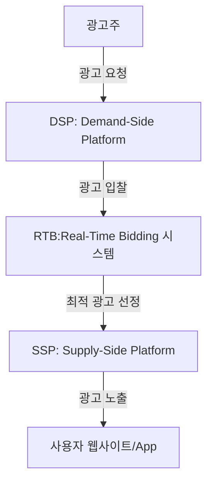

# 프로그래매틱 바잉 (Programmatic Buying): 자동화된 디지털 광고 거래

<!-- mtoc-start -->

- [정의 및 개념](#정의-및-개념)
- [주요 특징](#주요-특징)
- [프로그래매틱 바잉의 작동 방식](#프로그래매틱-바잉의-작동-방식)
- [활용 사례](#활용-사례)
- [기대 효과 및 필요성](#기대-효과-및-필요성)
- [마무리](#마무리)
- [Keywords](#keywords)

<!-- mtoc-end -->

디지털 광고 시장은 점점 더 자동화되고 있으며, 프로그래매틱 바잉(Programmatic Buying)은 그 핵심 기술 중 하나로 자리 잡고 있다. 이는 인공지능(AI)과 빅데이터를 활용하여 실시간으로 광고를 구매하고 최적화하는 방식으로, 광고 효율성과 정확성을 극대화한다. 프로그래매틱 바잉의 개념, 특징, 작동 방식 및 활용 사례를 살펴보고, 기대 효과를 분석한다.

## 정의 및 개념

프로그래매틱 바잉(Programmatic Buying)은 디지털 광고를 자동화된 플랫폼을 통해 실시간 경매(RTB, Real-Time Bidding) 방식으로 구매하는 프로세스. 알고리즘과 데이터 분석을 활용하여 적절한 광고를 최적의 타겟에게 노출한다.

- 특징: 자동화된 광고 거래, 실시간 입찰, 데이터 기반 최적화, 효율적인 광고 집행
- 목적: 광고 효율성 극대화, 비용 절감, 타겟팅 정밀도 향상
- 필요성: 급변하는 디지털 환경에서 광고 성과 극대화

## 주요 특징

1. **실시간 입찰(RTB, Real-Time Bidding)**
   - 광고 노출이 필요한 순간마다 실시간 경매를 통해 최적의 광고를 결정
2. **자동화된 광고 구매**
   - 사람이 아닌 알고리즘이 데이터를 기반으로 최적의 광고를 선택하고 구매
3. **정교한 타겟팅**
   - 사용자 행동, 관심사, 위치 정보 등을 분석하여 맞춤형 광고 제공
4. **비용 효율성 향상**
   - 광고 예산을 가장 효과적인 광고 슬롯에 자동 분배하여 ROI(투자 대비 수익) 극대화
5. **다양한 광고 지면 활용 가능**
   - 웹사이트, 앱, 동영상, 소셜 미디어 등 다양한 매체에서 광고 가능

## 프로그래매틱 바잉의 작동 방식

DSP(Demand-Side Platform)는 광고주가 광고를 구매하는 플랫폼이며, SSP(Supply-Side Platform)는 광고 지면을 제공하는 출판사가 이용하는 플랫폼이다. RTB 시스템을 통해 실시간으로 광고 경매가 이루어지며, 최적의 광고가 사용자에게 노출된다.

## 활용 사례

6. **이커머스 기업**: 사용자 행동 데이터를 기반으로 개인 맞춤형 광고 제공
7. **게임 앱 마케팅**: 특정 관심 그룹을 대상으로 효과적인 앱 설치 광고 진행
8. **미디어 및 출판사**: 광고 지면을 자동화된 방식으로 판매하여 수익 극대화
9. **B2B 마케팅**: 특정 업종 및 기업 타겟팅을 통한 고효율 광고 집행
10. **소셜 미디어 광고**: Facebook, Instagram 등에서 프로그래매틱 방식으로 광고 배포

## 기대 효과 및 필요성

- **광고 효율성 극대화**: 최적의 광고 지면을 자동 선택하여 광고 성과 향상
- **비용 절감**: 불필요한 광고 비용을 절감하고 ROI 개선
- **정확한 타겟팅**: 빅데이터 분석을 통한 고도화된 사용자 맞춤 광고 제공
- **실시간 최적화**: 광고 성과 분석을 기반으로 지속적인 개선 가능
- **광고 자동화**: 수작업 개입 없이 데이터 기반 광고 집행 가능

## 마무리

프로그래매틱 바잉은 디지털 광고 시장의 필수 요소로 자리 잡으며, 자동화와 데이터 기반 광고 최적화를 통해 높은 광고 성과를 실현할 수 있다. 기업들은 이 기술을 활용하여 광고 집행을 효율화하고, 최적의 마케팅 전략을 구축해야 한다. 데이터와 AI의 발전과 함께 프로그래매틱 바잉의 중요성은 더욱 커질 것이며, 이를 적극적으로 활용하는 것이 디지털 마케팅에서 경쟁력을 확보하는 핵심 요소가 될 것이다.

## Keywords

Programmatic Buying, Real-Time Bidding, 광고 자동화, DSP, SSP, 광고 최적화, 디지털 마케팅, 광고 효율성, 타겟팅, ROI 개선
