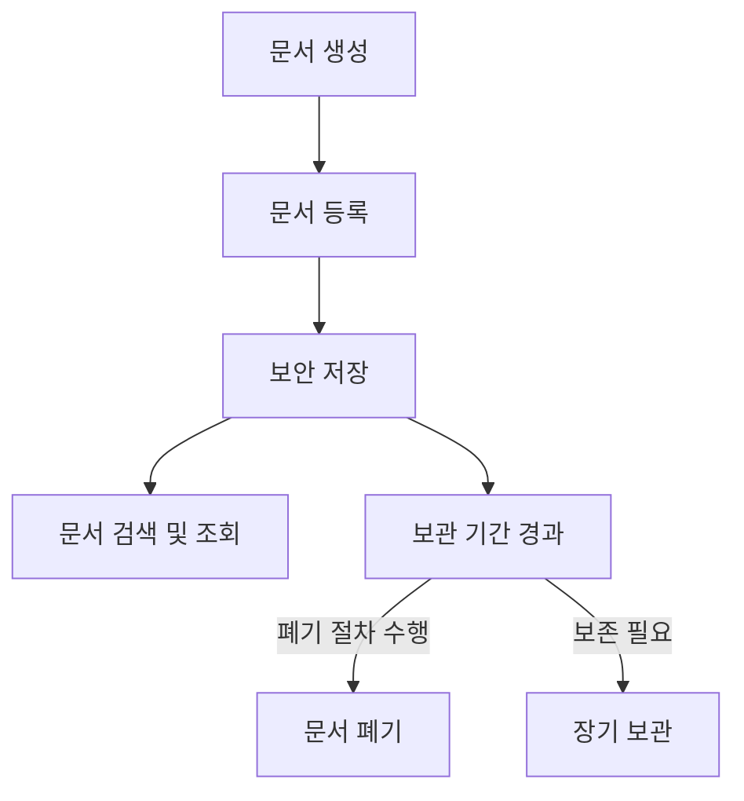

# 공인문서보관소: 안전한 문서 보관과 관리

<!-- mtoc-start -->

- [정의 및 개념](#정의-및-개념)
- [주요 특징](#주요-특징)
- [구성도](#구성도)
- [활용 사례](#활용-사례)
- [기대 효과 및 필요성](#기대-효과-및-필요성)
- [마무리](#마무리)
- [Keywords](#keywords)

<!-- mtoc-end -->

공인문서보관소는 정부 및 공공기관, 기업에서 생성된 주요 문서를 장기간 안전하게 보관하고 관리하는 시설이다. 문서의 보존성, 기밀성, 무결성을 유지하며, 필요 시 신속한 조회와 열람이 가능하도록 체계적인 관리가 이루어진다. 디지털화가 가속화되는 현대에서도 물리적 문서 및 전자문서의 안전한 보관은 필수적이며, 이에 대한 법적 규제와 기술적 관리 방법이 점점 더 중요해지고 있다.

## 정의 및 개념

공인문서보관소(Public Document Repository)는 정부, 공공기관 및 기업의 주요 문서를 안전하게 보관하고 관리하는 공식적인 장소.

- 목적: 문서의 장기 보존, 무결성 유지, 신속한 검색 및 활용 보장
- 특징: 보안성 강화, 장기 보존 가능, 법적 증거 자료로 활용 가능
- 법적 근거: 문서 보관 관련 법률 및 규정(예: 공공기록물 관리에 관한 법률, 전자문서 및 전자거래 기본법)

## 주요 특징

1. **문서 보존성 강화**

   - 환경 조절 시스템(온도, 습도 조절) 및 방재 시설 적용
   - 내화, 내습, 내구성이 강한 보관 시설 운영

2. **기밀성 및 보안성 유지**

   - 접근 통제 시스템 도입(출입권한 관리, 생체인증 등)
   - 전자문서 암호화 및 보안 프로토콜 적용

3. **디지털화 및 검색 기능 제공**

   - OCR(광학 문자 인식) 및 메타데이터 태깅을 통한 문서 검색 최적화
   - 클라우드 기반 전자문서 보관 및 백업 지원

4. **법적 증거로서의 신뢰성 확보**

   - 공인전자문서보관소를 통한 위변조 방지 기술 적용
   - 법적 분쟁 발생 시 증거 자료로 활용 가능

5. **보관 및 폐기 절차 표준화**
   - 문서의 보관 기간 설정 및 폐기 절차 엄격 관리
   - 정기적인 문서 검토 및 갱신 절차 수행

## 구성도

문서 생성 후 보안 저장이 이루어지며, 필요에 따라 검색 및 조회가 가능하다. 보관 기간이 경과하면 폐기 또는 장기 보관이 결정된다.

## 활용 사례

6. **정부 및 공공기관**

   - 행정 문서, 법률 문서, 정책 관련 문서 보관
   - 국가 기록물의 보존 및 활용

7. **금융 및 기업**

   - 금융거래 기록, 계약서, 고객 데이터 보호
   - 기업 내부 감사 및 법적 분쟁 대비

8. **병원 및 의료기관**

   - 환자 기록, 의료 보험 청구 내역 보관
   - 전자 건강 기록(EHR) 관리

9. **법률 및 법원 시스템**
   - 소송 관련 문서, 판결문 보관
   - 전자 증거 자료로 활용

## 기대 효과 및 필요성

- **안전한 문서 보관**: 기밀 유지 및 무결성 보장
- **효율적인 문서 관리**: 디지털화 및 검색 최적화로 신속한 정보 접근 가능
- **법적 증거 자료 확보**: 법적 분쟁 시 신뢰할 수 있는 문서 증빙 제공
- **비용 절감**: 문서 분실 방지 및 보관 비용 절감
- **규제 준수**: 법적 요구사항을 충족하여 기업 및 기관의 신뢰성 확보

## 마무리

공인문서보관소는 정부 기관, 기업, 의료 및 법률 부문 등 다양한 분야에서 필수적인 역할을 한다. 문서의 장기 보존, 보안성 유지, 신속한 검색 및 법적 증거로서의 활용을 위해 체계적인 관리가 요구된다. 디지털화와 보안 기술이 발전함에 따라 공인문서보관소의 역할은 더욱 확대될 것이며, 이를 통해 정보의 신뢰성과 효율적인 관리가 가능해질 것이다.

## Keywords

Public Document Repository, 공인문서보관소, 문서 보안, 전자문서 관리, 법적 증거 자료, 문서 디지털화, OCR 기술, 기록물 보존, 문서 검색, 문서 폐기 절차