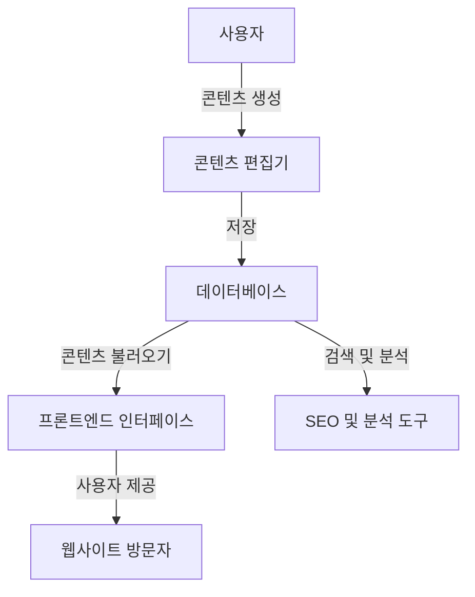

# CMS (Contents Management System): 효율적인 콘텐츠 관리

<!-- mtoc-start -->

- [정의 및 개념](#정의-및-개념)
- [주요 기능](#주요-기능)
- [CMS 아키텍처](#cms-아키텍처)
- [활용 사례](#활용-사례)
- [기대 효과 및 필요성](#기대-효과-및-필요성)
- [마무리](#마무리)
- [Keywords](#keywords)

<!-- mtoc-end -->

콘텐츠 관리 시스템(CMS, Contents Management System)은 디지털 콘텐츠를 효율적으로 생성, 관리 및 배포할 수 있도록 지원하는 소프트웨어이다. 기업, 미디어, 전자상거래 및 다양한 웹사이트에서 광범위하게 활용되며, 코드 작성 없이도 콘텐츠를 관리할 수 있는 사용자 친화적인 환경을 제공한다.

## 정의 및 개념

콘텐츠 관리 시스템(CMS)은 디지털 콘텐츠를 체계적으로 저장, 편집, 게시하는 플랫폼. 사용자는 프로그래밍 지식 없이도 콘텐츠를 손쉽게 관리할 수 있다.

- 특징: 콘텐츠 생성 및 관리 기능 제공, 사용자 접근 제어, 협업 지원, 확장 가능성
- 목적: 웹사이트 및 디지털 플랫폼의 운영 효율성 향상, 유지보수 비용 절감, 콘텐츠 일관성 유지
- 필요성: 비개발자도 콘텐츠 관리 가능, 빠른 업데이트 및 배포 지원, 다중 사용자 협업 가능

## 주요 기능

1. **콘텐츠 생성 및 편집**

   - WYSIWYG(What You See Is What You Get) 편집기 제공
   - 미디어 파일 업로드 및 관리 기능 포함

2. **템플릿 및 테마 지원**

   - 사전 제작된 디자인 템플릿 제공
   - 맞춤형 테마 및 UI 적용 가능

3. **사용자 및 권한 관리**

   - 관리자, 편집자, 작성자 등 역할별 접근 제어
   - 워크플로우 기반 승인 프로세스 지원

4. **확장성 및 플러그인 지원**

   - 모듈 및 플러그인으로 기능 확장 가능
   - API를 통한 외부 시스템 연동 지원

5. **SEO 및 분석 도구 연동**
   - 검색 엔진 최적화(SEO) 기능 제공
   - 방문자 트래픽 분석 및 리포트 생성

## CMS 아키텍처

CMS는 콘텐츠 생성, 저장, 배포, 분석을 지원하는 아키텍처로 구성된다. 사용자 입력이 편집기를 통해 저장되며, 프론트엔드를 통해 최종 사용자에게 제공된다.

## 활용 사례

- **기업 웹사이트**: 브랜드 사이트, 기업 블로그 운영
- **전자상거래**: 제품 카탈로그 및 쇼핑몰 콘텐츠 관리
- **미디어 및 뉴스 포털**: 뉴스 기사, 멀티미디어 콘텐츠 게시 및 업데이트
- **e러닝 플랫폼**: 교육 콘텐츠 저장 및 배포, 온라인 강의 운영
- **정부 및 공공 기관**: 공공 정보 제공, 정책 발표 및 자료 관리

## 기대 효과 및 필요성

- **운영 비용 절감**: 웹사이트 개발 및 유지보수 비용 절감
- **콘텐츠 일관성 유지**: 중앙 집중식 관리로 브랜드 아이덴티티 유지
- **생산성 향상**: 팀원 간 협업 가능, 빠른 콘텐츠 업데이트 지원
- **유연한 확장성**: 플러그인 및 API를 통한 기능 확장 가능
- **사용자 친화성**: 비개발자도 쉽게 콘텐츠 관리 가능

## 마무리

CMS는 디지털 콘텐츠의 효율적인 생성, 관리 및 배포를 지원하는 핵심 도구이다. 기업 및 개인이 온라인 콘텐츠를 효과적으로 운영하고 유지할 수 있도록 돕는 중요한 솔루션으로, 웹사이트 관리의 필수 요소로 자리 잡고 있다. 최적의 CMS를 선택하여 조직의 생산성과 운영 효율성을 극대화하는 것이 중요하다.

## Keywords

CMS, Contents Management System, 콘텐츠 관리 시스템, 디지털 콘텐츠, 웹사이트 관리, 전자상거래, SEO 최적화, 사용자 권한 관리, 플러그인 지원, 콘텐츠 편집기