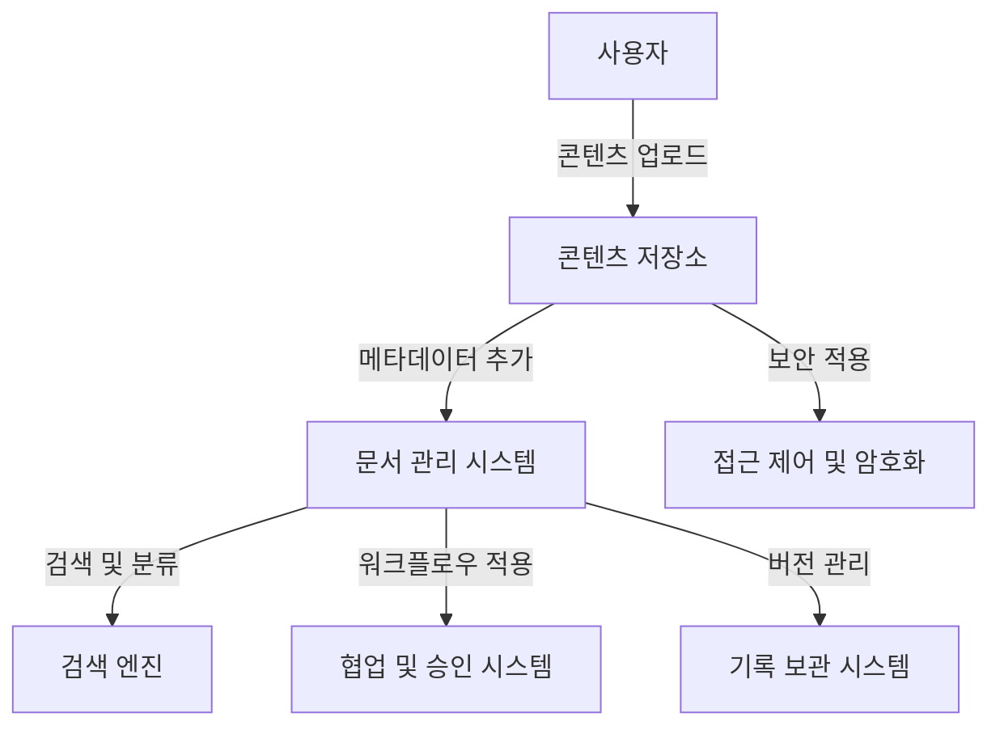

# ECM 1.0 (Enterprise Contents Management): 기업 콘텐츠의 체계적 관리

<!-- mtoc-start -->

- [정의 및 개념](#정의-및-개념)
- [주요 기능](#주요-기능)
- [ECM 1.0 아키텍처](#ecm-10-아키텍처)
- [활용 사례](#활용-사례)
- [기대 효과 및 필요성](#기대-효과-및-필요성)
- [마무리](#마무리)
- [Keywords](#keywords)

<!-- mtoc-end -->

기업 내에서 생성되는 다양한 콘텐츠를 효과적으로 관리하고 활용하기 위한 ECM(Enterprise Contents Management) 1.0은 콘텐츠의 수집, 저장, 분류, 검색, 배포 등 생명주기 전반을 체계적으로 운영할 수 있도록 지원하는 데이터 관리 기법이자 솔루션이다. 이를 통해 기업은 정보 활용도를 높이고, 효율적인 문서 및 데이터 관리를 실현할 수 있다.

## 정의 및 개념

ECM 1.0은 기업 내 콘텐츠를 중앙 집중화하여 체계적으로 관리하는 시스템. 문서, 이미지, 이메일 등 다양한 형태의 정보를 수집, 저장, 공유, 폐기하는 과정을 포함한다.

- 특징: 콘텐츠 저장, 접근 제어, 검색 기능, 협업 지원, 버전 관리
- 목적: 기업 내 정보 자산의 체계적 관리, 검색 및 활용성 극대화
- 필요성: 비효율적인 문서 관리 방지, 정보 보안 강화, 법규 준수 지원

## 주요 기능

1. **콘텐츠 수집 및 저장**

   - 문서, 이메일, 이미지 등 다양한 콘텐츠 유형 지원
   - 중앙 집중식 저장소 활용으로 데이터 보존 강화

2. **문서 분류 및 검색 기능**

   - 메타데이터 및 태그 기반의 체계적인 문서 분류
   - 고급 검색 기능 제공으로 빠른 데이터 검색 가능

3. **워크플로우 및 협업 지원**

   - 팀 간 문서 공유 및 공동 편집 기능
   - 승인 프로세스 및 자동화된 워크플로우 지원

4. **보안 및 접근 제어**

   - 역할 기반 접근 제어(Role-Based Access Control, RBAC) 적용
   - 데이터 암호화 및 백업 기능 포함

5. **버전 관리 및 기록 보관**
   - 문서 변경 이력 및 버전 관리 기능 제공
   - 법적 규제 준수를 위한 감사 로그 유지

## ECM 1.0 아키텍처

ECM 1.0은 콘텐츠 저장, 관리, 보안, 검색, 협업 등 다양한 기능을 포함하는 구조를 갖는다. 각 단계에서 문서가 체계적으로 관리되어 기업 내 정보 활용도를 높인다.

## 활용 사례

- **기업 문서 관리**: 계약서, 정책 문서, 보고서 등의 중앙 집중식 관리
- **법률 및 규제 준수**: 데이터 보관 및 변경 이력 관리로 규제 준수 지원
- **고객 서비스 개선**: 고객 문의 및 지원 자료를 효과적으로 저장 및 검색
- **제조 및 엔지니어링**: 기술 문서, 설계 파일, 제품 매뉴얼 등의 체계적 관리

## 기대 효과 및 필요성

- **운영 효율성 향상**: 문서 검색 및 접근 속도 개선으로 업무 생산성 증가
- **비용 절감**: 종이 문서 및 중복 데이터 관리 비용 감소
- **보안 강화**: 데이터 유출 방지 및 접근 제어를 통한 안전한 정보 관리
- **법규 준수 지원**: 규제 요구 사항 충족을 위한 감사 로그 및 기록 보관 기능 제공
- **협업 촉진**: 팀 간 문서 공유 및 협업 환경 강화

## 마무리

ECM 1.0은 기업이 보유한 다양한 콘텐츠를 효과적으로 관리하고 활용할 수 있도록 돕는 핵심 솔루션이다. 이를 통해 정보 접근성을 높이고, 보안 및 법규 준수를 강화할 수 있으며, 궁극적으로 기업 운영의 효율성을 극대화할 수 있다. 최적의 ECM 솔루션을 도입하여 체계적인 콘텐츠 관리를 실현하는 것이 중요하다.

## Keywords

ECM, Enterprise Contents Management, 기업 콘텐츠 관리, 문서 관리 시스템, 워크플로우, 버전 관리, 보안 및 접근 제어, 검색 최적화, 협업 지원, 법률 및 규제 준수