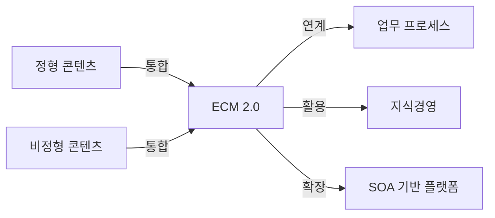

# ECM 2.0 (Enterprise Content Management): 기업 정보의 신규 가치 창출

<!-- mtoc-start -->

- [정의 및 개념](#정의-및-개념)
- [주요 특징](#주요-특징)
- [구성도](#구성도)
- [활용 사례](#활용-사례)
- [기대 효과 및 필요성](#기대-효과-및-필요성)
- [마무리](#마무리)
- [Keywords](#keywords)

<!-- mtoc-end -->

기업 내 분산된 정형 및 비정형 콘텐츠를 통합 관리하고 업무 프로세스와 연계하여 정보의 가치를 극대화하는 ECM 2.0(Enterprise Content Management) 개념이 주목받고 있다. Web 2.0 및 Enterprise 2.0의 핵심 요소를 반영하여 기업의 협업과 지식경영을 강화하는 것이 주요 목표다.

## 정의 및 개념

ECM 2.0은 기업의 정형 및 비정형 데이터를 통합적으로 관리하는 시스템, Web 2.0 및 SOA(Service-Oriented Architecture) 기술을 접목하여 비즈니스 모델을 다각화하고 정보의 가치를 극대화한다.

- 핵심 요소: Extended ECM, Web 2.0, Enterprise 2.0
- 특징: 통합 콘텐츠 관리, 협업 지원, 지식경영 기반 마련, SOA 적용
- 목적: 정보 활용 극대화, 프로세스 최적화, 기업 경쟁력 강화

## 주요 특징

- **통합 콘텐츠 관리**: 정형 및 비정형 데이터의 중앙 집중적 통합 관리
- **협업 강화**: Web 2.0 기반의 공동 작업 및 문서 공유 지원
- **비즈니스 프로세스 연계**: 업무 프로세스와 콘텐츠를 통합하여 자동화 및 최적화
- **SOA 기반 아키텍처**: 서비스 지향 아키텍처를 활용하여 유연한 확장 가능
- **정보의 가치 창출**: 데이터 재사용 및 분석을 통해 신규 가치를 창출

## 구성도

ECM 2.0은 정형 및 비정형 콘텐츠를 통합 관리하고, 이를 업무 프로세스 및 지식경영과 연결하여 기업의 정보 활용도를 극대화하는 구조를 가진다.

## 활용 사례

- **제조업**: 제품 설계 문서 및 매뉴얼 관리, 협업 지원
- **금융업**: 계약서 및 고객 정보 관리, 업무 프로세스 자동화
- **공공기관**: 공문서 및 행정 데이터의 중앙 관리
- **의료 산업**: 전자의무기록(EMR) 및 의료 지식 공유 시스템 구축

## 기대 효과 및 필요성

- **협업 및 생산성 향상**: Web 2.0 요소를 활용한 실시간 협업 및 정보 공유
- **정보 활용 극대화**: 콘텐츠의 재사용 및 분석을 통한 인사이트 도출
- **업무 효율성 증대**: 자동화 및 최적화를 통한 운영 비용 절감
- **기업 경쟁력 강화**: 정보 관리 체계 확립으로 비즈니스 모델 다각화

## 마무리

ECM 2.0은 기업 내 정보의 가치를 극대화하고 협업 및 지식경영을 강화하는 필수적인 시스템이다. Web 2.0 및 SOA 기반의 확장성을 고려하여 기업의 지속적인 성장과 혁신을 위한 핵심 도구로 활용할 필요가 있다.

## Keywords

ECM 2.0, Enterprise Content Management, Web 2.0, SOA, 지식경영, 협업 플랫폼, 정형 데이터, 비정형 데이터, 업무 프로세스 자동화, 콘텐츠 통합 관리