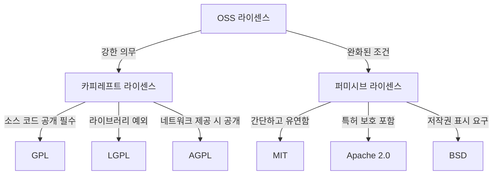

# OSS 라이센스: 오픈소스 소프트웨어의 법적 기반

<!-- mtoc-start -->

- [정의 및 개념](#정의-및-개념)
- [주요 특징](#주요-특징)
- [OSS 라이센스 유형](#oss-라이센스-유형)
  - [1. 카피레프트 라이센스](#1-카피레프트-라이센스)
  - [2. 퍼미시브 라이센스](#2-퍼미시브-라이센스)
- [OSS 라이센스 비교](#oss-라이센스-비교)
- [활용 사례](#활용-사례)
- [기대 효과 및 필요성](#기대-효과-및-필요성)
- [마무리](#마무리)
- [Keywords](#keywords)

<!-- mtoc-end -->

오픈소스 소프트웨어(Open Source Software, OSS)는 누구나 소스 코드를 자유롭게 사용, 수정 및 배포할 수 있도록 허용하는 소프트웨어이다. 그러나 이러한 자유로운 사용에는 특정한 라이센스 조건이 적용되며, OSS 라이센스는 소프트웨어의 사용 범위를 결정하는 중요한 요소이다. 본 글에서는 OSS 라이센스의 개념과 주요 특징, 라이센스 유형 및 활용 사례를 살펴본다.

## 정의 및 개념

OSS 라이센스는 오픈소스 소프트웨어의 사용, 수정, 배포를 규정하는 법적 계약. 각 라이센스는 특정한 권한과 제한 사항을 포함하며, 이를 준수하지 않을 경우 법적 문제가 발생할 수 있다.

- 목적: 소프트웨어의 자유로운 공유와 개방성 보장
- 필요성: 법적 문제 방지 및 OSS의 지속적 발전 지원

## 주요 특징

1. **자유로운 사용**: 누구나 소프트웨어를 다운로드하고 사용할 수 있음
2. **소스 코드 공개**: 프로그램의 소스 코드가 공개되며, 수정 및 배포 가능
3. **라이센스 준수 의무**: 라이센스 조건을 준수해야 하며, 위반 시 법적 책임 발생 가능
4. **재배포 가능**: 동일한 라이센스 조건을 유지하는 경우 소프트웨어 배포 가능
5. **상업적 이용 가능 여부**: 라이센스 유형에 따라 상업적 활용이 허용되거나 제한될 수 있음

## OSS 라이센스 유형

오픈소스 라이센스는 크게 **카피레프트(Copyleft) 라이센스**와 **퍼미시브(Permissive) 라이센스**로 나뉜다.

### 1. 카피레프트 라이센스

사용자가 수정하거나 배포할 때 동일한 라이센스 조건을 유지해야 하는 라이센스 유형

- **GPL (GNU General Public License)**: 가장 강력한 카피레프트 라이센스로, 수정 및 배포 시 동일한 GPL 적용 필수
- **LGPL (Lesser GPL)**: GPL보다 약한 카피레프트로, 라이브러리 사용 시 소스 코드 공개 의무 완화
- **AGPL (Affero GPL)**: 네트워크를 통해 제공되는 소프트웨어도 소스 코드 공개를 요구

### 2. 퍼미시브 라이센스

사용자가 수정 및 배포 시 라이센스 조건을 완화하여 적용할 수 있는 라이센스 유형

- **MIT 라이센스**: 사용 및 배포에 대한 제한이 적으며, 상업적 이용이 자유로움
- **Apache 2.0 라이센스**: 특허 관련 조항이 추가된 라이센스로, 소스 코드 변경 시 명시적 고지 필요
- **BSD 라이센스**: MIT 라이센스와 유사하며, 원저작자 명시 조건 포함

## OSS 라이센스 비교

OSS 라이센스는 카피레프트와 퍼미시브로 나뉘며, 각 라이센스는 공개 조건과 적용 방식이 다르다.

## 활용 사례

1. **리눅스 (Linux)** - GPL 라이센스를 기반으로 운영체제 배포
2. **마이SQL (MySQL)** - GPL과 상업 라이센스 병행 운영
3. **안드로이드 (Android)** - Apache 2.0 및 GPL을 혼합하여 사용
4. **React** - MIT 라이센스로 자유로운 사용 및 배포 가능
5. **TensorFlow** - Apache 2.0 라이센스로 AI/ML 연구 및 개발에 활용

## 기대 효과 및 필요성

- **법적 리스크 최소화**: OSS 사용 시 라이센스를 준수하여 법적 문제 예방
- **비용 절감**: 무료로 사용 가능한 소프트웨어 활용으로 개발 비용 절감
- **기술 혁신 촉진**: 오픈소스 생태계를 통해 협업 및 기술 발전 유도
- **보안성 향상**: 커뮤니티 기반 코드 리뷰로 보안 취약점 개선

## 마무리

OSS 라이센스는 오픈소스 소프트웨어의 자유로운 사용을 보장하면서도 일정한 법적 보호를 제공하는 중요한 요소이다. 적절한 라이센스를 선택하고 준수하는 것은 기업과 개발자 모두에게 필수적인 사항이다. 따라서, 오픈소스 활용 시 라이센스 조건을 명확히 이해하고 준수하는 것이 중요하다.

## Keywords

Open Source Software, OSS License, GPL, MIT License, Apache 2.0, BSD License, LGPL, AGPL, 소프트웨어 라이센스, 오픈소스 법적 준수
