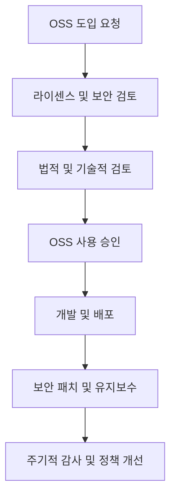

# OSS 가이드라인: 오픈소스 소프트웨어 활용의 최적 지침

<!-- mtoc-start -->

- [정의 및 개념](#정의-및-개념)
- [주요 가이드라인](#주요-가이드라인)
  - [1. OSS 정책 수립](#1-oss-정책-수립)
  - [2. OSS 라이센스 준수](#2-oss-라이센스-준수)
  - [3. 보안 및 취약점 관리](#3-보안-및-취약점-관리)
  - [4. OSS 도입 및 검토 절차](#4-oss-도입-및-검토-절차)
  - [5. OSS 커뮤니티 기여 지침](#5-oss-커뮤니티-기여-지침)
- [OSS 관리 프로세스](#oss-관리-프로세스)
- [활용 사례](#활용-사례)
- [기대 효과 및 필요성](#기대-효과-및-필요성)
- [마무리](#마무리)
- [Keywords](#keywords)

<!-- mtoc-end -->

오픈소스 소프트웨어(Open Source Software, OSS)는 현대 IT 환경에서 필수적인 요소로 자리 잡았다. 그러나 OSS를 올바르게 활용하지 않으면 법적, 보안적 문제를 초래할 수 있다. 본 글에서는 OSS를 안전하고 효율적으로 활용하기 위한 가이드라인을 제시한다.

## 정의 및 개념

OSS 가이드라인은 오픈소스 소프트웨어를 도입, 사용, 배포, 관리하는 과정에서 준수해야 할 원칙과 절차를 정리한 문서. 조직 내 OSS 활용을 체계적으로 관리하고 리스크를 줄이기 위한 기준을 제공한다.

- 목적: OSS 사용 시 법적, 기술적 문제 예방
- 필요성: 라이센스 준수 및 보안 위험 관리

## 주요 가이드라인

### 1. OSS 정책 수립

- 조직 내 OSS 사용 원칙을 명확히 정의
- OSS 라이센스 준수 방안 및 검토 절차 마련
- 보안 및 유지보수 계획 포함

### 2. OSS 라이센스 준수

- 사용하려는 OSS의 라이센스 유형(GPL, MIT, Apache 등) 이해
- OSS 라이센스 조항을 위반하지 않도록 내부 관리 체계 구축
- 소스 코드 변경 및 배포 시 라이센스 조건을 검토하고 적용

### 3. 보안 및 취약점 관리

- 최신 보안 패치 적용 및 취약점 주기적 점검
- 신뢰할 수 있는 소스에서 OSS 다운로드 및 사용
- 내부 보안 정책과 연계하여 OSS 활용 방안 마련

### 4. OSS 도입 및 검토 절차

- 새로운 OSS 도입 시 내부 검토 프로세스 운영
- 법무, 보안, 개발팀과 협력하여 적절한 OSS 선택
- 외부에서 제공된 OSS 코드에 대한 검증 및 승인 절차 마련

### 5. OSS 커뮤니티 기여 지침

- OSS 프로젝트에 기여할 경우 내부 승인 절차 준수
- 기여한 코드의 저작권 및 라이센스 조건 명확화
- 기업 또는 개인의 OSS 기여 원칙 수립

## OSS 관리 프로세스

OSS 도입부터 유지보수까지의 전반적인 프로세스를 관리하여 법적 및 보안 리스크를 최소화할 수 있다.

## 활용 사례

1. **대기업 OSS 거버넌스 구축** - OSS 정책을 수립하고 전담 팀을 운영하여 법적 리스크 관리
2. **공공기관 OSS 활용 가이드라인 도입** - 정부 기관 내 OSS 활용 기준을 마련하고 보안 강화
3. **스타트업 OSS 기반 제품 개발** - OSS를 적극 활용하여 개발 비용 절감 및 시장 경쟁력 확보

## 기대 효과 및 필요성

- **법적 리스크 최소화**: 라이센스 위반 방지 및 법적 문제 예방
- **보안 강화**: OSS 취약점 관리 및 보안 정책 적용
- **운영 효율성 향상**: 체계적인 OSS 관리로 개발 생산성 증가
- **커뮤니티 기여 활성화**: OSS 생태계 발전 기여 및 기업 이미지 제고

## 마무리

OSS 활용은 현대 IT 산업에서 필수적이지만, 이에 따른 법적·보안적 위험을 고려해야 한다. 체계적인 OSS 가이드라인을 통해 효과적으로 관리한다면, OSS의 장점을 극대화할 수 있다.

## Keywords

Open Source Software, OSS 가이드라인, OSS 라이센스, 오픈소스 정책, 오픈소스 보안, GPL, MIT License, Apache License, OSS 거버넌스, 소프트웨어 법적 준수
