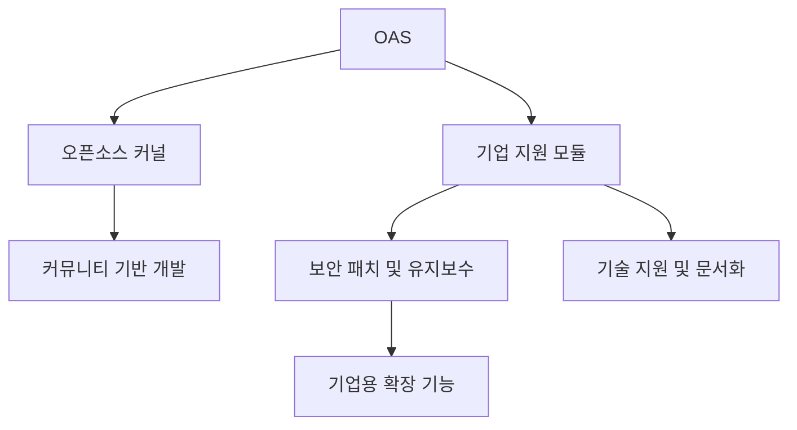

# OAS (Open Adoption Software): 개방형 소프트웨어 도입 전략

<!-- mtoc-start -->

- [정의 및 개념](#정의-및-개념)
- [주요 특징](#주요-특징)
- [OAS 아키텍처](#oas-아키텍처)
- [활용 사례](#활용-사례)
- [기대 효과 및 필요성](#기대-효과-및-필요성)
- [마무리](#마무리)
- [Keywords](#keywords)

<!-- mtoc-end -->

OAS(Open Adoption Software)는 기업과 조직이 오픈소스 소프트웨어를 효과적으로 채택하고 운영할 수 있도록 지원하는 개념이다. 기존의 오픈소스 소프트웨어(Open Source Software, OSS)와 차별화되는 점은, 오픈소스의 유연성을 유지하면서도 기업 환경에서 쉽게 채택할 수 있도록 설계되었다는 점이다. 본 글에서는 OAS의 개념과 주요 특징, 활용 사례 및 기대 효과에 대해 살펴본다.

## 정의 및 개념

OAS(Open Adoption Software)는 기업 및 조직에서 쉽게 도입할 수 있도록 상용 소프트웨어의 편리함을 갖춘 오픈소스 기반의 소프트웨어.

- 특징: 오픈소스 소프트웨어와 상용 소프트웨어의 장점을 결합한 개념
- 목적: 기업이 오픈소스를 도입할 때의 기술적 장벽을 낮추고 유지보수 용이성을 높임

## 주요 특징

1. **사용자 친화적 인터페이스**: 상용 소프트웨어처럼 직관적인 UI/UX 제공
2. **기업 지원 기능 포함**: 보안, 확장성, 유지보수 기능 강화
3. **유연한 배포 옵션**: 온프레미스, 클라우드, 하이브리드 환경 지원
4. **커뮤니티 및 상업적 지원 병행**: 오픈소스 커뮤니티 지원과 함께 공식적인 기술 지원 제공
5. **라이센스 유연성**: 기업이 법적 리스크 없이 활용할 수 있도록 다양한 라이센스 옵션 제공

## OAS 아키텍처

OAS는 기본적으로 오픈소스 커널을 기반으로 하지만, 기업 환경에서 요구하는 추가적인 기능과 지원을 포함하여 안정적인 운영을 보장한다.

## 활용 사례

1. **클라우드 서비스 플랫폼**: AWS, Azure와 같은 클라우드 환경에서 오픈소스 기반으로 운영되지만, 기업이 쉽게 도입할 수 있도록 상용 지원 기능을 포함
2. **데이터베이스 솔루션**: PostgreSQL과 같은 오픈소스 데이터베이스에 기업용 관리 기능을 추가한 상업적 솔루션
3. **컨테이너 오케스트레이션**: Kubernetes 기반의 관리형 서비스 제공
4. **AI 및 머신러닝 플랫폼**: TensorFlow와 같은 오픈소스 프로젝트에 상용 지원을 포함한 솔루션

## 기대 효과 및 필요성

- **비용 절감**: 상용 소프트웨어 대비 낮은 비용으로 도입 가능
- **유연한 확장성**: 기업 환경에 맞게 기능을 추가하거나 변경 가능
- **보안 강화**: 기업이 요구하는 보안 및 관리 기능이 포함된 패키지 제공
- **기술 지원 보장**: 기존 오픈소스의 단점인 지원 문제를 해결하며 안정적인 운영 가능

## 마무리

OAS(Open Adoption Software)는 오픈소스의 장점을 유지하면서도 기업 환경에서 쉽게 채택할 수 있도록 하는 새로운 접근 방식이다. 기업이 오픈소스를 적극적으로 도입하면서도 안정성을 확보할 수 있도록 OAS는 중요한 역할을 하며, 향후 IT 인프라에서 점점 더 중요한 요소로 자리 잡을 것이다.

## Keywords

Open Adoption Software, OAS, 오픈소스 도입, 기업용 오픈소스, OSS, Kubernetes, PostgreSQL, TensorFlow, 클라우드 컴퓨팅, 소프트웨어 채택 전략
