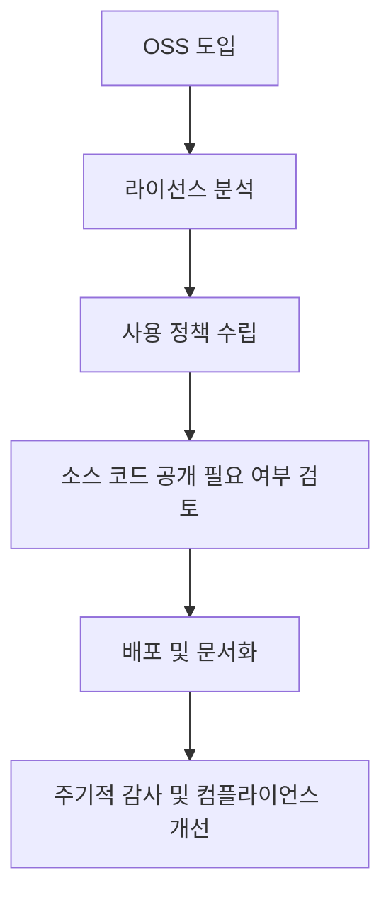

# 오픈소스 솔루션 의무조항: 법적 준수와 책임

<!-- mtoc-start -->

- [정의 및 개념](#정의-및-개념)
- [주요 오픈소스 라이선스 의무조항](#주요-오픈소스-라이선스-의무조항)
  - [1. GPL (GNU General Public License)](#1-gpl-gnu-general-public-license)
  - [2. LGPL (Lesser General Public License)](#2-lgpl-lesser-general-public-license)
  - [3. Apache 2.0 라이선스](#3-apache-20-라이선스)
  - [4. MIT 라이선스](#4-mit-라이선스)
  - [5. BSD 라이선스](#5-bsd-라이선스)
- [기업이 준수해야 할 의무사항](#기업이-준수해야-할-의무사항)
  - [1. OSS 라이선스 검토 및 준수](#1-oss-라이선스-검토-및-준수)
  - [2. 소스 코드 공개 및 저작권 고지](#2-소스-코드-공개-및-저작권-고지)
  - [3. OSS 사용 내역 관리](#3-oss-사용-내역-관리)
  - [4. 내부 교육 및 정책 수립](#4-내부-교육-및-정책-수립)
- [OSS 의무조항 관리 프로세스](#oss-의무조항-관리-프로세스)
- [기대 효과 및 필요성](#기대-효과-및-필요성)
- [마무리](#마무리)
- [Keywords](#keywords)

<!-- mtoc-end -->

오픈소스 소프트웨어(Open Source Software, OSS)는 무료로 사용 가능하지만, 특정 라이선스의 의무조항을 준수해야 한다. 오픈소스 라이선스를 무시할 경우 법적 분쟁이 발생할 수 있으므로, 기업과 개발자는 의무조항을 정확히 이해하고 따라야 한다. 본 글에서는 주요 오픈소스 라이선스의 의무조항을 살펴보고, 기업이 이를 준수하기 위한 방법을 설명한다.

## 정의 및 개념

오픈소스 솔루션 의무조항은 특정 OSS 라이선스를 따를 때 반드시 준수해야 하는 법적 요구사항. 이는 소프트웨어의 사용, 수정, 배포 시 적용되며, 라이선스에 따라 다를 수 있다.

- 목적: OSS 사용 시 법적 준수를 보장하고 라이선스 위반 방지
- 필요성: 기업과 개발자가 OSS를 안전하게 활용하기 위한 가이드라인 제공

## 주요 오픈소스 라이선스 의무조항

### 1. GPL (GNU General Public License)

- 수정된 소프트웨어 배포 시 소스 코드 공개 필수
- 동일한 GPL 라이선스를 유지해야 함 (카피레프트 조항)
- 프로그램을 포함한 배포물에 라이선스 명시 필요

### 2. LGPL (Lesser General Public License)

- 독립적인 소프트웨어와 결합 시, LGPL 라이선스 유지 필요 없음
- 라이브러리 변경 시 소스 코드 공개 의무 존재
- 바이너리 배포 시 원본 소스 코드 제공 필수

### 3. Apache 2.0 라이선스

- 소스 코드 변경 시 변경 내용 명시 필요
- 특허 라이선스 제공 의무
- 라이선스 파일과 저작권 고지 유지

### 4. MIT 라이선스

- 코드 사용 시 원저작권 및 라이선스 고지 필요
- 수정 및 재배포에 대한 제한 없음
- 소프트웨어의 보증 책임 없음

### 5. BSD 라이선스

- MIT 라이선스와 유사하지만, 원저작자 명시 조항이 추가됨
- 수정 및 배포 시 라이선스 조항 유지 필수

## 기업이 준수해야 할 의무사항

### 1. OSS 라이선스 검토 및 준수

- 사용하려는 오픈소스의 라이선스를 사전에 검토
- 내부 정책을 마련하여 OSS 라이선스 준수 체계 구축

### 2. 소스 코드 공개 및 저작권 고지

- GPL, LGPL 적용 시 소스 코드 공개 필요
- Apache 2.0, MIT 등 라이선스 고지를 명확히 표시

### 3. OSS 사용 내역 관리

- 사용한 OSS 목록과 해당 라이선스 기록 유지
- 배포 시 OSS 포함 여부 및 라이선스 요구사항 점검

### 4. 내부 교육 및 정책 수립

- 개발자를 대상으로 OSS 라이선스 교육 진행
- 라이선스 위반을 방지하기 위한 내부 프로세스 마련

## OSS 의무조항 관리 프로세스

OSS 관리 프로세스를 통해 라이선스 준수를 보장하고 법적 리스크를 방지할 수 있다.

## 기대 효과 및 필요성

- **법적 리스크 최소화**: 라이선스 위반 방지를 통해 법적 분쟁 예방
- **기업 신뢰도 향상**: OSS 준수를 통해 투명한 소프트웨어 운영 가능
- **비용 절감**: 라이선스 위반으로 인한 소송 및 배상 비용 절감
- **보안 강화**: OSS 사용 내역 관리로 보안 취약점 예방

## 마무리

오픈소스 솔루션을 활용할 때는 반드시 라이선스의 의무조항을 준수해야 한다. 기업과 개발자는 OSS의 법적 요구사항을 이해하고, 체계적인 관리 프로세스를 도입함으로써 법적 리스크를 줄이고 안전하게 OSS를 활용할 수 있다.

## Keywords

오픈소스 라이선스, GPL, LGPL, Apache 2.0, MIT 라이선스, BSD 라이선스, OSS 법적 준수, 소스 코드 공개, 소프트웨어 라이선스 관리, 오픈소스 컴플라이언스
