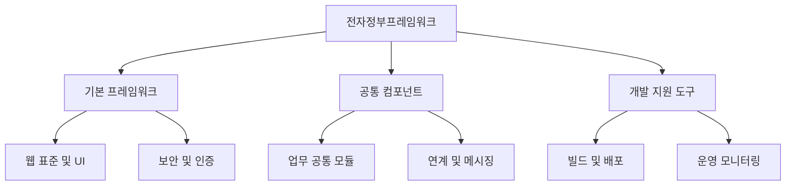

# 전자정부프레임워크 (e-Government Framework): 공공 IT 서비스의 표준화 기반

<!-- mtoc-start -->

- [정의 및 개념](#정의-및-개념)
- [주요 특징](#주요-특징)
- [전자정부프레임워크의 구성 요소](#전자정부프레임워크의-구성-요소)
- [활용 사례](#활용-사례)
  - [1. 공공기관의 전자문서 관리 시스템](#1-공공기관의-전자문서-관리-시스템)
  - [2. 정부 행정 서비스 포털 구축](#2-정부-행정-서비스-포털-구축)
  - [3. 지자체 정보 시스템 통합](#3-지자체-정보-시스템-통합)
- [기대 효과 및 필요성](#기대-효과-및-필요성)
- [마무리](#마무리)
- [Keywords](#keywords)

<!-- mtoc-end -->

전자정부프레임워크(e-Government Framework)는 공공기관의 IT 시스템 개발을 위한 표준화된 개발 프레임워크이다. 이 프레임워크는 정부 기관 간의 시스템 통합과 서비스 표준화를 촉진하며, 개발 비용 절감과 유지보수 효율성을 높이는 데 기여한다. 본 글에서는 전자정부프레임워크의 개념과 주요 특징, 구성 요소 및 활용 사례를 살펴본다.

## 정의 및 개념

전자정부프레임워크(e-Government Framework)는 정부 및 공공기관이 효율적으로 정보 시스템을 개발하고 운영할 수 있도록 지원하는 개발 표준 및 도구 집합.

- 특징: 재사용성과 표준화된 개발 환경 제공
- 목적: 공공기관의 IT 시스템 개발 비용 절감 및 품질 향상

## 주요 특징

1. **표준화된 개발 환경**: 공공기관 간 일관된 소프트웨어 아키텍처 제공
2. **재사용성 강화**: 공통 모듈을 활용하여 개발 생산성 증가
3. **보안 강화**: 인증 및 접근 제어 등 보안 기능 내장
4. **유지보수 용이성**: 프레임워크 기반으로 확장성과 유지보수 효율성 향상
5. **오픈소스 기반**: 개방형 기술 채택을 통해 벤더 종속성 최소화

## 전자정부프레임워크의 구성 요소

전자정부프레임워크는 기본 프레임워크, 공통 컴포넌트, 개발 지원 도구로 구성되며, 이를 통해 공공기관 시스템의 효율적인 개발이 가능하다.

## 활용 사례

### 1. 공공기관의 전자문서 관리 시스템

- 전자정부프레임워크 기반으로 개발된 문서 관리 시스템을 활용하여 기관 간 전자문서 교환 표준화

### 2. 정부 행정 서비스 포털 구축

- 통합된 개발 환경을 활용하여 대민 서비스 제공 시스템 구축

### 3. 지자체 정보 시스템 통합

- 각 지방자치단체별로 분산된 IT 시스템을 전자정부프레임워크를 통해 통합하여 운영 비용 절감

## 기대 효과 및 필요성

- **개발 비용 절감**: 공통 모듈 재사용을 통해 개발 비용 감소
- **운영 효율성 향상**: 표준화된 시스템을 통해 유지보수 비용 절감
- **보안 및 안정성 강화**: 정부 기관 간 데이터 보호 및 접근 제어 표준화
- **대국민 서비스 품질 향상**: 일관된 UX/UI 및 안정적인 시스템 운영 가능

## 마무리

전자정부프레임워크는 공공 IT 서비스의 표준화를 촉진하고 개발 효율성을 극대화하는 중요한 도구이다. 이를 활용하면 정부 기관은 비용을 절감하고, 유지보수를 효율적으로 수행하며, 국민에게 보다 안정적인 전자정부 서비스를 제공할 수 있다.

## Keywords

전자정부프레임워크, e-Government Framework, 공공기관 IT, 전자정부, 표준화 프레임워크, 공통 컴포넌트, 개발 생산성, 보안 강화, 오픈소스 프레임워크, 행정 서비스 표준화
