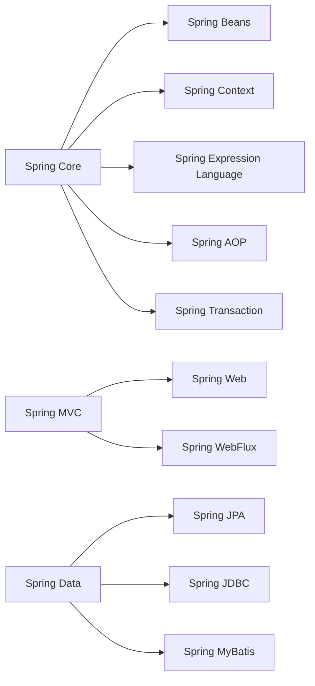

# 스프링 프레임워크 (Spring Framework): 자바 애플리케이션 개발의 표준

<!-- mtoc-start -->

- [정의 및 개념](#정의-및-개념)
- [주요 특징](#주요-특징)
- [스프링 프레임워크 아키텍처](#스프링-프레임워크-아키텍처)
- [활용 사례](#활용-사례)
  - [1. 엔터프라이즈 애플리케이션 개발](#1-엔터프라이즈-애플리케이션-개발)
  - [2. 마이크로서비스 아키텍처(MSA) 적용](#2-마이크로서비스-아키텍처msa-적용)
  - [3. 데이터 처리 및 관리](#3-데이터-처리-및-관리)
  - [4. RESTful API 개발](#4-restful-api-개발)
- [기대 효과 및 필요성](#기대-효과-및-필요성)
- [마무리](#마무리)
- [Keywords](#keywords)

<!-- mtoc-end -->

스프링 프레임워크(Spring Framework)는 자바(Java) 기반 애플리케이션 개발을 위한 강력한 프레임워크로, 객체 지향 설계 원칙을 지원하며 다양한 기능을 제공한다. 본 글에서는 스프링 프레임워크의 개념과 주요 특징, 아키텍처 및 활용 사례를 살펴본다.

## 정의 및 개념

스프링 프레임워크는 자바 애플리케이션 개발을 위한 개방형 프레임워크, 의존성 주입(Dependency Injection)과 관점 지향 프로그래밍(AOP, Aspect-Oriented Programming)을 기반으로 한다.

- 특징: 경량 컨테이너 기반으로 모듈화된 아키텍처 제공
- 목적: 생산성 향상 및 유지보수 용이성 증대

## 주요 특징

1. **경량 컨테이너**: IoC(Inversion of Control) 컨테이너를 제공하여 객체 생명주기 관리
2. **의존성 주입(DI)**: 객체 간의 의존성을 자동으로 관리하여 결합도를 낮춤
3. **관점 지향 프로그래밍(AOP)**: 횡단 관심사(로깅, 보안 등)를 모듈화하여 코드의 가독성 향상
4. **MVC 아키텍처 지원**: Spring MVC를 통해 웹 애플리케이션 개발 지원
5. **트랜잭션 관리**: 선언적 트랜잭션 관리 기능 제공
6. **다양한 기술 스택 연계**: Hibernate, JPA, MyBatis 등의 ORM 프레임워크와 통합 가능

## 스프링 프레임워크 아키텍처

스프링 프레임워크는 **Core, MVC, Data, AOP, Transaction** 등의 다양한 모듈로 구성되며, 유연한 개발 환경을 제공한다.

- **Core**: 의존성 주입(DI) 및 IoC 컨테이너 제공
- **MVC**: 웹 애플리케이션 개발을 위한 모델-뷰-컨트롤러 패턴 지원
- **Data**: 데이터 접근 계층을 관리하며, JPA, JDBC, MyBatis 등의 ORM 연계 가능
- **AOP**: 횡단 관심사를 분리하여 보안, 로깅 등의 기능을 효율적으로 적용
- **Transaction**: 일관된 트랜잭션 관리 기능을 제공하여 데이터 정합성 유지

## 활용 사례

### 1. 엔터프라이즈 애플리케이션 개발

- 대규모 기업 시스템 개발 시 트랜잭션 관리 및 보안 강화 가능

### 2. 마이크로서비스 아키텍처(MSA) 적용

- Spring Boot와 함께 사용하여 경량화된 마이크로서비스 시스템 구축

### 3. 데이터 처리 및 관리

- Spring Data JPA 및 Spring Batch를 활용하여 데이터베이스 연계 및 대량 데이터 처리 가능

### 4. RESTful API 개발

- Spring MVC와 Spring WebFlux를 통해 RESTful API를 효율적으로 구축 가능

## 기대 효과 및 필요성

- **개발 생산성 향상**: 코드 재사용성과 유지보수성이 뛰어나 개발 효율 증가
- **유연한 확장성**: 다양한 모듈과 연계하여 다양한 시스템에 적용 가능
- **보안 및 안정성 강화**: 내장된 보안 및 트랜잭션 관리 기능 제공
- **테스트 용이성**: DI 기반으로 단위 테스트 및 통합 테스트가 용이함

## 마무리

스프링 프레임워크는 자바 애플리케이션 개발의 표준으로 자리 잡았으며, 대규모 엔터프라이즈 애플리케이션부터 마이크로서비스까지 다양한 환경에서 활용되고 있다. 개발 생산성을 높이고 유지보수를 용이하게 하려면 스프링 프레임워크를 적극적으로 활용하는 것이 필요하다.

## Keywords

Spring Framework, 스프링 프레임워크, 자바 개발, Spring MVC, Spring Boot, Spring Data, DI, AOP, 트랜잭션 관리, RESTful API
