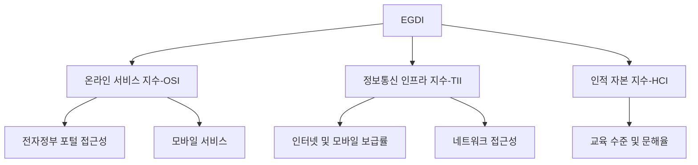

# EGDI (E-Government Development Index): 전자정부 발전 수준 평가 지표

<!-- mtoc-start -->

- [정의 및 개념](#정의-및-개념)
- [주요 구성 요소](#주요-구성-요소)
- [EGDI 평가 기준](#egdi-평가-기준)
- [활용 사례](#활용-사례)
  - [1. 국가별 전자정부 정책 수립](#1-국가별-전자정부-정책-수립)
  - [2. 국제 비교 및 경쟁력 평가](#2-국제-비교-및-경쟁력-평가)
  - [3. 공공 서비스 개선](#3-공공-서비스-개선)
- [기대 효과 및 필요성](#기대-효과-및-필요성)
- [마무리](#마무리)
- [Keywords](#keywords)

<!-- mtoc-end -->

전자정부 발전 지수(E-Government Development Index, EGDI)는 유엔(UN)에서 각국의 전자정부 발전 수준을 평가하기 위해 개발한 지표이다. EGDI는 정보통신 기술(ICT)의 활용도를 기반으로 정부의 디지털 서비스 제공 역량을 평가하며, 정부의 전자 행정 효율성을 측정하는 중요한 기준이 된다. 본 글에서는 EGDI의 개념, 주요 구성 요소, 평가 기준 및 활용 사례를 살펴본다.

## 정의 및 개념

EGDI는 전자정부 구축 및 운영 수준을 측정하는 글로벌 지표, 정보통신 기술을 활용한 공공 서비스 제공 역량을 평가.

- 특징: 유엔(UN)에서 주관하며, 전 세계 국가를 대상으로 평가
- 목적: 전자정부 발전 수준을 진단하고 개선 방향을 제시

## 주요 구성 요소

EGDI는 세 가지 핵심 요소로 구성된다.

1. **온라인 서비스 지수(OSI, Online Service Index)**

   - 정부가 제공하는 온라인 서비스 수준 평가
   - 전자정부 포털, 모바일 서비스, 정보 접근성 등의 항목 포함

2. **정보통신 인프라 지수(TII, Telecommunication Infrastructure Index)**

   - 인터넷 보급률, 모바일 가입자 수, 광대역 네트워크 접근성 평가
   - 디지털 격차 해소 및 국가별 ICT 환경 분석

3. **인적 자본 지수(HCI, Human Capital Index)**
   - 국민의 교육 수준 및 디지털 리터러시 평가
   - 초등·중등·고등 교육 등록률, 성인 문해율 등의 데이터 활용

## EGDI 평가 기준

EGDI는 온라인 서비스, 정보통신 인프라, 인적 자본의 세 가지 주요 지표를 기반으로 평가되며, 국가별 전자정부 발전 수준을 종합적으로 분석하는 데 사용된다.

## 활용 사례

### 1. 국가별 전자정부 정책 수립

- EGDI를 기반으로 정부는 디지털 전환 전략을 수립하고 실행 가능
- 온라인 서비스 개선 및 ICT 인프라 확충 목표 설정

### 2. 국제 비교 및 경쟁력 평가

- 각국의 EGDI 순위를 통해 글로벌 전자정부 경쟁력을 분석
- 선진국 및 개발도상국 간 디지털 격차 파악

### 3. 공공 서비스 개선

- EGDI 평가 결과를 반영하여 국민 맞춤형 전자정부 서비스 제공
- 디지털 접근성 향상을 위한 정책 마련

## 기대 효과 및 필요성

- **정부의 디지털 역량 강화**: 전자정부 발전 수준을 객관적으로 측정하여 개선 가능
- **국민의 서비스 접근성 향상**: 정보통신 인프라 확충을 통해 편리한 공공 서비스 제공
- **국제 협력 및 벤치마킹 기회 제공**: 우수 사례를 도입하여 국가 간 협력 강화
- **디지털 격차 해소**: ICT 인프라 개발 및 교육을 통한 국가 간 차이 완화

## 마무리

EGDI는 각국의 전자정부 발전 수준을 평가하는 중요한 지표로, 정부의 디지털 혁신을 촉진하는 역할을 한다. 이를 통해 국가별 전자정부 전략을 수립하고, 국민 중심의 디지털 서비스를 개선하는 방향으로 나아갈 수 있다.

## Keywords

EGDI, E-Government Development Index, 전자정부 발전 지수, 전자정부 평가, 온라인 서비스 지수, 정보통신 인프라, 인적 자본 지수, 전자정부 정책, 디지털 전환, 국제 비교
