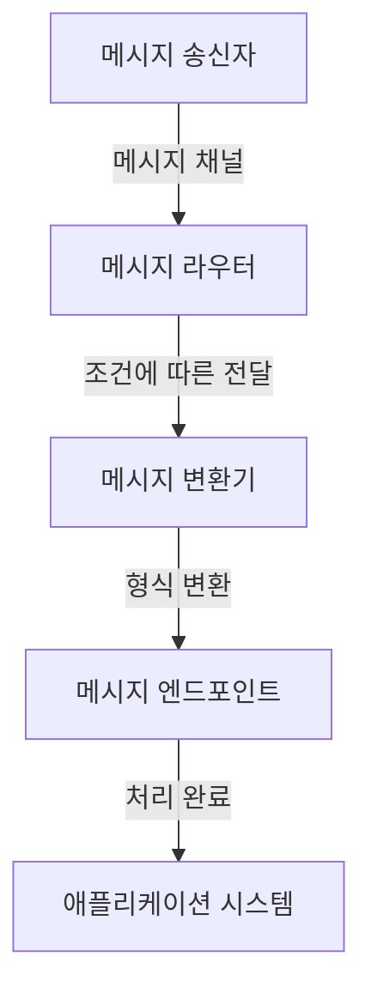

# EIP (Enterprise Integration Patterns): 기업 통합 패턴

<!-- mtoc-start -->

- [정의 및 개념](#정의-및-개념)
- [주요 기업 통합 패턴](#주요-기업-통합-패턴)
  - [1. 메시지 채널 (Message Channel)](#1-메시지-채널-message-channel)
  - [2. 메시지 라우터 (Message Router)](#2-메시지-라우터-message-router)
  - [3. 메시지 변환기 (Message Translator)](#3-메시지-변환기-message-translator)
  - [4. 메시지 엔드포인트 (Message Endpoint)](#4-메시지-엔드포인트-message-endpoint)
  - [5. 집계기 (Aggregator)](#5-집계기-aggregator)
- [EIP 아키텍처 개요](#eip-아키텍처-개요)
- [활용 사례](#활용-사례)
  - [1. 금융 시스템 통합](#1-금융-시스템-통합)
  - [2. 전자상거래 플랫폼](#2-전자상거래-플랫폼)
  - [3. IoT 데이터 처리](#3-iot-데이터-처리)
- [기대 효과 및 필요성](#기대-효과-및-필요성)
- [마무리](#마무리)
- [Keywords](#keywords)

<!-- mtoc-end -->

기업 시스템은 다양한 애플리케이션과 서비스가 상호 연동하여 운영된다. 이러한 시스템 간 원활한 데이터 흐름과 통합을 위해 **EIP(Enterprise Integration Patterns, 기업 통합 패턴)** 이 활용된다. 본 글에서는 EIP의 개념과 주요 패턴, 활용 사례 및 기대 효과를 살펴본다.

## 정의 및 개념

EIP(Enterprise Integration Patterns)는 기업 내 분산된 시스템을 효율적으로 연계하기 위한 설계 패턴의 집합.

- 특징: 시스템 간의 메시지 전달, 데이터 변환, 라우팅 등을 표준화하여 복잡성을 감소시킴
- 목적: 애플리케이션 간의 통합을 원활하게 수행하여 시스템 간의 데이터 흐름 최적화

## 주요 기업 통합 패턴

EIP는 여러 가지 통합 방법을 제공하며, 대표적인 패턴은 다음과 같다.

### 1. 메시지 채널 (Message Channel)

- 애플리케이션 간 통신을 위해 메시지를 송수신하는 채널
- 예: 단일 채널(Queue), 브로드캐스트 채널(Topic)

### 2. 메시지 라우터 (Message Router)

- 메시지를 특정 조건에 따라 다양한 경로로 전달
- 예: 콘텐츠 기반 라우터, 동적 라우터

### 3. 메시지 변환기 (Message Translator)

- 서로 다른 데이터 형식 간 변환을 수행하여 시스템 간 호환성 유지
- 예: XML-JSON 변환, 프로토콜 변환

### 4. 메시지 엔드포인트 (Message Endpoint)

- 애플리케이션이 메시지를 보내거나 받는 지점
- 예: API 게이트웨이, Kafka Consumer

### 5. 집계기 (Aggregator)

- 여러 개의 메시지를 하나의 메시지로 결합하여 처리
- 예: 주문 시스템에서 개별 품목 데이터를 하나의 주문 데이터로 통합

## EIP 아키텍처 개요

EIP는 메시지 송신부터 변환, 라우팅, 최종 애플리케이션 전달까지의 전체적인 통합 프로세스를 구성한다.

## 활용 사례

### 1. 금융 시스템 통합

- 은행 간 실시간 결제 시스템에서 메시지 변환 및 라우팅 활용

### 2. 전자상거래 플랫폼

- 주문 및 결제 프로세스에서 여러 시스템 간 데이터 연계

### 3. IoT 데이터 처리

- 센서 데이터를 실시간으로 변환하고 적절한 서버로 라우팅

## 기대 효과 및 필요성

- **효율적인 시스템 통합**: 다양한 애플리케이션 간 데이터 흐름을 최적화
- **유지보수 용이성 향상**: 표준화된 패턴을 활용하여 개발 및 유지보수 단순화
- **확장성 증가**: 새로운 시스템 추가 시 기존 인프라와 원활하게 연동 가능
- **비용 절감**: 통합 프로세스 자동화로 운영 비용 절감

## 마무리

EIP는 기업 내 다양한 애플리케이션과 서비스가 원활하게 통합될 수 있도록 도와주는 중요한 패턴 집합이다. 표준화된 패턴을 활용하면 시스템 간의 상호 운용성을 높이고 유지보수 비용을 절감할 수 있다.

## Keywords

Enterprise Integration Patterns, EIP, 기업 통합, 메시지 채널, 메시지 라우터, 메시지 변환기, 시스템 연계, API 게이트웨이, 데이터 통합, 메시지 기반 아키텍처
