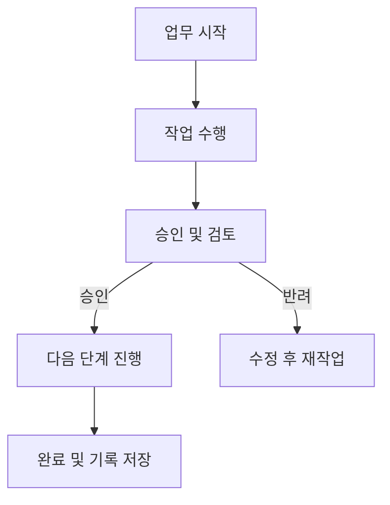

# Workflow: 작업흐름과 작업절차의 운영적 측면

<!-- mtoc-start -->

- [정의 및 개념](#정의-및-개념)
- [워크플로우의 구성 요소](#워크플로우의-구성-요소)
- [워크플로우 운영 및 절차](#워크플로우-운영-및-절차)
- [기대 효과 및 필요성](#기대-효과-및-필요성)
- [마무리](#마무리)
- [Keywords](#keywords)

<!-- mtoc-end -->

워크플로우(Workflow)는 정보 또는 업무의 이동과 수행 절차를 정의하는 체계적인 과정이다. 이는 조직 내에서 업무가 원활하게 진행될 수 있도록 구성 요소와 절차를 명확히 정리하여 효율성을 극대화하는 데 목적이 있다. 본 글에서는 워크플로우의 개념, 주요 구성 요소, 운영적 측면, 그리고 기대 효과를 살펴본다.

## 정의 및 개념

워크플로우는 작업흐름과 작업절차를 통한 정보 및 업무의 이동을 체계적으로 정의하는 프로세스. 이는 기업 및 조직에서 일어나는 업무의 수행 방식과 절차를 최적화하여 효율적인 운영을 가능하게 한다.

- 특징: 업무 수행 방식의 표준화 및 자동화를 통한 생산성 향상
- 목적: 업무의 흐름을 체계화하여 수행 주체와 절차를 명확히 정리

## 워크플로우의 구성 요소

워크플로우는 업무의 이동성과 작업 절차의 운영적 측면을 중심으로 다음과 같은 구성 요소를 포함한다.

1. **업무 구성**: 특정 프로세스 내에서 수행해야 할 개별 업무 정의
2. **수행 주체**: 업무를 담당하는 사용자, 조직, 또는 시스템
3. **작업 순서**: 업무를 수행하는 단계별 진행 방식
4. **동기화 방안**: 병렬 또는 순차적 작업 수행 방식 정의
5. **업무 지원 정보 흐름**: 필요한 데이터 및 문서의 이동 경로
6. **업무 추적 방안**: 프로세스 진행 상황과 로그 기록을 통한 모니터링 및 개선

## 워크플로우 운영 및 절차

위 흐름도는 업무의 시작부터 완료까지의 주요 단계를 나타낸다. 승인 및 검토 단계에서의 의사 결정에 따라 다음 단계로 이동하거나 재작업이 진행될 수 있다.

## 기대 효과 및 필요성

- **업무 효율성 향상**: 반복적인 작업 절차를 자동화하여 업무 생산성 증가
- **업무 가시성 확보**: 프로세스 진행 상황을 추적하여 문제를 신속히 해결 가능
- **의사 결정 속도 향상**: 승인 및 검토 절차를 명확히 하여 신속한 의사 결정 지원
- **업무 표준화**: 일관된 작업 수행 방식 제공으로 조직 내 협업 강화

## 마무리

워크플로우는 조직의 업무 절차를 체계적으로 정리하고 효율적으로 운영하는 중요한 도구이다. 이를 통해 정보 및 업무의 이동을 최적화하고, 업무 생산성을 높일 수 있다. 성공적인 업무 운영을 위해 워크플로우의 적절한 설계와 구현이 필수적이다.

## Keywords

워크플로우, 작업흐름, 업무 프로세스, 작업 절차, 업무 이동성, 프로세스 자동화, 정보 흐름, 업무 관리, 워크플로우 설계, 업무 효율성
