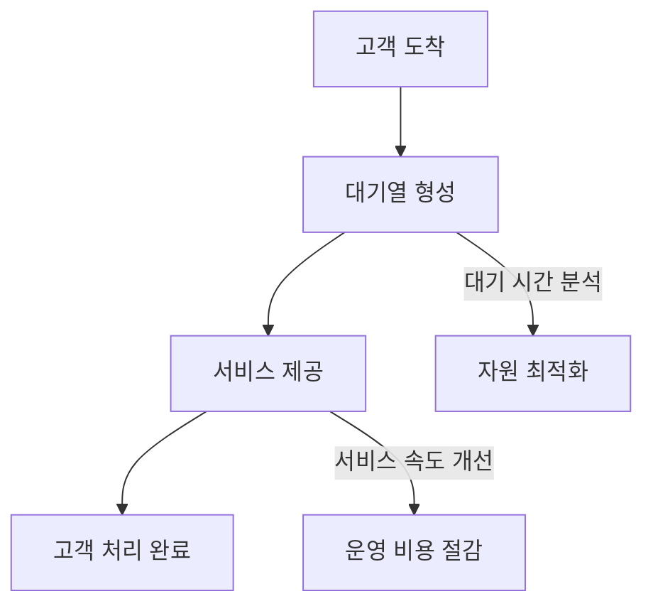

# 대기행렬이론 (Queuing Theory): 서비스 대기열 분석과 최적화

<!-- mtoc-start -->

- [정의 및 개념](#정의-및-개념)
- [대기행렬의 주요 특성](#대기행렬의-주요-특성)
- [대기행렬의 수학적 분석](#대기행렬의-수학적-분석)
  - [1. M/M/1 모델 (단일 서버, 무제한 대기열)](#1-mm1-모델-단일-서버-무제한-대기열)
  - [2. M/M/c 모델 (다중 서버, 무제한 대기열)](#2-mmc-모델-다중-서버-무제한-대기열)
  - [3. M/G/1 모델 (일반적인 서비스 시간 분포 적용)](#3-mg1-모델-일반적인-서비스-시간-분포-적용)
- [대기행렬의 운영 및 최적화 기법](#대기행렬의-운영-및-최적화-기법)
- [활용 사례](#활용-사례)
  - [1. 은행 및 금융 기관](#1-은행-및-금융-기관)
  - [2. 콜센터 및 고객 지원 서비스](#2-콜센터-및-고객-지원-서비스)
  - [3. 제조 및 물류 시스템](#3-제조-및-물류-시스템)
  - [4. IT 및 네트워크 시스템](#4-it-및-네트워크-시스템)
- [기대 효과 및 필요성](#기대-효과-및-필요성)
- [마무리](#마무리)
- [Keywords](#keywords)

<!-- mtoc-end -->

대기행렬이론(Queuing Theory)은 서비스 시스템에서 발생하는 대기열(Queue) 현상을 분석하고 최적화하는 수학적 기법이다. 고객과 서비스 제공자 간의 관계를 확률론적 모델로 표현하여 시스템의 효율성을 높이는 데 활용된다. 본 글에서는 대기행렬이론의 개념, 주요 특성, 수학적 모델, 그리고 실무에서의 활용 사례를 살펴본다.

## 정의 및 개념

대기행렬이론(Queuing Theory)은 한정된 자원을 사용하는 시스템에서 고객 요청이 도착하고 서비스가 제공되는 과정에서 발생하는 대기열을 분석하는 이론.

- 특징: 고객과 서비스 제공자 간의 대기 시간 및 처리 속도를 최적화
- 목적: 서비스 품질 개선, 운영 비용 절감, 자원 활용도 극대화

## 대기행렬의 주요 특성

1. **고객 도착 패턴**: 고객이 시스템에 도착하는 방식 (Poisson 분포 등)
2. **서비스 제공 방식**: 고객이 처리되는 과정 (고정 시간 또는 확률적 서비스)
3. **대기열 규칙**: 고객이 줄을 서는 방식 (FCFS, LCFS, 우선순위 기반 등)
4. **서버 수**: 서비스를 제공하는 자원의 개수 (단일 서버, 다중 서버)
5. **시스템 용량**: 시스템이 수용할 수 있는 고객 수 (무제한 또는 제한된 대기 공간)

## 대기행렬의 수학적 분석

대기행렬은 다양한 수학적 모델로 표현되며, 대표적인 모형은 다음과 같다.

### 1. M/M/1 모델 (단일 서버, 무제한 대기열)

- **고객 도착**: Poisson 분포
- **서비스 시간**: 지수 분포
- **서버 개수**: 1개
- **적용 사례**: 은행 창구, 콜센터 상담원

### 2. M/M/c 모델 (다중 서버, 무제한 대기열)

- **고객 도착**: Poisson 분포
- **서비스 시간**: 지수 분포
- **서버 개수**: c개
- **적용 사례**: 공항 체크인 카운터, 병원 접수 창구

### 3. M/G/1 모델 (일반적인 서비스 시간 분포 적용)

- **고객 도착**: Poisson 분포
- **서비스 시간**: 일반적인 분포
- **서버 개수**: 1개
- **적용 사례**: 제조업의 생산라인에서 불규칙한 서비스 처리 시간

## 대기행렬의 운영 및 최적화 기법

대기행렬을 최적화하는 다양한 방법이 존재한다:

- **대기열 관리 시스템 도입**: 자동화된 고객 흐름 조절
- **서비스 속도 향상**: 프로세스 개선 및 병렬 처리 적용
- **자원 최적화**: 적절한 서버 수 배치로 대기 시간 단축
- **우선순위 시스템 구축**: 긴급 고객을 위한 별도 대기열 운영

## 활용 사례

### 1. 은행 및 금융 기관

- 고객 대기 시간을 줄이기 위한 창구 운영 최적화
- ATM 기기의 배치 및 서비스 속도 조절

### 2. 콜센터 및 고객 지원 서비스

- 상담원의 적정 배치 및 고객 요청 처리 최적화
- 대기 시간 예측을 통한 서비스 품질 개선

### 3. 제조 및 물류 시스템

- 생산 라인에서의 대기 시간 분석 및 효율적 운영
- 물류 센터에서의 패키지 처리 시간 최소화

### 4. IT 및 네트워크 시스템

- 서버 부하 관리 및 트래픽 조절
- 데이터 센터의 클라우드 컴퓨팅 자원 배분

## 기대 효과 및 필요성

- **서비스 품질 향상**: 고객의 대기 시간을 줄이고 만족도를 증가
- **운영 비용 절감**: 불필요한 리소스 낭비를 최소화하여 효율적인 운영 가능
- **리소스 최적화**: 서버, 인력, 장비 등의 자원 활용도를 극대화
- **비즈니스 경쟁력 강화**: 빠르고 효율적인 서비스 제공으로 시장 경쟁력 확보

## 마무리

대기행렬이론은 서비스 시스템에서 발생하는 대기열 문제를 분석하고 최적화하는 데 필수적인 이론이다. 이를 활용하면 고객 만족도를 높이고, 운영 효율성을 극대화할 수 있다. 다양한 산업 분야에서 대기행렬이론을 적용하여 서비스 품질을 개선하고 비용을 절감할 수 있다.

## Keywords

대기행렬이론, Queuing Theory, 서비스 대기열, 대기행렬 모델, M/M/1, M/M/c, 대기시간 최적화, 자원 활용, 서비스 운영, 고객 대기 관리
