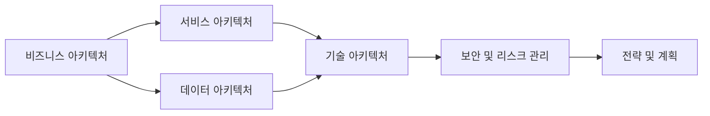

# EA/ITA: 엔터프라이즈 아키텍처와 IT 아키텍처의 개요

<!-- mtoc-start -->

- [정의 및 개념](#정의-및-개념)
  - [엔터프라이즈 아키텍처 (EA)](#엔터프라이즈-아키텍처-ea)
  - [IT 아키텍처 (ITA)](#it-아키텍처-ita)
- [EA/ITA의 주요 구성 요소](#eaita의-주요-구성-요소)
- [EA/ITA의 구조 및 관계](#eaita의-구조-및-관계)
- [활용 사례](#활용-사례)
  - [1. 정부 기관의 IT 거버넌스 개선](#1-정부-기관의-it-거버넌스-개선)
  - [2. 대기업 IT 투자 최적화](#2-대기업-it-투자-최적화)
  - [3. 금융 및 헬스케어 산업의 보안 강화](#3-금융-및-헬스케어-산업의-보안-강화)
- [기대 효과 및 필요성](#기대-효과-및-필요성)
- [마무리](#마무리)
- [Keywords](#keywords)

<!-- mtoc-end -->

EA(Enterprise Architecture)와 ITA(IT Architecture)는 기업 및 조직의 IT 거버넌스를 체계적으로 관리하고 최적화하는 설계 원칙과 프레임워크를 제공하는 개념이다. 이를 통해 조직의 IT 환경을 효과적으로 조정하고, 비즈니스 목표와 IT 전략을 일치시킬 수 있다. 본 글에서는 EA/ITA의 개념과 구성 요소, 구조 및 주요 프레임워크를 다룬다.

## 정의 및 개념

### 엔터프라이즈 아키텍처 (EA)

EA(Enterprise Architecture)는 기업의 비즈니스와 IT 전략을 정렬하고 최적화하기 위한 설계 원칙과 프레임워크.

- 특징: 조직 전체의 IT 자산을 구조화하고 최적화하는 방법론 제공
- 목적: 비즈니스 목표와 IT 인프라의 정렬을 통해 운영 효율성 증대

### IT 아키텍처 (ITA)

ITA(IT Architecture)는 IT 시스템과 기술 요소의 구조와 관계를 정의하는 아키텍처이다.

- 특징: 기업의 IT 환경을 최적화하기 위한 기술 프레임워크 제공
- 목적: IT 시스템의 일관성 유지 및 효율적인 정보 활용

## EA/ITA의 주요 구성 요소

EA와 ITA는 다양한 아키텍처 레이어로 구성되며, 주요 요소는 다음과 같다.

1. **비즈니스 참조 모델(BRM, Business Reference Model)**

   - 기업의 주요 비즈니스 기능과 프로세스 정의
   - 비즈니스 운영과 IT의 연계성 확보

2. **서비스 참조 모델(SRM, Service Reference Model)**

   - 서비스 기반의 IT 시스템 구축을 위한 구조 제공
   - 조직 간 상호운용성을 위한 서비스 설계

3. **데이터 참조 모델(DRM, Data Reference Model)**

   - 데이터 표준화 및 일관성 유지
   - 조직 간 데이터 공유 및 품질 보장

4. **기술 참조 모델(TRM, Technology Reference Model)**

   - IT 시스템에서 사용되는 기술 및 표준 정의
   - IT 인프라와 애플리케이션의 표준화

5. **성능 참조 모델(PRM, Performance Reference Model)**

   - IT 투자 효과성을 측정하고 성과 관리 수행
   - 성능 지표 및 평가 체계 제공

6. **보안 및 리스크 관리(RM, Risk Management)**

   - IT 환경 내 보안 정책 및 위험 요소 관리
   - 조직의 정보 보호 및 규제 준수

7. **전략 및 계획(SP, Strategic Planning)**
   - IT 거버넌스 및 기업 전략과의 정렬
   - 장기적인 IT 투자 및 기술 로드맵 수립

## EA/ITA의 구조 및 관계

EA/ITA는 비즈니스, 서비스, 데이터, 기술 아키텍처로 구성되며, 각각의 요소가 서로 긴밀하게 연계되어 운영된다.

## 활용 사례

### 1. 정부 기관의 IT 거버넌스 개선

- EA 기반으로 공공기관 IT 시스템 표준화
- 데이터 공유 및 상호운용성 강화

### 2. 대기업 IT 투자 최적화

- PRM을 활용한 IT 투자 효과성 평가
- 비즈니스 요구사항 기반의 ITA 설계

### 3. 금융 및 헬스케어 산업의 보안 강화

- RM을 통한 보안 정책 수립
- TRM을 활용한 기술 표준 준수

## 기대 효과 및 필요성

- **비즈니스와 IT의 정렬**: 전략적 목표에 부합하는 IT 인프라 구축
- **운영 효율성 증대**: IT 자원의 최적 활용 및 비용 절감
- **보안 및 규제 준수 강화**: 기업 리스크 관리 및 데이터 보호
- **기술 표준화**: IT 시스템 간 상호운용성을 강화하고 유지보수 비용 절감

## 마무리

EA/ITA는 기업 및 공공기관의 IT 환경을 체계적으로 관리하고 최적화하는 핵심 프레임워크이다. 이를 활용하면 조직의 비즈니스 목표와 IT 전략을 효과적으로 연계하여 지속 가능한 성장을 도모할 수 있다.

## Keywords

EA, ITA, Enterprise Architecture, IT Architecture, IT 거버넌스, BRM, SRM, DRM, TRM, PRM, RM, SP, 기업 아키텍처, 기술 아키텍처
