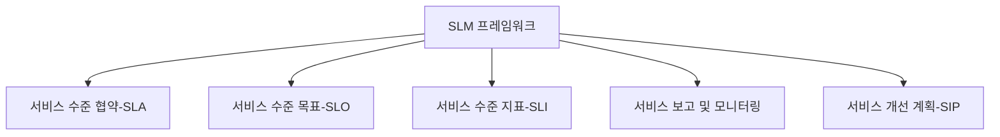

# SLM 프레임워크: 서비스 수준 관리(Service Level Management) 체계

<!-- mtoc-start -->

- [정의 및 개념](#정의-및-개념)
- [SLM 프레임워크의 주요 구성 요소](#slm-프레임워크의-주요-구성-요소)
- [SLM 프레임워크 구조](#slm-프레임워크-구조)
- [SLM 프레임워크의 활용 사례](#slm-프레임워크의-활용-사례)
  - [1. IT 서비스 제공 기업](#1-it-서비스-제공-기업)
  - [2. 클라우드 서비스 제공업체](#2-클라우드-서비스-제공업체)
  - [3. 금융 및 의료 산업](#3-금융-및-의료-산업)
- [기대 효과 및 필요성](#기대-효과-및-필요성)
- [마무리](#마무리)
- [Keywords](#keywords)

<!-- mtoc-end -->

서비스 수준 관리(Service Level Management, SLM)는 IT 서비스 제공자가 고객과의 서비스 수준을 명확히 정의하고, 지속적으로 모니터링하며, 최적의 품질을 유지하기 위한 프레임워크이다. SLM 프레임워크는 IT 서비스 관리(ITSM)와 IT 거버넌스의 핵심 요소로, SLA(Service Level Agreement)를 기반으로 서비스 성과를 측정하고 개선하는 체계를 제공한다.

## 정의 및 개념

SLM 프레임워크는 IT 서비스 제공자가 고객과 합의한 서비스 수준을 유지하고 관리하기 위한 구조화된 접근 방식.

- **특징**: 서비스 수준 목표 정의, 성과 측정 및 지속적 개선을 포함
- **목적**: IT 서비스의 품질을 보장하고, 고객 요구 사항을 충족하는 지속 가능한 서비스 관리 체계 구축

## SLM 프레임워크의 주요 구성 요소

SLM 프레임워크는 다음과 같은 핵심 요소로 구성된다.

1. **서비스 수준 협약(SLA, Service Level Agreement)**

   - 고객과 서비스 제공자 간의 서비스 수준을 명확히 정의한 문서
   - 서비스 목표, 성과 지표, 책임 범위 포함

2. **서비스 수준 목표(SLO, Service Level Objectives)**

   - SLA에서 정의한 서비스 성과 목표
   - 가용성, 응답 시간, 처리 시간 등의 측정 기준 설정

3. **서비스 수준 지표(SLI, Service Level Indicators)**

   - SLO 달성을 측정하는 주요 성과 지표
   - 예: 평균 응답 시간, 시스템 가용성, 오류율

4. **서비스 보고 및 모니터링**

   - SLA 및 SLO 준수를 실시간 모니터링하고 보고서를 생성
   - 자동화된 대시보드 및 알림 시스템 활용

5. **서비스 개선 계획(SIP, Service Improvement Plan)**
   - 지속적인 서비스 품질 개선을 위한 전략
   - 성과 평가 및 최적화 활동 포함

## SLM 프레임워크 구조

SLM 프레임워크는 SLA, SLO, SLI, 모니터링, 개선 계획 등의 요소로 구성되어 있으며, 이를 통해 지속적으로 서비스 품질을 관리한다.

## SLM 프레임워크의 활용 사례

### 1. IT 서비스 제공 기업

- SLA를 기반으로 서비스 가용성을 보장하고 성과 모니터링 수행
- 고객과의 계약 조건을 명확히 하여 신뢰성 확보

### 2. 클라우드 서비스 제공업체

- 시스템 가용성과 성능을 SLI로 측정하여 안정적인 서비스 제공
- 자동화된 SLA 모니터링 및 경고 시스템 도입

### 3. 금융 및 의료 산업

- 데이터 보호 및 시스템 안정성을 SLA에 명시하여 규제 준수
- 지속적인 서비스 성능 평가를 통한 최적화 진행

## 기대 효과 및 필요성

- **서비스 품질 향상**: SLA 기반의 성과 측정으로 일관된 서비스 제공
- **운영 효율성 증가**: 자동화된 모니터링을 통해 문제를 사전에 감지
- **고객 만족도 향상**: 명확한 서비스 목표 설정으로 고객 신뢰 확보
- **비즈니스 경쟁력 강화**: SLA 준수를 통한 신뢰도 상승 및 시장 경쟁력 확보

## 마무리

SLM 프레임워크는 IT 서비스 제공의 핵심 요소로, 명확한 서비스 수준 정의와 지속적인 모니터링을 통해 고객 만족도를 높이고 비즈니스 목표를 달성하는 데 기여한다. 조직은 SLM 프레임워크를 도입함으로써 서비스 성과를 극대화하고, 운영 효율성을 극대화할 수 있다.

## Keywords

SLM, 서비스 수준 관리, SLA, SLO, SLI, IT 서비스 관리, 성과 모니터링, 서비스 개선 계획, IT 거버넌스, 클라우드 서비스 관리
