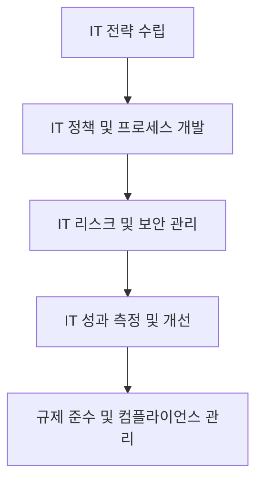

# IT Governance: 효과적인 IT 거버넌스 관리와 프레임워크

<!-- mtoc-start -->

- [정의 및 개념](#정의-및-개념)
- [IT 거버넌스의 주요 구성 요소](#it-거버넌스의-주요-구성-요소)
- [주요 IT 거버넌스 프레임워크](#주요-it-거버넌스-프레임워크)
- [IT 거버넌스 운영 및 관리 절차](#it-거버넌스-운영-및-관리-절차)
- [IT 거버넌스의 활용 사례](#it-거버넌스의-활용-사례)
  - [1. 대기업의 IT 투자 최적화](#1-대기업의-it-투자-최적화)
  - [2. 금융 산업에서의 IT 규제 준수](#2-금융-산업에서의-it-규제-준수)
  - [3. 공공기관의 IT 서비스 품질 개선](#3-공공기관의-it-서비스-품질-개선)
- [기대 효과 및 필요성](#기대-효과-및-필요성)
- [마무리](#마무리)
- [Keywords](#keywords)

<!-- mtoc-end -->

IT 거버넌스(IT Governance)는 기업과 조직이 IT 자원을 효과적으로 관리하고, 비즈니스 목표와 IT 전략을 정렬하여 운영하는 체계를 의미한다. IT 거버넌스는 기업의 IT 투자 효율성을 높이고, 리스크를 최소화하며, 규제 및 법적 요구 사항을 준수하는 데 중요한 역할을 한다. 본 글에서는 IT 거버넌스의 개념, 주요 프레임워크, 구성 요소 및 기대 효과를 살펴본다.

## 정의 및 개념

IT 거버넌스는 기업이 IT를 전략적으로 활용하고 관리할 수 있도록 도와주는 관리 체계. 이는 기업의 IT 관련 의사 결정과 자원 배분을 최적화하여 비즈니스 가치 창출을 극대화하는 데 중점을 둔다.

- **특징**: IT 의사결정 및 관리 체계 수립, 리스크 관리, 성과 측정
- **목적**: IT와 비즈니스 전략의 일관성을 유지하고, 기업의 IT 가치를 극대화

## IT 거버넌스의 주요 구성 요소

IT 거버넌스는 여러 핵심 요소로 구성되며, 조직의 IT 운영을 체계적으로 지원한다.

1. **IT 전략 및 계획**

   - 비즈니스 목표와 IT 전략을 일치시키는 로드맵 수립
   - 장기적인 IT 투자 방향 설정

2. **리스크 관리 및 보안**

   - IT 리스크 분석 및 대응 전략 수립
   - 보안 정책 및 데이터 보호 방안 마련

3. **IT 성과 및 가치 평가**

   - IT 투자 대비 성과 평가 및 개선
   - KPI(Key Performance Indicator) 및 ROI(Return on Investment) 측정

4. **IT 프로세스 및 정책**

   - 표준화된 IT 운영 프로세스 적용
   - IT 서비스 관리(ITSM) 및 규제 준수

5. **컴플라이언스 및 규제 준수**
   - ISO 27001, GDPR, SOX 등 글로벌 규제 준수
   - 법적 요구 사항을 충족하는 IT 관리 체계 구축

## 주요 IT 거버넌스 프레임워크

IT 거버넌스의 효과적인 운영을 위해 다양한 글로벌 표준과 프레임워크가 활용된다.

1. **COBIT (Control Objectives for Information and Related Technologies)**

   - IT 거버넌스를 위한 국제 표준 프레임워크
   - IT 리스크 관리 및 컴플라이언스 강화

2. **ITIL (Information Technology Infrastructure Library)**

   - IT 서비스 관리를 위한 베스트 프랙티스 제공
   - IT 운영 최적화 및 서비스 품질 개선

3. **ISO/IEC 38500**

   - IT 거버넌스 원칙 및 가이드라인 제공
   - IT 의사결정 및 책임 구조 개선

4. **TOGAF (The Open Group Architecture Framework)**

   - 기업 아키텍처(Enterprise Architecture) 관리 프레임워크
   - IT와 비즈니스 전략의 정렬 강화

5. **CMMI (Capability Maturity Model Integration)**
   - IT 프로세스 성숙도 평가 및 개선 모델
   - 조직의 IT 운영 최적화 및 성능 향상

## IT 거버넌스 운영 및 관리 절차

IT 거버넌스는 전략 수립부터 성과 관리까지의 프로세스를 체계적으로 운영하여 기업의 IT 활용도를 최적화한다.

## IT 거버넌스의 활용 사례

### 1. 대기업의 IT 투자 최적화

- COBIT 기반 IT 관리 체계 도입으로 리스크 감소 및 비용 절감
- IT 성과 지표를 활용한 투자 대비 효과 분석

### 2. 금융 산업에서의 IT 규제 준수

- ISO 27001 및 GDPR 준수를 위한 보안 정책 강화
- 데이터 보호 및 개인정보 관리 체계 구축

### 3. 공공기관의 IT 서비스 품질 개선

- ITIL을 활용한 서비스 관리 프로세스 최적화
- 국민을 위한 디지털 서비스 품질 향상

## 기대 효과 및 필요성

- **비즈니스 연계성 강화**: IT와 비즈니스 목표의 정렬로 기업 경쟁력 향상
- **운영 효율성 증대**: 표준화된 IT 프로세스 도입으로 비용 절감 및 생산성 향상
- **리스크 관리 및 보안 강화**: IT 리스크를 식별하고 대응하여 보안 및 안정성 향상
- **규제 준수 지원**: IT 거버넌스를 통해 법적 요구 사항 및 규제 준수 보장

## 마무리

IT 거버넌스는 기업과 조직이 IT를 전략적으로 활용하고 효과적으로 운영할 수 있도록 지원하는 필수적인 요소이다. 글로벌 프레임워크를 도입하고 체계적인 IT 관리 프로세스를 적용함으로써, 기업은 IT 투자 대비 성과를 극대화하고 지속적인 경쟁력을 확보할 수 있다.

## Keywords

IT 거버넌스, IT Governance, IT 관리, COBIT, ITIL, ISO 38500, TOGAF, CMMI, IT 전략, IT 리스크 관리, IT 성과 평가
