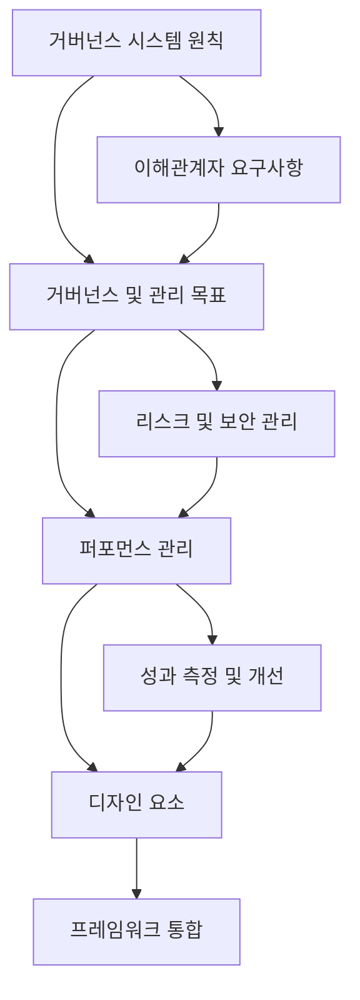

# COBIT 2019: 최신 IT 거버넌스 프레임워크

<!-- mtoc-start -->

- [정의 및 개념](#정의-및-개념)
- [주요 특징](#주요-특징)
- [구성도](#구성도)
  - [구성 요소 설명](#구성-요소-설명)
- [활용 사례](#활용-사례)
- [기대 효과 및 필요성](#기대-효과-및-필요성)
- [마무리](#마무리)
- [Keywords](#keywords)

<!-- mtoc-end -->

오늘날의 디지털 시대에서 기업의 정보와 기술(I&T)을 효과적으로 관리하고 거버넌스하는 것은 성공의 핵심 요소입니다. 이러한 필요성에 부응하여 ISACA는 2018년에 COBIT 2019를 발표하였습니다. 이는 이전 버전인 COBIT 5를 기반으로 최신 기술 동향과 비즈니스 요구를 반영하여 업데이트된 프레임워크입니다.

## 정의 및 개념

COBIT 2019는 기업의 정보와 기술 거버넌스 및 관리를 위한 포괄적인 프레임워크. 이 프레임워크는 비즈니스 목표와 IT 목표의 정렬을 지원하며, IT 프로세스의 효율성과 효과성을 향상시키는 것을 목적으로 합니다.

- 특징: 40개의 거버넌스 및 관리 목표로 구성, 최신 기술 및 비즈니스 동향 반영, 유연하고 개방적인 아키텍처 제공

## 주요 특징

- **거버넌스 시스템 원칙**: COBIT 2019는 6가지 거버넌스 시스템 원칙을 제시하여, 이해관계자의 요구를 충족하고 정보와 기술의 가치를 극대화합니다.
- **거버넌스 및 관리 목표**: 5개의 도메인에 걸쳐 40개의 구체적인 목표를 정의하여, 기업의 IT 관리와 거버넌스 활동을 체계적으로 지원합니다.
- **퍼포먼스 관리**: CMMI 기반의 성숙도 및 역량 측정 모델을 도입하여, IT 프로세스의 성과를 체계적으로 평가하고 개선합니다.
- **디자인 요소**: 기업의 전략, 위험 프로파일, 컴플라이언스 요구사항 등 11가지 디자인 요소를 통해, 각 조직의 특성에 맞는 거버넌스 시스템을 설계할 수 있습니다.
- **프레임워크 통합**: ITIL, ISO 27001, NIST 등 다양한 국제 표준 및 프레임워크와의 통합을 통해, 일관된 거버넌스 구조를 구축할 수 있습니다.

## 구성도

### 구성 요소 설명

- **거버넌스 시스템 원칙**: 정보와 기술 거버넌스의 전반적인 방향을 설정하는 원칙을 정의합니다.
- **거버넌스 및 관리 목표**: 기업의 IT 거버넌스와 관리를 효과적으로 운영하기 위한 구체적인 목표들을 포함합니다.
- **퍼포먼스 관리**: 조직의 IT 프로세스 성숙도를 평가하고 지속적인 개선을 위한 측정 방법을 제공합니다.
- **디자인 요소**: 조직의 비즈니스 환경, 리스크 프로파일, 전략적 목표를 고려한 맞춤형 거버넌스 설계를 지원합니다.
- **프레임워크 통합**: ITIL, ISO 27001, NIST 등 다양한 표준 및 프레임워크와의 연계를 통해 포괄적인 거버넌스 체계를 구축합니다.

## 활용 사례

- **기업의 IT 거버넌스 강화**: COBIT 2019를 도입하여 IT와 비즈니스 목표를 정렬하고, IT 투자 대비 최대의 가치를 창출한 사례가 있습니다.
- **리스크 관리 개선**: 금융 기관에서 COBIT 2019를 활용하여 IT 관련 위험을 체계적으로 식별하고 관리함으로써, 규제 준수와 보안 수준을 향상시킨 사례가 보고되었습니다.

## 기대 효과 및 필요성

COBIT 2019의 도입을 통해 기업은 다음과 같은 긍정적인 효과를 기대할 수 있습니다:

- **비즈니스와 IT의 정렬**: IT 전략과 비즈니스 목표의 일치를 통해, 기업 전체의 효율성과 효과성을 향상시킵니다.
- **리스크 최소화**: 체계적인 위험 관리 프로세스를 통해, IT 관련 위험을 줄이고 대응 능력을 강화합니다.
- **컴플라이언스 준수**: 다양한 국제 표준과의 통합을 통해, 법적 및 규제 요구사항을 효과적으로 준수할 수 있습니다.

## 마무리

디지털 전환이 가속화되는 현대 비즈니스 환경에서, COBIT 2019는 기업의 정보와 기술 거버넌스를 위한 필수적인 프레임워크로 자리매김하고 있습니다. 이를 통해 기업은 IT와 비즈니스의 조화를 이루고, 지속 가능한 성장을 도모할 수 있습니다.

## Keywords

COBIT 2019, IT 거버넌스, 정보 기술 관리, CMMI, 디지털 전환, 리스크 관리, 컴플라이언스, ITIL, ISO 27001, NIST
