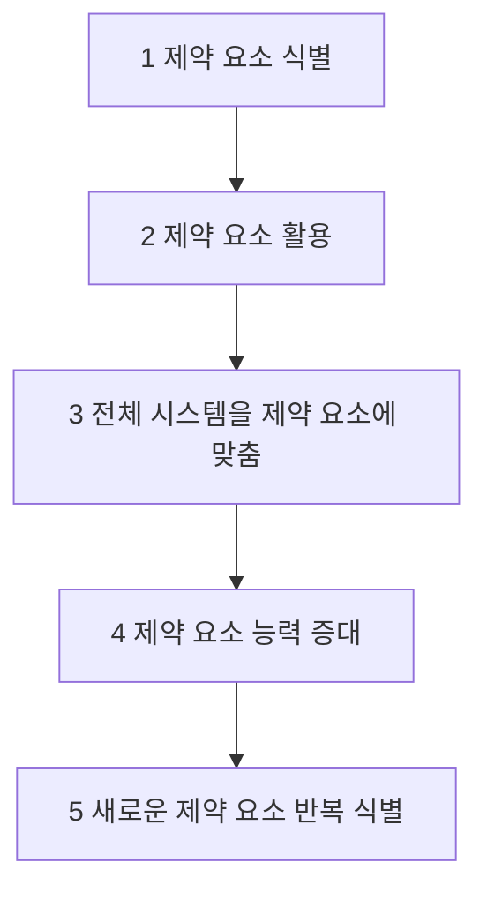

# TOC (Theory of Constraints): 병목을 해결하는 경영 혁신 방법론

<!-- mtoc-start -->

- [정의 및 개념](#정의-및-개념)
- [주요 특징](#주요-특징)
- [TOC의 5단계 집중 프로세스](#toc의-5단계-집중-프로세스)
- [활용 사례](#활용-사례)
- [기대 효과 및 필요성](#기대-효과-및-필요성)
- [마무리](#마무리)
- [Keywords](#keywords)

<!-- mtoc-end -->

기업은 지속적인 성장과 수익성을 유지하기 위해 운영 프로세스를 최적화해야 한다. 하지만 모든 시스템에는 성과를 제한하는 병목 요소가 존재하며, 이를 해결하지 않으면 전체 성과가 저하될 수 있다. TOC(제약 이론, Theory of Constraints)는 이러한 병목을 식별하고 극복함으로써 시스템의 생산성을 극대화하는 경영 혁신 방법론이다.

## 정의 및 개념

TOC(Theory of Constraints, 제약 이론)는 시스템의 목표 달성을 제한하는 병목(제약 조건)을 찾아 해결함으로써 성과를 극대화하는 경영 방법론.

- 핵심 개념: 시스템의 성과는 가장 약한 고리(제약 조건)에 의해 결정됨
- 목적: 병목을 제거하여 전체 시스템의 생산성과 효율성을 향상
- 특징: 제한된 자원을 효율적으로 활용하여 지속적인 개선 가능

## 주요 특징

1. **병목 중심 사고**
   - 시스템의 생산성은 가장 큰 제약 조건(병목)에 의해 결정됨
2. **5단계 집중 프로세스(Five Focusing Steps)**
   - 병목을 식별하고 개선하여 전체 시스템을 최적화하는 단계적 접근 방식
3. **드럼-버퍼-로프(DBR) 시스템**
   - 병목 자원의 효율적 운영을 위한 생산 일정 및 흐름 관리 기법
4. **재고 및 리드 타임 감소**
   - 병목 해결을 통해 불필요한 재고를 줄이고 납기 단축 가능
5. **지속적인 개선(Continuous Improvement)**
   - 병목이 해결되면 새로운 제약 요소를 식별하고 지속적으로 개선

## TOC의 5단계 집중 프로세스

TOC는 위의 5단계를 통해 지속적으로 병목을 찾아 개선함으로써 기업 운영의 최적화를 달성한다.

## 활용 사례

1. **제조업**: 생산 라인의 병목 공정을 찾아 작업 흐름을 개선하여 생산량 증가
2. **서비스업**: 고객 응대 및 프로세스 병목을 해결하여 대기 시간 단축 및 서비스 품질 향상
3. **IT 및 소프트웨어 개발**: 병목이 되는 개발 프로세스를 개선하여 프로젝트 일정 단축
4. **물류 및 공급망 관리**: 물류 병목을 해소하여 재고 비용 절감 및 배송 효율성 향상

## 기대 효과 및 필요성

- **생산성 향상**: 병목을 해결함으로써 전체 시스템 성과 개선
- **비용 절감**: 불필요한 재고 및 리드 타임을 감소하여 비용 효율성 증대
- **경쟁력 강화**: 지속적인 개선을 통해 시장에서의 경쟁 우위 확보
- **고객 만족도 증가**: 프로세스 최적화를 통한 품질 및 서비스 향상

## 마무리

TOC(제약 이론)는 기업이 운영 최적화를 달성하기 위한 강력한 프레임워크를 제공한다. 병목을 식별하고 해결하는 5단계 집중 프로세스를 활용하면 생산성, 효율성 및 수익성을 극대화할 수 있다. 제조업뿐만 아니라 다양한 산업에서 활용 가능하며, 지속적인 개선을 통해 경쟁력을 유지할 수 있는 핵심 전략 중 하나이다.

## Keywords

Theory of Constraints, 제약 이론, 병목 관리, 생산성 향상, 드럼-버퍼-로프, 지속적 개선, 프로세스 최적화, 제조업 혁신, 공급망 병목, 기업 운영 효율화
