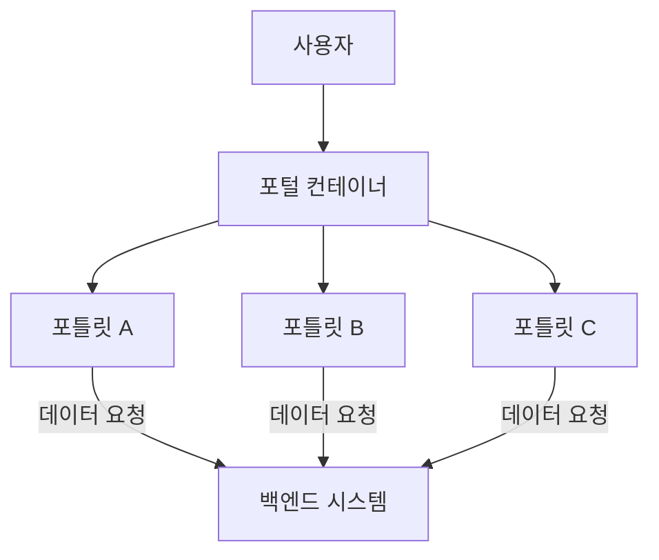

# 포틀릿 (Portlet): 웹 애플리케이션 구성의 핵심 요소

<!-- mtoc-start -->

- [정의 및 개념](#정의-및-개념)
- [주요 특징](#주요-특징)
- [포틀릿 아키텍처](#포틀릿-아키텍처)
- [활용 사례](#활용-사례)
- [기대 효과 및 필요성](#기대-효과-및-필요성)
- [마무리](#마무리)
- [Keywords](#keywords)

<!-- mtoc-end -->

포틀릿(Portlet)은 웹 포털에서 독립적으로 실행되며 콘텐츠를 표시하는 모듈형 구성 요소이다. 포털 환경에서 사용자 맞춤형 콘텐츠 제공과 대시보드 구성에 필수적인 요소로 활용된다. 기업 및 기관에서는 포틀릿을 활용하여 정보 접근성을 향상시키고, 효율적인 웹 애플리케이션을 구축한다.

## 정의 및 개념

포틀릿(Portlet)은 웹 포털에서 개별적으로 실행되며 특정 기능을 제공하는 웹 구성 요소.

- **역할**: 웹 포털 내에서 개별 애플리케이션 또는 위젯 역할 수행
- **목적**: 모듈화된 콘텐츠 제공 및 사용자 맞춤형 정보 전달
- **표준**: JSR 168 및 JSR 286(Java Portlet Specification) 표준 준수

## 주요 특징

1. **모듈화 및 재사용성**
   - 여러 개의 포틀릿을 조합하여 유연한 웹 페이지 구성 가능
2. **독립적 실행 가능**
   - 각 포틀릿은 개별적으로 실행되며, 특정 작업을 수행하는 기능을 제공
3. **사용자 맞춤형 콘텐츠 제공**
   - 사용자의 설정에 따라 동적인 콘텐츠 출력 가능
4. **포털 프레임워크와의 연동**
   - Liferay, IBM WebSphere, Apache Pluto 등의 포털 플랫폼과 호환
5. **보안 및 권한 관리**
   - 사용자 및 역할 기반 접근 제어 가능

## 포틀릿 아키텍처

포틀릿은 포털 컨테이너를 통해 실행되며, 백엔드 시스템과의 데이터 연동을 통해 콘텐츠를 제공한다.

## 활용 사례

1. **기업 포털**: 사내 시스템, 일정 관리, 공지사항 등의 기능 제공
2. **전자 정부 시스템**: 공공 서비스 포털에서 정보 및 서비스 제공
3. **전자 상거래**: 제품 추천, 장바구니, 주문 내역 표시 기능
4. **교육 플랫폼**: 강의 목록, 과제 제출, 성적 확인 등의 모듈 구현

## 기대 효과 및 필요성

- **유연한 웹 구성**: 여러 포틀릿을 조합하여 다양한 사용자 요구 충족
- **운영 효율성 향상**: 모듈화된 구조로 유지보수 용이
- **사용자 경험 개선**: 맞춤형 콘텐츠 제공을 통한 접근성 향상
- **표준 기반 확장성**: JSR 표준 준수를 통해 다양한 포털과 호환 가능

## 마무리

포틀릿(Portlet)은 다양한 웹 포털 환경에서 필수적인 구성 요소로, 모듈화된 콘텐츠 제공과 사용자 맞춤형 인터페이스를 구현하는 데 중요한 역할을 한다. 기업, 공공기관, 교육 및 전자상거래 등 다양한 분야에서 활용되며, 포털 시스템의 유연성과 확장성을 높이는 핵심 기술 중 하나로 자리 잡고 있다.

## Keywords

포틀릿, Portlet, 웹 포털, 모듈화, JSR 168, JSR 286, 사용자 맞춤형 콘텐츠, Liferay, 웹 애플리케이션, 포털 프레임워크
