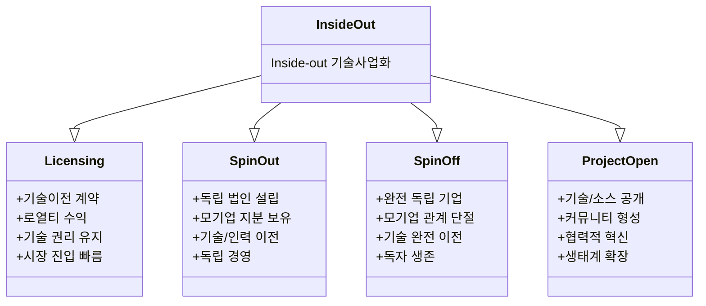

# Inside-Out 유형 4가지: 라이센싱, Spin-Out, Spin-Off, 프로젝트 공개

<!-- mtoc-start -->

- [정의 및 개념](#정의-및-개념)
- [Inside-Out 유형 4가지](#inside-out-유형-4가지)
  - [1. 라이센싱 (Licensing)](#1-라이센싱-licensing)
  - [2. 스핀아웃 (Spin-Out)](#2-스핀아웃-spin-out)
  - [3. 스핀오프 (Spin-Off)](#3-스핀오프-spin-off)
  - [4. 프로젝트 공개 (Open Project)](#4-프로젝트-공개-open-project)
- [Inside-Out 유형 분류](#inside-out-유형-분류)
- [Inside-Out 전략의 기대 효과 및 필요성](#inside-out-전략의-기대-효과-및-필요성)
- [마무리](#마무리)
- [Keywords](#keywords)

<!-- mtoc-end -->

Inside-Out(Open Innovation) 전략은 기업 내부의 기술과 아이디어를 외부로 이전하여 가치를 창출하는 개방형 혁신 방식이다. 기업이 보유한 지식과 기술을 외부와 공유하는 방식에는 여러 가지 유형이 있으며, 대표적으로 라이센싱(Licensing), 스핀아웃(Spin-Out), 스핀오프(Spin-Off), 프로젝트 공개(Open Project) 등이 있다. 이 글에서는 Inside-Out 전략의 주요 4가지 유형과 특징을 상세히 살펴본다.

## 정의 및 개념

Inside-Out 전략이란 기업 내부에서 개발된 기술, 지식 또는 아이디어를 외부 조직이나 시장에 이전하여 추가적인 비즈니스 기회를 창출하는 개방형 혁신 방식.

- **목적**: 기업 내부 자산을 활용하여 새로운 수익원 창출 및 기술 확산
- **특징**: 개방형 혁신(Open Innovation)의 한 형태로, 외부 조직과의 협력을 통한 가치 창출

## Inside-Out 유형 4가지

### 1. 라이센싱 (Licensing)

라이센싱은 기업이 보유한 기술이나 지적 재산권(IP)을 외부 기업이나 기관에 사용 권한을 부여하는 방식.

- **방식**: 특허, 상표, 소프트웨어 등의 사용권 판매 또는 임대
- **장점**:
  - 추가적인 수익 창출 가능
  - 유지보수 및 운영 부담 감소
- **예시**: 반도체, 제약, 소프트웨어 산업에서 활발히 활용됨 (예: ARM의 반도체 설계 라이센스)

### 2. 스핀아웃 (Spin-Out)

스핀아웃은 기업 내부의 기술이나 연구 결과를 활용하여 별도의 독립 기업을 설립하는 방식.

- **방식**: 기존 기업의 연구 프로젝트나 특정 기술을 기반으로 신규 스타트업 창업
- **장점**:
  - 기술 상업화 촉진
  - 외부 투자 유치 가능
- **예시**: 대학 연구소에서 개발한 기술이 스타트업으로 발전하는 경우 (예: Google X에서 Waymo로 독립)

### 3. 스핀오프 (Spin-Off)

스핀오프는 기존 기업의 일부 사업 부문이나 조직을 분리하여 독립적인 회사로 설립하는 전략.

- **방식**: 기존 조직 내 특정 부서를 독립 법인으로 분리
- **장점**:
  - 핵심 사업과 비핵심 사업 분리로 경영 효율성 증대
  - 신규 비즈니스 기회 창출
- **예시**: HP의 프린터 사업부 분리 후 HP Inc.와 Hewlett Packard Enterprise(HPE)로 독립

### 4. 프로젝트 공개 (Open Project)

프로젝트 공개(Open Project)는 기업이 보유한 기술이나 소프트웨어를 오픈소스로 제공하여 외부 개발자 및 기업이 활용할 수 있도록 하는 방식.

- **방식**: 소스 코드, 연구 결과, 데이터 등을 공개하여 협업 유도
- **장점**:
  - 기술 확산 및 생태계 조성 가능
  - 개발 속도 향상 및 혁신 촉진
- **예시**: Google의 TensorFlow, Meta의 PyTorch 등 오픈소스 AI 프레임워크 공개

## Inside-Out 유형 분류

1. 라이센싱(Licensing)

   - 기업이 보유한 기술을 타 기업에 사용권 허가
   - 계약을 통한 로열티 수익 창출
   - 원천기술에 대한 권리는 유지
   - 빠른 시장 진입과 수익화 가능

2. 스핀아웃(Spin-out)

   - 사내 프로젝트/부서를 독립 법인으로 분리
   - 모기업이 지분 일부 보유하며 관리
   - 기술과 인력의 부분적 이전
   - 독립적 경영권 보장되나 모기업 영향력 존재

3. 스핀오프(Spin-off)

   - 완전한 독립 기업으로 분사
   - 모기업과의 자본/인적 관계 완전 단절
   - 기술의 완전한 이전과 독자적 활용
   - 독립적 생존과 성장 추구

4. 프로젝트 공개
   - 기술이나 소스코드를 공개
   - 외부 개발자 커뮤니티 형성
   - 협력적 혁신과 발전 도모
   - 기술 생태계 확장 효과

이러한 유형들은 각각의 장단점이 있으며, 기업의 전략과 목표에 따라 적절한 방식을 선택해야 합니다.

## Inside-Out 전략의 기대 효과 및 필요성

- **기술 상업화 촉진**: 내부 기술을 외부로 이전하여 수익성 극대화 가능
- **비용 절감 및 리스크 분산**: 연구개발 비용을 줄이고, 시장 불확실성 대응 가능
- **생태계 조성**: 협업을 통해 지속적인 혁신과 산업 발전 유도
- **기업 경쟁력 강화**: 기술 활용도를 높여 새로운 사업 기회를 창출

## 마무리

Inside-Out 전략은 기업이 보유한 기술과 지적 자산을 외부와 공유하여 지속적인 혁신을 이루는 강력한 방법이다. 라이센싱, 스핀아웃, 스핀오프, 프로젝트 공개와 같은 다양한 접근 방식을 통해 기업은 새로운 수익 모델을 구축하고, 기술 생태계를 조성할 수 있다. 이러한 전략을 적절히 활용하면 기업의 경쟁력을 높이고 지속 가능한 혁신을 달성할 수 있다.

## Keywords

Inside-Out, Open Innovation, 라이센싱, Spin-Out, Spin-Off, 프로젝트 공개, 기술 상업화, 오픈소스, 기업 혁신, 기술 이전
