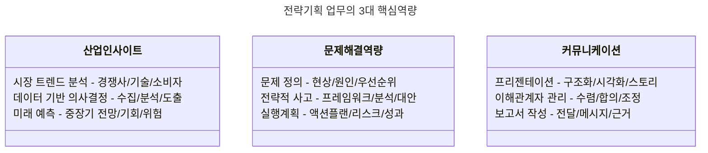
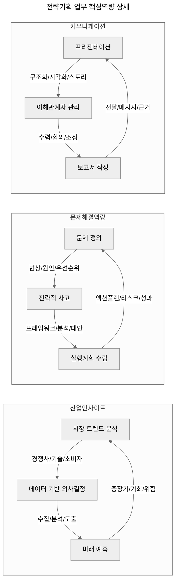

# 전략기획 업무 3가지: 핵심 역량과 역할

<!-- mtoc-start -->

- [1. 산업에 대한 인사이트](#1-산업에-대한-인사이트)
  - [예시](#예시)
- [2. 문제 해결 역량 (전략적 사고)](#2-문제-해결-역량-전략적-사고)
  - [예시](#예시-1)
- [3. 커뮤니케이션 (프리젠테이션)](#3-커뮤니케이션-프리젠테이션)
  - [예시](#예시-2)
- [전략기획 업무의 3대 핵심역량](#전략기획-업무의-3대-핵심역량)
- [마무리](#마무리)
- [Keywords](#keywords)

<!-- mtoc-end -->

전략기획 업무는 기업의 성장과 경쟁력 확보를 위한 필수적인 역할을 수행한다. 전략기획자는 비즈니스 환경을 분석하고, 효과적인 문제 해결 방안을 도출하며, 이를 이해관계자에게 설득력 있게 전달하는 역량을 갖추어야 한다. 이 글에서는 전략기획 업무를 수행하는 데 필수적인 3가지 핵심 역량을 살펴본다.

## 1. 산업에 대한 인사이트

산업에 대한 깊은 이해는 전략을 수립하는 데 있어 가장 기본적인 요소이다. 시장 동향을 파악하고 경쟁사의 전략을 분석하며, 이를 바탕으로 기업의 방향성을 설정하는 것이 핵심이다.

- **시장 및 경쟁 분석**: 산업 구조, 경쟁 환경, 시장 성장 가능성을 분석하여 기업의 위치를 평가
- **트렌드 예측**: 신기술, 정책 변화, 소비자 행동 등을 예측하여 중장기 전략 수립
- **벤치마킹**: 선도 기업의 성공 사례를 분석하여 자사의 전략적 방향성 수립

### 예시

- IT 산업에서 AI와 클라우드 기술 발전이 기업 경쟁력을 좌우하는 요소로 부각됨
- 자동차 산업에서는 친환경차 및 자율주행 기술이 시장을 주도

## 2. 문제 해결 역량 (전략적 사고)

전략기획자는 기업이 직면한 문제를 해결하고, 최적의 솔루션을 도출할 수 있는 논리적이고 분석적인 사고방식을 가져야 한다.

- **문제 정의 및 원인 분석**: 단순한 현상 파악이 아닌 근본적인 문제 원인을 찾아내는 역량
- **가설 설정 및 검증**: 데이터를 기반으로 가설을 세우고, 이를 검증하여 최적의 전략을 도출
- **의사결정 지원**: 경영진이 신속하고 정확한 결정을 내릴 수 있도록 명확한 분석 자료 제공

### 예시

- 매출 감소 문제를 해결하기 위해 고객 세분화 분석을 통해 핵심 타겟층을 재정의
- 비용 절감을 위해 공급망 최적화 및 운영 효율성 증대 방안 도출

## 3. 커뮤니케이션 (프리젠테이션)

전략기획 업무에서 도출한 인사이트와 해결책을 효과적으로 전달하는 역량이 필수적이다. 이를 통해 경영진, 팀원, 투자자 등 다양한 이해관계자와 원활한 협업이 가능하다.

- **스토리텔링 기법 활용**: 복잡한 데이터를 이해하기 쉽게 전달하는 기술
- **시각적 자료 활용**: PPT, 데이터 시각화, 인포그래픽 등을 활용하여 가독성 높은 자료 제작
- **설득력 있는 발표**: 경영진과 이해관계자의 신뢰를 얻을 수 있도록 논리적이고 명확한 커뮤니케이션 수행

### 예시

- 신사업 기획을 위한 투자자 대상 피칭(Pitching) 진행
- 경영진 회의에서 신규 전략 방향 발표 및 실행 계획 설명

## 전략기획 업무의 3대 핵심역량

1. 산업 인사이트

- 시장과 산업의 전반적인 흐름을 이해하고 데이터에 기반한 통찰력 확보
- 경쟁사, 기술, 소비자 트렌드를 종합적으로 분석하여 미래 방향성 예측
- 정량적/정성적 데이터를 결합한 객관적 의사결정 지원

2. 문제해결역량

- 복잡한 비즈니스 이슈의 본질을 정확히 파악하고 우선순위 설정
- 논리적 프레임워크를 활용한 체계적인 분석과 실행 가능한 해결책 도출
- 구체적인 실행계획 수립과 리스크 관리를 통한 성과 달성

3. 커뮤니케이션

- 복잡한 내용을 명확하고 설득력 있게 전달하는 프리젠테이션 역량
- 다양한 이해관계자들의 의견을 조율하고 합의점을 도출하는 능력
- 핵심 메시지와 근거를 명확히 제시하는 문서 작성 능력

이러한 세 가지 역량이 균형있게 갖춰질 때 효과적인 전략기획 업무 수행이 가능합니다. 특히 각 역량은 독립적으로 존재하는 것이 아니라 서로 유기적으로 연결되어 시너지를 창출합니다.

## 마무리

전략기획 업무는 산업 인사이트, 문제 해결 역량, 그리고 효과적인 커뮤니케이션이라는 세 가지 핵심 역량을 요구한다. 시장을 분석하고, 논리적으로 해결책을 도출하며, 이를 명확하게 전달하는 능력을 갖춘다면, 기업의 성장을 이끄는 전략적 리더로 자리 잡을 수 있다.

## Keywords

전략기획, 산업 분석, 문제 해결 역량, 전략적 사고, 프리젠테이션, 데이터 분석, 경영 전략, 시장 트렌드, 의사결정 지원, 비즈니스 인사이트
