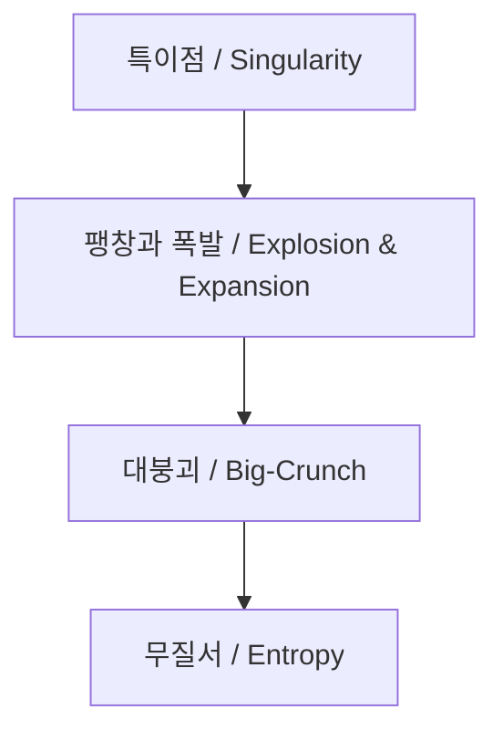
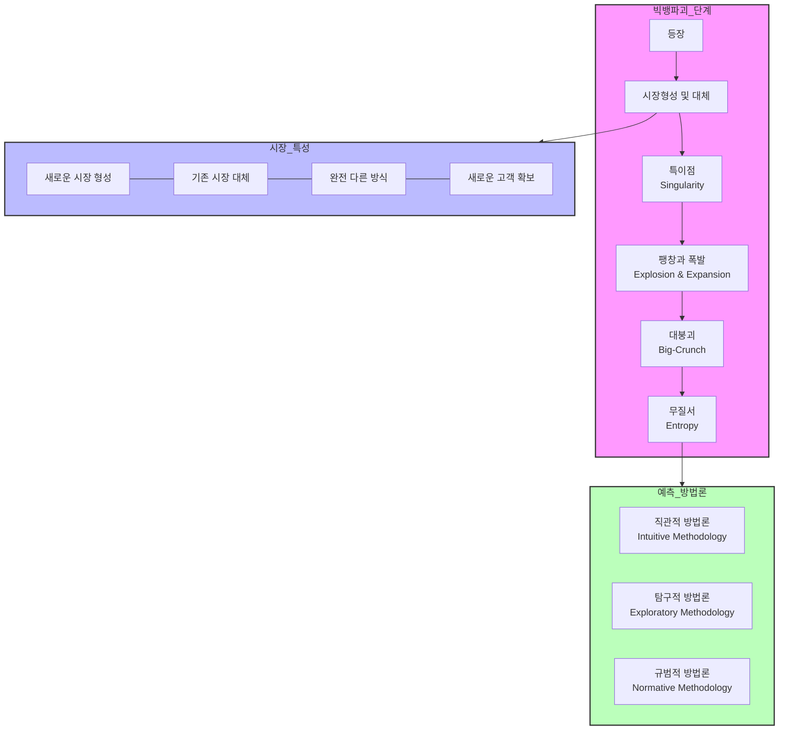

# 빅뱅파괴: 시장을 뒤흔드는 혁신적 변화

<!-- mtoc-start -->

- [정의 및 개념](#정의-및-개념)
- [빅뱅파괴의 진행 과정](#빅뱅파괴의-진행-과정)
- [빅뱅파괴의 진행 과정 및 예측 방법론](#빅뱅파괴의-진행-과정-및-예측-방법론)
- [빅뱅파괴의 대표 사례](#빅뱅파괴의-대표-사례)
- [빅뱅파괴의 예측 방법](#빅뱅파괴의-예측-방법)
- [마무리](#마무리)
- [Keywords](#keywords)

<!-- mtoc-end -->

빅뱅파괴(Big Bang Disruption)는 새로운 기술과 혁신적인 제품이 등장과 동시에 시장을 급격히 변화시키고 기존 시장을 대체하는 현상을 의미한다. 기존의 점진적 혁신과 달리, 빅뱅파괴는 급격한 팽창과 붕괴를 거치는 독특한 특성을 보이며, 전통적인 산업 구조를 빠르게 무너뜨린다. 이 글에서는 빅뱅파괴의 개념, 진행 과정, 예측 방법론 등을 자세히 살펴본다.

## 정의 및 개념

빅뱅파괴(Big Bang Disruption)는 신기술이나 혁신적인 제품이 등장과 동시에 새로운 시장을 형성하고 기존 시장을 급격히 대체하는 현상.

- **핵심 특징**:
  - 등장과 동시에 새로운 시장을 창출
  - 기존 시장을 빠르게 대체
  - 완전히 새로운 방식으로 고객을 확보
  - 전통적인 경쟁 구조를 붕괴
- **관련 경제 이론**: 기술 혁신 주기 이론, 파괴적 혁신(Disruptive Innovation)

## 빅뱅파괴의 진행 과정

빅뱅파괴는 특이점(Singularity)에서 시작해 팽창과 폭발(Explosion & Expansion)을 거쳐, 대붕괴(Big-Crunch) 및 무질서(Entropy) 상태로 진행된다.

- **특이점(Singularity)**: 혁신적인 기술이나 제품이 등장하여 시장의 판도를 바꾸는 초기 단계
- **팽창과 폭발(Explosion & Expansion)**: 신제품이 빠르게 확산되며 대량 소비 시장으로 성장하는 단계
- **대붕괴(Big-Crunch)**: 기존 시장이 붕괴하고 기존 강자들이 도태되는 단계
- **무질서(Entropy)**: 기술이 보편화되고, 경쟁이 격화되며 새로운 혁신을 위한 변화가 필요한 상태

## 빅뱅파괴의 진행 과정 및 예측 방법론

1. 빅뱅파괴의 진행 과정

- 최초 등장 → 시장 진입
- 특이점(Singularity) 도달 → 급격한 변화 시작
- 팽창과 폭발 단계를 거쳐 시장 지배
- 대붕괴를 통한 시장 재편
- 최종적으로 무질서 상태로 진화

2. 시장 특성

- 기존과 완전히 다른 새로운 시장 창출
- 전통적 시장을 대체하는 파괴적 혁신
- 혁신적인 비즈니스 모델 도입
- 새로운 고객층 확보 및 시장 확장

3. 예측 방법론

- 직관적 방법론: 전문가의 경험과 통찰에 기반한 예측
- 탐구적 방법론: 데이터와 트렌드 분석을 통한 예측
- 규범적 방법론: 이론과 모델에 기반한 체계적 예측

이러한 빅뱅파괴 현상은 디지털 전환 시대에 특히 두드러지며, 기업들은 이러한 변화에 대한 예측과 대응이 필수적입니다. 세 가지 예측 방법론을 통합적으로 활용하여 변화에 대비하는 것이 중요.

## 빅뱅파괴의 대표 사례

1. **스마트폰의 등장** → 기존 피처폰 시장 대체
2. **스트리밍 서비스** → 전통적인 DVD 대여 및 방송 시장 붕괴
3. **전기차(EV) 혁명** → 내연기관 자동차 시장 대체
4. **핀테크(디지털 결제, 가상화폐)** → 전통 금융 시스템 변화

## 빅뱅파괴의 예측 방법

빅뱅파괴는 기존의 점진적인 혁신 모델과는 다른 특성을 가지므로, 이를 예측하기 위한 방법론이 필요하다. 대표적인 예측 방법론은 다음과 같다.

1. **직관적 방법론(Intuitive Methodology)**

   - 전문가의 경험과 통찰력을 기반으로 미래 변화를 예측
   - 사례: 미래학자들이 기술 트렌드를 예측하는 방식

2. **탐구적 방법론(Exploratory Methodology)**

   - 현재 기술과 시장 동향을 분석하여 향후 변화를 예측
   - 사례: 데이터 분석, 시장 조사 등을 통한 미래 예측

3. **규범적 방법론(Normative Methodology)**
   - 특정 목표를 설정하고, 이를 달성하기 위한 경로를 예측
   - 사례: 정부 정책 및 기업의 중장기 전략 수립

## 마무리

빅뱅파괴는 전통적인 시장을 빠르게 변화시키며, 기업과 개인 모두에게 도전과 기회를 제공한다. 기존 시장을 점진적으로 변화시키는 것이 아니라, 단기간에 대체하는 특성을 보이므로 이를 예측하고 대비하는 것이 중요하다. 기업들은 직관적, 탐구적, 규범적 방법론을 활용하여 빅뱅파괴의 영향을 최소화하고 새로운 시장에서 경쟁력을 확보해야 한다.

## Keywords

빅뱅파괴, Big Bang Disruption, 파괴적 혁신, 신시장 창출, 기술 혁신, 특이점, 시장 붕괴, 예측 방법론, 규범적 방법론, 탐구적 방법론
