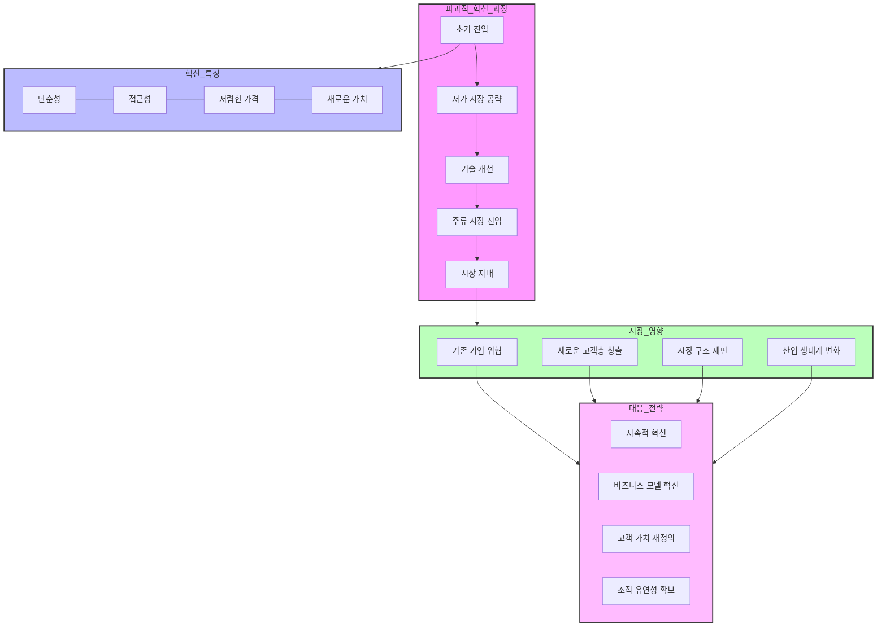

# 파괴적 혁신(Disruptive Innovation): 기존 시장을 무너뜨리는 혁신의 힘

<!-- mtoc-start -->

- [정의 및 개념](#정의-및-개념)
- [주요 특징](#주요-특징)
- [빅뱅혁신 vs 파괴적 혁신 비교표](#빅뱅혁신-vs-파괴적-혁신-비교표)
- [파괴적 혁신의 진행 과정](#파괴적-혁신의-진행-과정)
- [대표적인 사례](#대표적인-사례)
- [기업의 대응 전략](#기업의-대응-전략)
- [마무리](#마무리)
- [Keywords](#keywords)

<!-- mtoc-end -->

기술 발전과 시장 변화 속에서 기업이 지속적인 성장을 이루기 위해서는 혁신이 필수적이다. 그중에서도 "파괴적 혁신(Disruptive Innovation)"은 기존의 강력한 시장 지배자를 무너뜨리고 새로운 질서를 만드는 강력한 힘을 가진 개념이다. 이 글에서는 파괴적 혁신의 정의, 주요 특징, 사례, 그리고 기업이 이에 대응하는 전략에 대해 살펴본다.

## 정의 및 개념

파괴적 혁신(Disruptive Innovation)은 기존 시장의 주요 기업들이 간과하거나 대응하지 못하는 혁신적 기술이나 비즈니스 모델을 통해 새로운 시장을 형성하고 기존 시장을 대체하는 현상.

- **주요 개념**:

  - 기존 시장의 주류 기업들이 간과한 저가 또는 틈새 시장에서 시작
  - 시간이 지나면서 기술 발전과 소비자 수용이 증가하여 기존 시장을 대체
  - 시장 지배자들이 따라잡기 어려운 속도로 성장

- **창시자**: 하버드 비즈니스 스쿨의 클레이튼 크리스텐슨(Clayton Christensen)이 1997년 "혁신자의 딜레마(The Innovator’s Dilemma)"에서 개념화

## 주요 특징

1. **새로운 시장 창출**
   - 기존 시장에서는 제공되지 않던 새로운 가치와 경험을 제공하며, 새로운 소비자층을 확보함
2. **기존 제품보다 저렴하거나 단순한 솔루션 제공**

   - 초기에는 성능이 기존 제품보다 떨어질 수 있으나, 가격 경쟁력과 쉬운 접근성으로 시장에 진입

3. **점진적인 성능 향상**

   - 시간이 지남에 따라 기술이 발전하고, 기존 시장의 주류 소비자들도 점차 수용

4. **기존 강자의 무시 또는 대응 지연**
   - 시장 지배자들이 초기에는 위협으로 인식하지 않다가, 어느 순간 급격한 변화가 발생하여 대응이 어려워짐

## 빅뱅혁신 vs 파괴적 혁신 비교표

| 항목               | 빅뱅혁신(Big Bang Innovation)                        | 파괴적 혁신(Disruptive Innovation)                       |
| ------------------ | ---------------------------------------------------- | -------------------------------------------------------- |
| **정의**           | 신기술이 등장과 동시에 시장을 급격히 변화시키는 혁신 | 기존 시장을 점진적으로 대체하는 혁신                     |
| **속도**           | 매우 빠른 확산과 변화                                | 비교적 점진적인 확산                                     |
| **시장 영향**      | 기존 시장을 즉시 대체하고 새로운 시장을 창출         | 기존 시장의 저가 또는 틈새 시장에서 시작하여 점진적 대체 |
| **예시**           | 스마트폰, 전기차, 스트리밍 서비스                    | 넷플릭스 vs. 블록버스터, 디지털 카메라 vs. 필름 카메라   |
| **기업 대응 방식** | 빠른 시장 대응과 기술 주도권 확보                    | 점진적 대응 및 신기술 투자 필요                          |
| **주요 전략**      | 단기간 내 시장 장악과 네트워크 효과 극대화           | 신흥 시장 공략 후 점진적 확산                            |

## 파괴적 혁신의 진행 과정

---

1. 파괴적 혁신의 진행 과정

- 초기에는 틈새시장이나 하위시장에 진입
- 저가 시장을 공략하며 기술력 축적
- 지속적인 기술 개선으로 성능 향상
- 점진적으로 주류 시장으로 진입
- 최종적으로 기존 시장 지배

2. 혁신의 주요 특징

- 단순성: 복잡한 제품/서비스를 단순화
- 접근성: 더 많은 사용자가 쉽게 접근
- 저렴한 가격: 비용 혁신을 통한 가격 경쟁력
- 새로운 가치: 기존과 다른 가치 제안

3. 시장에 미치는 영향

- 기존 선도 기업들의 시장 지위 위협
- 새로운 고객층 발굴 및 시장 확대
- 산업 구조의 근본적 재편
- 전체 산업 생태계의 변화 유도

4. 기업의 대응 전략

- 지속적인 혁신 투자와 기술 개발
- 비즈니스 모델의 근본적 혁신
- 고객 가치의 재정의와 새로운 가치 제안
- 조직의 유연성과 대응력 강화

파괴적 혁신은 단순히 기술의 진보가 아닌 시장과 산업 구조를 근본적으로 변화시키는 혁신.\
성공적인 파괴적 혁신을 위해서는 기술력뿐만 아니라 비즈니스 모델의 혁신과 시장에 대한 깊은 이해가 필요.\
파괴적 혁신은 초기에는 작은 시장에서 시작하지만, 기술 개선과 함께 점차 기존 시장을 대체하는 구조.

## 대표적인 사례

1. **넷플릭스(Netflix) vs. 블록버스터(Blockbuster)**

   - DVD 대여 서비스로 시작한 넷플릭스는 스트리밍 서비스를 도입하며 기존 비디오 대여 시장을 파괴

2. **스마트폰 vs. 피처폰**

   - 애플의 아이폰이 등장하면서 노키아, 모토로라 등의 피처폰 시장을 대체

3. **전기차(EV) vs. 내연기관차**

   - 테슬라를 필두로 한 전기차 기술이 발전하면서 기존 내연기관차 시장에 대한 위협 증가

4. **디지털 카메라 vs. 필름 카메라**
   - 코닥(Kodak)은 디지털 카메라 시장을 무시하다가 결국 도태됨

## 기업의 대응 전략

기업이 파괴적 혁신에 대응하고 이를 활용하기 위해서는 다음과 같은 전략이 필요하다.

1. **시장 변화에 대한 지속적인 모니터링**

   - 신생 기업과 기술의 변화를 주시하고, 조기에 대응할 수 있도록 준비

2. **자체적인 파괴적 혁신 시도**

   - 내부 스타트업, 연구개발(R&D) 투자, 신사업 확장을 통해 새로운 시장 창출

3. **기존 사업의 유연한 변화**

   - 기존 제품의 개선뿐만 아니라 새로운 비즈니스 모델을 도입하여 지속적인 경쟁력 확보

4. **개방형 혁신(Open Innovation) 활용**
   - 외부 스타트업과 협력하거나 인수합병(M&A)을 통해 혁신을 흡수

## 마무리

파괴적 혁신은 단순한 기술 변화가 아니라 산업 구조 자체를 변화시키는 강력한 힘을 가지고 있다. 기업이 시장에서 지속적인 경쟁력을 유지하기 위해서는 혁신을 무시하지 않고 적극적으로 받아들이며, 유연한 전략을 통해 변화를 주도하는 것이 중요하다.

## Keywords

파괴적 혁신, Disruptive Innovation, 넷플릭스, 테슬라, 클레이튼 크리스텐슨, 혁신자의 딜레마, 신시장 창출, 기술 혁신, 기업 전략, 비즈니스 모델
