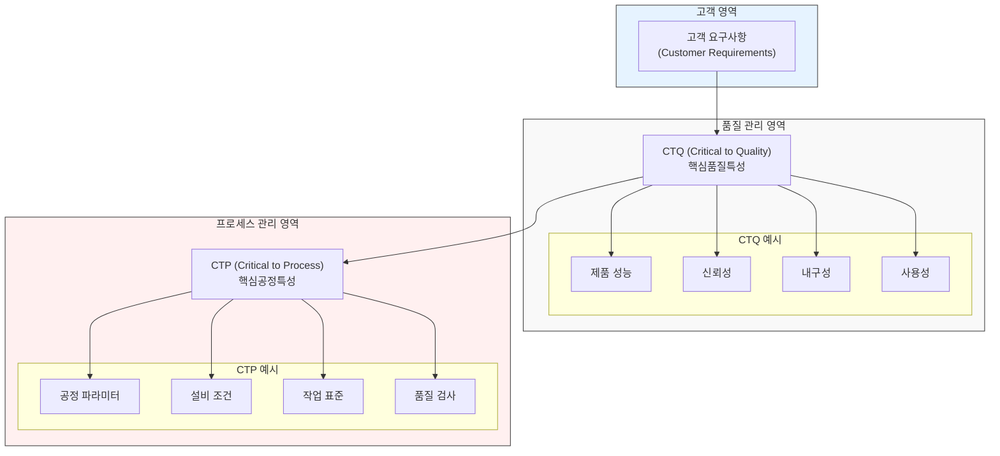

# CTQ (Critical to Quality): 핵심 품질 인자

<!-- mtoc-start -->

- [CTQ (Critical to Quality)의 정의 및 개념](#ctq-critical-to-quality의-정의-및-개념)
- [CTP (Critical to Process)와의 관계](#ctp-critical-to-process와의-관계)
- [CTQ의 주요 요소](#ctq의-주요-요소)
- [CTQ를 관리하는 방법](#ctq를-관리하는-방법)
- [CTQ와 CTP 관계도](#ctq와-ctp-관계도)
- [마무리](#마무리)
- [Keywords](#keywords)

<!-- mtoc-end -->

기업이 고객 만족을 극대화하기 위해서는 제품이나 서비스의 품질을 철저히 관리해야 한다. 특히, 품질에 결정적인 영향을 미치는 요소를 식별하고 이를 효과적으로 관리하는 것이 중요하다. CTQ(Critical to Quality)는 이러한 핵심 품질 인자를 의미하며, 고객이 요구하는 수준에 맞춰 관리해야 하는 주요 항목을 포함한다. 또한, CTQ를 결정짓는 핵심 공정 관리 항목을 CTP(Critical to Process)라고 한다. 본 글에서는 CTQ의 개념, CTP와의 관계, 주요 요소 및 활용 방법을 상세히 살펴본다.

## CTQ (Critical to Quality)의 정의 및 개념

CTQ(Critical to Quality)는 제품이나 서비스의 품질을 결정짓는 중요한 요소로, 고객의 기대와 요구사항을 충족시키는 데 필수적인 기준.

- **핵심 개념**:

  - 고객의 요구사항을 직접적으로 반영하는 품질 속성
  - 고객 만족도를 결정하는 주요 품질 특성
  - 기업이 집중적으로 관리해야 할 품질 항목

- **CTQ의 중요성**:
  - 고객 요구사항을 충족하여 만족도 향상
  - 제품 불량률 감소 및 프로세스 최적화
  - 브랜드 신뢰성 강화 및 경쟁력 확보

## CTP (Critical to Process)와의 관계

CTP(Critical to Process)는 CTQ를 달성하기 위해 반드시 관리해야 하는 프로세스(공정) 항목.

- **CTQ vs. CTP 비교**
  | 항목 | CTQ (Critical to Quality) | CTP (Critical to Process) |
  |------|-------------------------|--------------------------|
  | **정의** | 품질에 결정적인 영향을 미치는 요소 | 품질을 보장하기 위해 관리해야 할 공정 요소 |
  | **중점 사항** | 고객 요구사항 충족 | 제조·운영 프로세스 최적화 |
  | **예시** | 제품의 강도, 디자인, 내구성 | 원자재 품질, 온도·압력 조절, 제조 속도 |

## CTQ의 주요 요소

1. **기능(Functionality)**

   - 제품이나 서비스가 고객의 기대에 부합하는 기능을 수행하는지 여부
   - 예: 스마트폰의 배터리 수명, 자동차의 연비

2. **신뢰성(Reliability)**

   - 제품이 일정 기간 동안 일관된 성능을 유지하는 정도
   - 예: 전자제품의 고장률, 의료 기기의 정확성

3. **내구성(Durability)**

   - 제품이 외부 환경에서도 일정 수준 이상의 품질을 유지하는 능력
   - 예: 건축 자재의 내구성, 방수 기능

4. **안전성(Safety)**

   - 제품 사용 중 발생할 수 있는 위험 요소를 최소화하는 것
   - 예: 자동차의 충돌 안전성, 식품의 위생 관리

5. **사용 편의성(Usability)**
   - 고객이 제품을 쉽게 사용할 수 있도록 설계하는 요소
   - 예: 소프트웨어 UI/UX, 전자기기의 조작 간편성

## CTQ를 관리하는 방법

1. **고객 요구사항 분석**

   - 고객의 기대치를 명확히 파악하여 CTQ를 정의
   - VOC(Voice of Customer) 및 설문조사 활용

2. **품질 측정 및 데이터 기반 관리**

   - KPI(Key Performance Indicator) 설정 및 모니터링
   - 실험 데이터 및 통계 분석을 통해 품질 최적화

3. **프로세스 개선 및 CTP 관리**

   - 공정 내 변수를 최적화하여 품질 향상
   - Lean Six Sigma 등의 품질 관리 기법 적용

4. **지속적인 피드백 및 개선**
   - 지속적인 품질 검사 및 개선 활동 수행
   - 고객 피드백을 반영한 품질 혁신 추진

## CTQ와 CTP 관계도

1. CTQ (Critical to Quality)

- 정의: 제품이나 서비스의 품질에 결정적 영향을 미치는 핵심 특성
- 고객의 요구사항을 직접적으로 반영하는 품질 특성
- 반드시 고객이 원하는 수준으로 관리되어야 하는 항목
- 예: 제품 성능, 신뢰성, 내구성, 사용성 등

2. CTP (Critical to Process)

- 정의: CTQ를 달성하기 위해 필요한 핵심 공정 특성
- CTQ를 실현하기 위한 구체적인 프로세스 관리 항목
- 기업 내부에서 통제하고 관리해야 하는 항목
- 예: 공정 파라미터, 설비 조건, 작업 표준, 품질 검사 등

3. CTQ와 CTP의 관계

- CTQ는 고객 관점의 품질 요구사항
- CTP는 기업 관점의 프로세스 관리 요소
- CTQ 달성을 위해 CTP가 적절히 관리되어야 함
- 양자는 상호 연계되어 있으며, 품질 관리의 두 축을 형성

이러한 체계적인 품질 관리 시스템을 통해 고객 만족과 기업의 품질 목표를 동시에 달성할 수 있습니다.

## 마무리

CTQ(Critical to Quality)는 기업이 품질을 유지하고 경쟁력을 확보하는 핵심 요소다. 이를 효과적으로 관리하기 위해서는 CTP(Critical to Process)와의 연계를 이해하고, 데이터 기반의 지속적인 개선을 수행해야 한다. 고객 만족을 극대화하기 위해서는 품질 관리 시스템을 구축하고 철저한 모니터링을 통해 CTQ 요소를 최적화해야 한다.

## Keywords

CTQ, Critical to Quality, 핵심 품질 인자, CTP, 품질 관리, 고객 요구사항, 프로세스 최적화, 품질 측정, 신뢰성, 내구성
