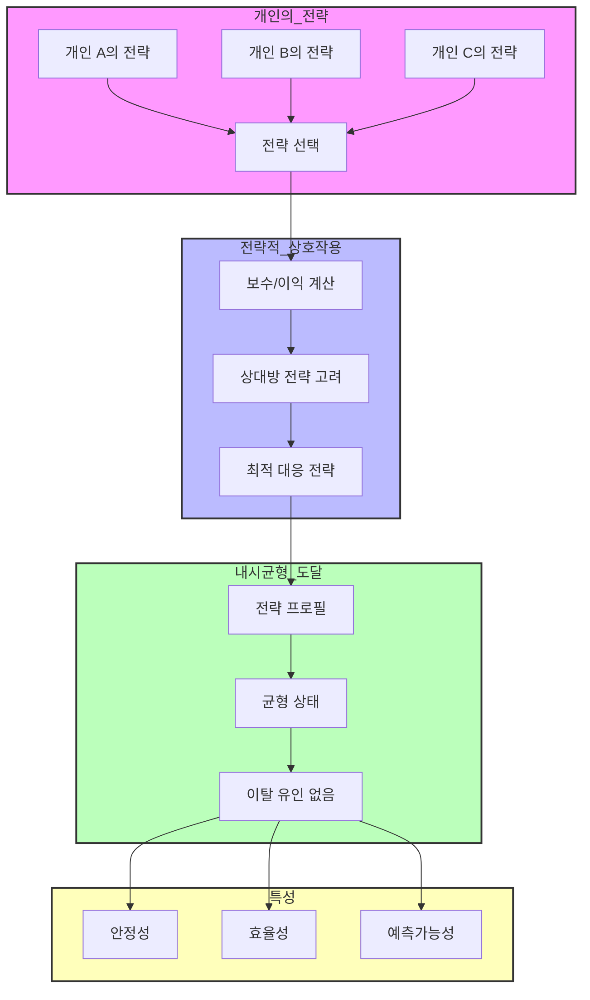

# 내시균형(Nash Equilibrium): 개인과 집단의 최적 전략

<!-- mtoc-start -->

- [내시균형의 개념 및 역사적 배경](#내시균형의-개념-및-역사적-배경)
- [죄수의 딜레마와 내시균형](#죄수의-딜레마와-내시균형)
  - [죄수의 딜레마 시나리오](#죄수의-딜레마-시나리오)
- [내시균형 개념도](#내시균형-개념도)
- [내시균형의 시사점 및 정책적 함의](#내시균형의-시사점-및-정책적-함의)
- [마무리](#마무리)
- [Keywords](#keywords)

<!-- mtoc-end -->

경제학과 게임이론에서 중요한 개념 중 하나인 내시균형(Nash Equilibrium)은 개인이 자신의 이익을 극대화하려 할 때, 전체 집단의 최적 상태가 반드시 보장되지 않을 수 있음을 보여주는 개념이다. 이는 전통적인 경제학 이론과 대비되는 시각을 제공하며, 정책적 개입의 필요성까지 시사한다.

## 내시균형의 개념 및 역사적 배경

내시균형(Nash Equilibrium)은 게임이론에서 각 참여자가 자신의 전략을 최적화한 상태에서, 상대방이 자신의 전략을 변경하지 않는 한 어떠한 개인도 자신의 전략을 바꿀 이유가 없는 상태를 의미한다. 이는 미국 수학자 존 내시(John Nash)에 의해 1950년대에 정립되었으며, 기존 경제학 이론과의 차별점을 가진다.

- **고전 경제학(국부론, 아담 스미스)**

  - 개인이 자신의 이익을 추구하면 결국 집단 전체가 이롭게 된다고 주장
  - 자유시장 경제에서 보이지 않는 손(Invisible Hand) 개념을 강조

- **내시의 균형 이론(존 내시, Nash Equilibrium)**
  - 개인의 이익 추구가 반드시 전체 사회의 부와 이익을 극대화하지는 않는다고 주장
  - 오히려 집단이 최적의 상태에 도달하기 위해서는 개개인이 약간의 손해를 감수해야 함

## 죄수의 딜레마와 내시균형

대표적인 예로 **죄수의 딜레마(Prisoner’s Dilemma)**가 있다. 이는 두 명의 죄수가 서로 협력하지 않고 자신만의 이익을 추구할 때, 결과적으로 모두에게 불리한 결과를 초래하는 상황을 설명하는 이론이다.

### 죄수의 딜레마 시나리오

|                       | 죄수 B 협력(침묵) | 죄수 B 배신(자백) |
| --------------------- | ----------------- | ----------------- |
| **죄수 A 협력(침묵)** | A: 1년, B: 1년    | A: 3년, B: 0년    |
| **죄수 A 배신(자백)** | A: 0년, B: 3년    | A: 2년, B: 2년    |

- **내시균형 상태**: 두 죄수 모두 '자백'하는 선택을 하게 됨 (배신, 배신)
- **비효율적 결과**: 협력했을 경우보다 더 높은 형량을 받게 됨
- **시사점**: 개인이 자신의 이익을 극대화하는 행동이 반드시 전체 집단의 최적 결과를 보장하지 않음

## 내시균형 개념도

1. 정의와 기본 개념

- 내시균형: 게임 참여자 모두가 다른 참여자들의 전략을 주어진 것으로 보고 자신의 전략을 최적화한 상태.
- 모든 참여자가 상대방의 전략을 고려했을 때 현재 전략에서 이탈할 유인이 없는 상태를 의미.

2. 주요 특징

- 안정성: 어떤 참여자도 자신의 전략을 일방적으로 변경하여 이익을 증가시킬 수 없음
- 예측가능성: 합리적인 참여자들의 행동을 예측.
- 자기강화성: 일단 균형에 도달하면 참여자들의 행동이 균형을 유지하려는 경향.

3. 실제 적용

- 경제학: 기업들의 가격 책정, 시장 진입 전략 분석
- 정치학: 국가 간 협상, 투표 행위 분석
- 사회학: 사회적 규범의 형성과 유지 설명

4. 한계와 고려사항

- 완전한 합리성 가정: 현실에서는 참여자들이 항상 합리적이지 않음.
- 다중균형: 여러 개의 내시균형이 존재할 수 있어 어떤 균형이 실현될지 예측이 어려움.
- 정보의 불완전성: 현실에서는 완전한 정보를 가정하기 어려움.

내시균형의 개념은 개인과 집단의 전략적 의사결정을 이해하고 분석하는 데 중요한 도구.

## 내시균형의 시사점 및 정책적 함의

1. **개인의 이기적인 행동이 반드시 사회 전체를 이롭게 하지 않음**

   - 전통 경제학과 달리, 개인의 최적 선택이 사회적 최적 상태로 연결되지 않을 수 있음

2. **집단적 최적 결과를 위해 협력이 필요함**

   - 사회 구성원이 서로 협력할 때, 더 나은 집단적 이익을 창출할 수 있음

3. **정부의 개입 필요성**
   - 현실에서 모든 개인이 합리적으로 행동하지 않기 때문에, 정부나 공공기관이 적절한 규제와 인센티브를 제공하여 협력을 유도할 필요가 있음
   - 예: 환경 규제, 공정거래법, 공공재 제공 등

## 마무리

내시균형은 개인의 이기적인 선택이 반드시 사회 전체에 긍정적인 영향을 주지 않으며, 집단적 최적화를 위해 협력이 필수적이라는 점을 강조한다. 죄수의 딜레마 사례를 통해 이를 쉽게 이해할 수 있으며, 이러한 개념은 경제학뿐만 아니라 정치학, 사회학, 심리학 등 다양한 분야에서 활용된다. 또한, 정부의 적절한 개입을 통해 집단의 장기적인 이익을 보장할 필요가 있다는 점에서 정책적 함의도 크다.

## Keywords

내시균형, Nash Equilibrium, 죄수의 딜레마, 게임이론, 아담 스미스, 국부론, 협력과 배신, 정부 개입, 경제학, 사회 최적화
