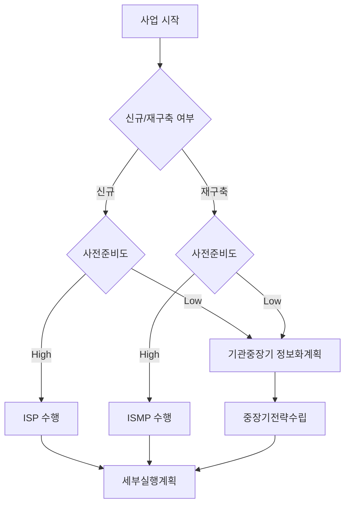
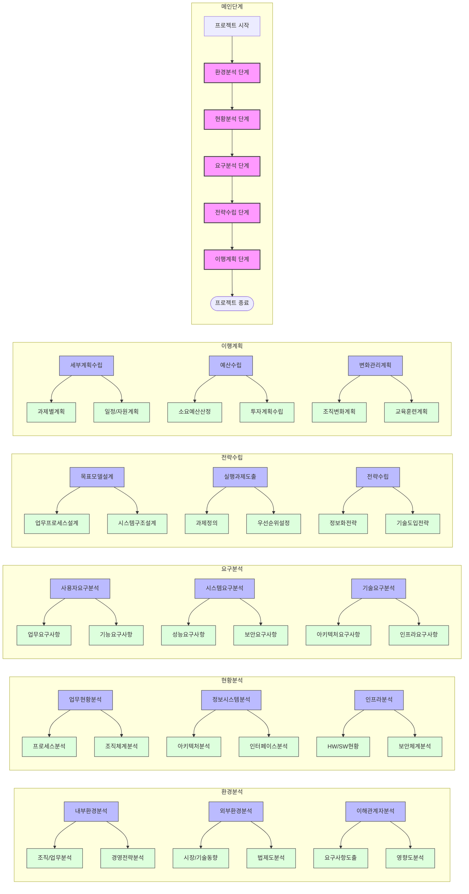
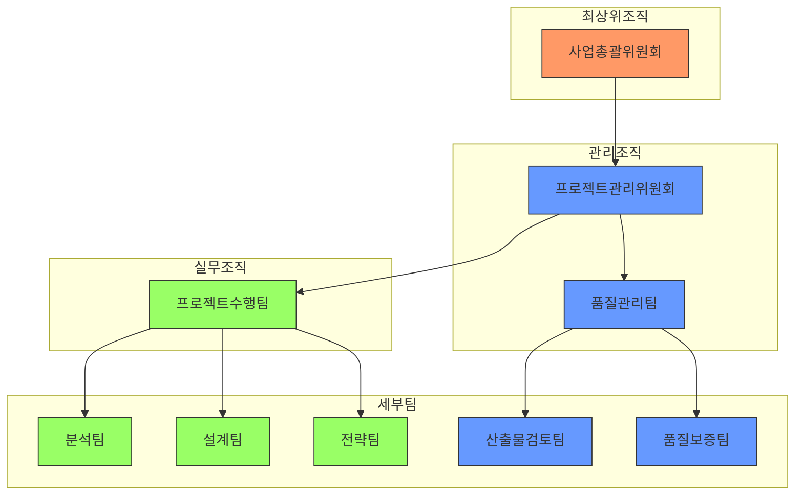
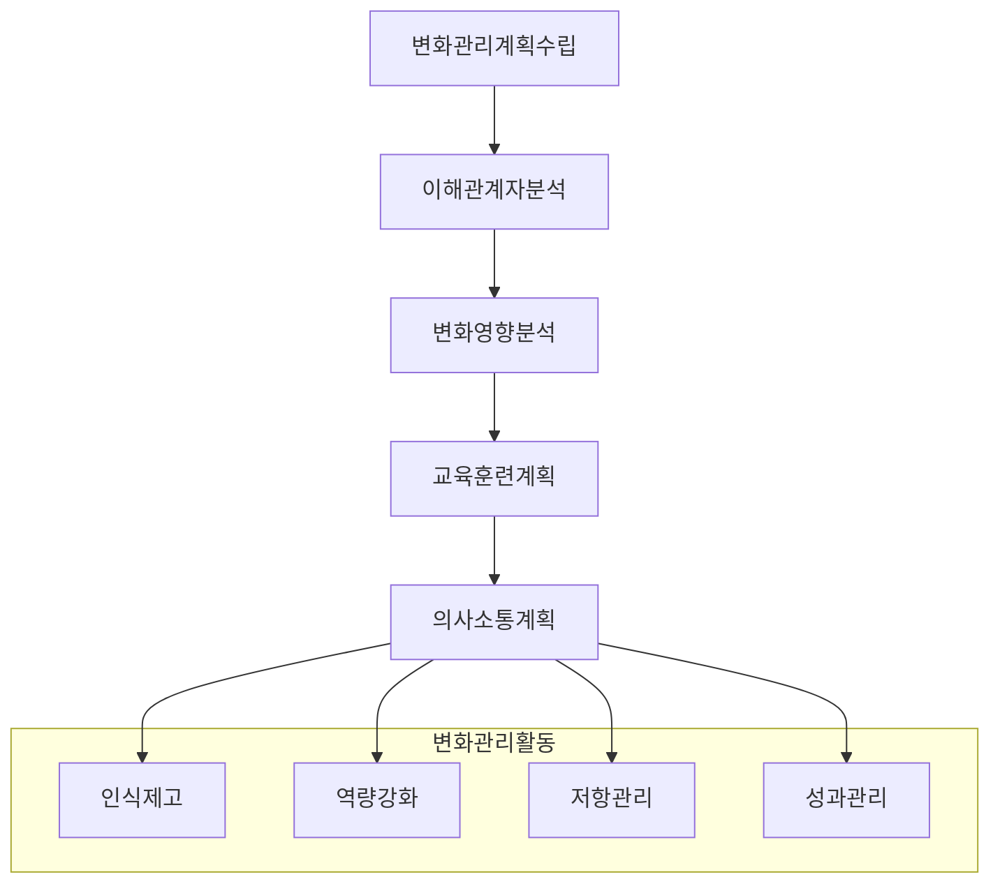

# ISP/ISMP 수립 공통가이드 6판: 효과적인 정보화 전략 수립

<!-- mtoc-start -->

- [가이드 개요 및 주요 개정사항](#가이드-개요-및-주요-개정사항)
  - [1.1 기본 개요](#11-기본-개요)
  - [1.2 주요 개정사항](#12-주요-개정사항)
- [1. 가이드라인의 기본 구성](#1-가이드라인의-기본-구성)
  - [계획 수립의 기본방향](#계획-수립의-기본방향)
  - [사업유형별 구분](#사업유형별-구분)
    - [신규사업](#신규사업)
    - [재구축사업](#재구축사업)
- [2. ISP 주요 내용](#2-isp-주요-내용)
  - [경영환경 분석](#경영환경-분석)
  - [업무 프로세스 분석](#업무-프로세스-분석)
- [3. ISMP 주요 내용](#3-ismp-주요-내용)
  - [현행 시스템 분석](#현행-시스템-분석)
  - [요구사항 분석](#요구사항-분석)
- [4. 기관 중장기 정보화 계획](#4-기관-중장기-정보화-계획)
  - [정보화 비전/전략](#정보화-비전전략)
  - [투자계획 수립](#투자계획-수립)
- [5. 실행 관리 방안](#5-실행-관리-방안)
  - [성과관리](#성과관리)
  - [변화관리](#변화관리)
- [6. 사업유형 선택 프로세스](#6-사업유형-선택-프로세스)
- [7. 사업유형별 특징 비교](#7-사업유형별-특징-비교)
- [8. 단계별 주요 활동](#8-단계별-주요-활동)
- [4. 주요 산출물 목록](#4-주요-산출물-목록)
- [5. 품질관리 지표](#5-품질관리-지표)
- [6. 수행조직 구성](#6-수행조직-구성)
- [7. 위험관리 매트릭스](#7-위험관리-매트릭스)
- [8. 변화관리 전략](#8-변화관리-전략)
- [마무리](#마무리)
- [Keywords](#keywords)

<!-- mtoc-end -->

## 가이드 개요 및 주요 개정사항

### 1.1 기본 개요

- 명칭이 'ISP·ISMP 수립 공통가이드'로 변경됨
- 정보화 전략 계획(ISP)과 정보시스템 마스터플랜(ISMP) 수립 시 필수 수행사항을 정의
- 정보화 사업의 체계적인 기획과 효율적인 추진을 위한 지침 제공

### 1.2 주요 개정사항

- 산출물 검토신청 절차 개선: 연중 수시 접수 체계 도입
- 정보화 계획 수립 유형 세분화: ISP, ISMP, 기관 중장기 정보화 계획으로 구분
- 디지털 정부 구현을 위한 요소 강화: AI·데이터 기술, 통합인증체계 등 반영

## 1. 가이드라인의 기본 구성

### 계획 수립의 기본방향

- **정보화 전략과 경영전략 연계성 강화**

  - 조직의 미션과 비전을 정보화 전략에 명확히 반영
  - 경영목표 달성을 위한 정보화 지원방안 구체화
  - 정보화 투자의 경영성과 기여도 평가체계 구축

- **구체적이고 실행 가능한 계획 수립**

  - 현실적인 목표와 일정 설정으로 실행력 제고
  - 조직의 역량과 자원을 고려한 단계적 접근
  - 세부 실행과제별 책임과 권한의 명확한 정의

- **정보자원의 효율적 관리와 활용**
  - 기존 정보자원의 활용도 극대화 방안 수립
  - 신규 도입 자원의 투자효과 분석
  - 정보자원 생명주기별 관리방안 수립

### 사업유형별 구분

#### 신규사업

- **업무 프로세스 재설계 검토**

  - 현행 업무 프로세스의 문제점 분석
  - 정보화를 통한 업무혁신 방안 도출
  - 이해관계자 의견수렴 및 합의형성

- **신기술 도입 가능성 평가**
  - 최신 IT 트렌드 분석 및 적용가능성 검토
  - 기술도입에 따른 위험요소 분석
  - 기술검증 및 시범적용 방안 수립

#### 재구축사업

- **현행 시스템 분석**

  - 시스템 운영현황 및 문제점 파악
  - 사용자 만족도 및 요구사항 조사
  - 시스템 노후화 정도 평가

- **개선방안 수립**
  - 단계적 시스템 전환 전략 수립
  - 업무 연속성 보장방안 마련
  - 사용자 혼란 최소화 방안 도출

## 2. ISP 주요 내용

### 경영환경 분석

- **조직 미션/비전 분석**

  - 조직의 존재 목적과 미래상 파악
  - 중장기 발전계획과의 연계성 확보
  - 경영진의 정보화 방향성 반영

- **내부/외부 환경 분석**
  - 조직 구조 및 업무 체계 분석
  - 외부 이해관계자 요구사항 파악
  - 정보화 관련 법/제도 환경 검토

### 업무 프로세스 분석

- **현행 프로세스 분석**

  - 업무 절차 및 규정 검토
  - 업무수행 상의 문제점 도출
  - 정보화 지원 필요영역 식별

- **To-Be 프로세스 설계**
  - 업무 효율화 방안 도출
  - 정보시스템 지원방안 구체화
  - 업무 혁신 목표 수립

## 3. ISMP 주요 내용

### 현행 시스템 분석

- **시스템 아키텍처 분석**

  - 하드웨어/소프트웨어 구성 현황
  - 네트워크 구성 및 성능 분석
  - 시스템 간 연계현황 파악

- **데이터베이스 구조 분석**
  - 데이터 모델 검토
  - 데이터 품질 수준 평가
  - 데이터 보안체계 분석

### 요구사항 분석

- **사용자 요구사항**

  - 업무담당자 인터뷰 및 설문
  - 시스템 개선요구사항 수집
  - 사용자 편의성 개선방안 도출

- **시스템 요구사항**
  - 성능 및 용량 요구사항
  - 보안 요구사항
  - 시스템 확장성 요구사항

## 4. 기관 중장기 정보화 계획

### 정보화 비전/전략

- **중장기 발전방향**

  - 기관의 미래상과 발전목표 분석
  - 정보화를 통한 지원방안 도출
  - 단계별 발전방안 수립

- **전략 체계 수립**
  - 전략목표별 추진과제 도출
  - 성과지표 개발
  - 이행관리 체계 수립

### 투자계획 수립

- **소요예산 산정**

  - 과제별 세부 예산 산출
  - 연차별 투자계획 수립
  - 예산확보 방안 검토

- **투자 우선순위**
  - 시급성 및 중요도 평가
  - 투자효과 분석
  - 제약사항 검토

## 5. 실행 관리 방안

### 성과관리

- **성과지표 개발**

  - 정량적/정성적 지표 설정
  - 측정방법 정의
  - 목표치 설정

- **모니터링 체계**
  - 주기적 성과측정 방안
  - 문제점 조기발견 체계
  - 개선조치 이행관리

### 변화관리

- **조직 변화관리**

  - 조직문화 혁신방안
  - 저항관리 방안
  - 동기부여 방안

- **교육 계획**
  - 사용자 교육 프로그램
  - 운영자 교육 계획
  - 교육효과 평가방안

이러한 상세 내용들은 각 기관의 특성과 상황에 맞게 선택적으로 적용되며, 실제 수행 시에는 더욱 구체적인 실행 방안이 포함되어야 합니다. 특히 디지털 전환 시대에 맞춰 클라우드, AI, 빅데이터 등 신기술 도입 검토가 필수적이며, 정보보안과 개인정보보호에 대한 고려도 매우 중요합니다.

## 6. 사업유형 선택 프로세스

## 7. 사업유형별 특징 비교

| 구분       | ISP      | ISMP       | 기관중장기 정보화계획 |
| ---------- | -------- | ---------- | --------------------- |
| 적용대상   | 신규사업 | 재구축사업 | 전사적 정보화계획     |
| 수행기간   | 3-6개월  | 4-8개월    | 6-12개월              |
| 주요초점   | 전략수립 | 구현방안   | 중장기비전            |
| 산출물깊이 | 개념수준 | 상세수준   | 전략수준              |
| 사전준비도 | High     | High       | Low                   |

## 8. 단계별 주요 활동

1. 환경분석 단계

   - 내부환경분석보고서
   - 외부환경분석보고서
   - 이해관계자요구사항정의서

2. 현황분석 단계

   - 업무프로세스현황분석서
   - 정보시스템현황분석서
   - 인프라구성현황분석서

3. 요구분석 단계

   - 사용자요구사항정의서
   - 시스템요구사항정의서
   - 기술요구사항정의서

4. 전략수립 단계

   - 목표모델설계서
   - 실행과제정의서
   - 정보화전략보고서

5. 이행계획 단계
   - 세부실행계획서
   - 예산투자계획서
   - 변화관리계획서

**주요특징:**

1. 계층적 구조: 주요 단계 → 세부 활동 → 세부 태스크로 구분
2. 색상 구분: 단계별로 다른 색상을 사용하여 시각적 구분
3. 연관관계: 활동 간의 관계를 화살표로 표시
4. 그룹화: subgraph를 사용하여 관련 활동을 그룹화

이를 통해 프로젝트 참여자들은 전체 프로세스를 쉽게 이해하고 각자의 역할과 책임을 명확히 파악.

## 4. 주요 산출물 목록

| 단계     | ISP 산출물                                    | ISMP 산출물                                        |
| -------- | --------------------------------------------- | -------------------------------------------------- |
| 환경분석 | - 환경분석보고서 - SWOT 분석서             | - 현행 시스템 분석서 - 기술동향 분석서          |
| 현황분석 | - 업무현황 분석서 - 정보화현황 진단서      | - 시스템 아키텍처 분석서 - DB 구조 분석서       |
| 요구분석 | - 사용자 요구사항 정의서 - 개선과제 도출서 | - 상세 요구사항 명세서 - 시스템 요구사항 정의서 |
| 전략수립 | - 정보화 전략 보고서 - 과제정의서          | - 목표 아키텍처 정의서 - 소프트웨어 구조 설계서 |
| 이행계획 | - 로드맵 - 예산 산정서                     | - 상세 구축계획서 - 투자계획서                  |

## 5. 품질관리 지표

| 영역     | 평가항목      | 측정방법                    | 목표치   |
| -------- | ------------- | --------------------------- | -------- |
| 계획수립 | 일정준수율    | 계획대비 실제 수행일정 비율 | 90% 이상 |
| 산출물   | 산출물 완성도 | 검토의견 반영률             | 95% 이상 |
| 의사소통 | 회의체 운영   | 정기회의 실시율             | 100%     |
| 위험관리 | 위험대응      | 식별된 위험 조치율          | 90% 이상 |

## 6. 수행조직 구성

## 7. 위험관리 매트릭스

| 위험도   | 높음       | 중간     | 낮음     |
| -------- | ---------- | -------- | -------- |
| 대응전략 | 즉시조치   | 모니터링 | 정기점검 |
| 보고수준 | 총괄책임자 | 팀장     | 담당자   |
| 점검주기 | 일간       | 주간     | 월간     |
| 문서화   | 상세기록   | 주요내용 | 요약기록 |

## 8. 변화관리 전략

## 마무리

ISP/ISMP 수립 공통가이드는 정보화 사업의 체계적인 기획과 성공적인 추진을 위해 필수적인 지침을 제공한다. 이를 통해 기관별 맞춤형 정보화 전략을 수립하고, 최적의 IT 인프라를 구축하며, 지속 가능한 디지털 전환을 실현할 수 있다. 따라서 각 기관은 본 가이드를 준수하여 정보화 사업의 효과성을 극대화하고, 조직의 경쟁력을 강화하는 데 활용해야 한다.

## Keywords

정보화전략계획, ISP, ISMP, 정보시스템마스터플랜, 정보화계획, 공통가이드, 디지털전환, 정보화비전, IT거버넌스, 시스템구축
