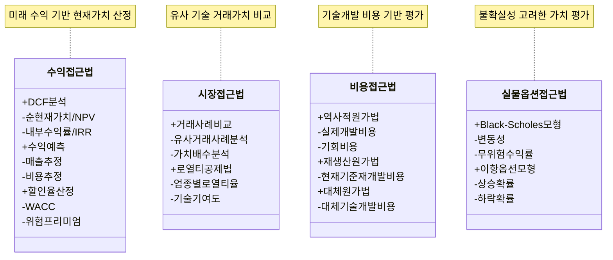

# 기술가치평가 (Technology Valuation): 기술의 경제적 가치 평가

<!-- mtoc-start -->

- [정의 및 개념](#정의-및-개념)
- [주요 특징](#주요-특징)
- [기술가치평가 방법](#기술가치평가-방법)
- [활용 사례](#활용-사례)
- [기대 효과 및 필요성](#기대-효과-및-필요성)
- [마무리](#마무리)
- [Keywords](#keywords)

<!-- mtoc-end -->

기술가치평가(Technology Valuation)는 사업화하려는 기술이나 이미 사업화된 기술이 창출하는 경제적 가치를 평가하는 과정이다. 이는 기술시장에서 일반적으로 인정된 가치평가 원칙과 방법론에 입각하여 수행되며, 기술의 활용성과 시장성을 객관적으로 분석하는 데 중점을 둔다.

## 정의 및 개념

기술가치평가는 기술이 창출하는 경제적 가치를 평가하는 절차, 일반적인 원칙과 방법론을 기반으로 수행된다.

- 특징: 기술의 경제적 가치 분석, 객관적 평가 방법 적용, 시장성과 활용성 고려
- 목적: 기술의 적정 가치 산정, 투자 유치 및 사업 전략 수립, 기술 이전 및 거래 활성화
- 필요성: 기업의 기술 경쟁력 강화, 기술 투자 의사 결정 지원, 공정한 기술 거래 환경 조성

## 주요 특징

1. **경제적 가치 중심 평가**: 기술이 창출하는 수익성과 비용 절감을 고려하여 가치를 산정한다.
2. **시장성 및 활용성 고려**: 기술의 시장 경쟁력과 활용 가능성을 분석하여 평가한다.
3. **다양한 평가 방법 적용**: 수익 접근법, 시장 접근법, 비용 접근법 등의 다양한 방법론을 활용한다.
4. **객관적 지표 활용**: 기술 수준, 특허 가치, 산업 내 경쟁력 등을 정량적·정성적으로 평가한다.
5. **기술 이전 및 거래 지원**: 평가 결과를 기반으로 기술 거래 및 사업화 전략을 수립할 수 있다.

## 기술가치평가 방법

기술가치평가는 다양한 접근법을 활용하여 수행되며, 일반적으로 다음과 같은 방법이 적용된다.

1. 수익접근법:

   - DCF 분석을 통한 NPV와 IRR 계산
   - 수익 예측에서의 매출과 비용 추정
   - 할인율 산정에서의 WACC와 위험프리미엄 고려

2. 시장접근법:

   - 거래사례 비교를 통한 유사거래 분석과 가치배수 분석
   - 로열티공제법을 통한 업종별 로열티율과 기술기여도 분석

3. 비용접근법:

   - 역사적 원가법에 의한 실제개발비용과 기회비용
   - 재생산원가법과 대체원가법의 세부 분석

4. 실물옵션접근법:
   - Black-Scholes 모형의 변동성과 무위험수익률
   - 이항옵션모형의 상승/하락 확률 분석

## 활용 사례

- **기업의 기술 투자**: 신기술 도입 전 경제적 타당성을 분석하여 투자 의사 결정을 지원
- **기술 이전 및 라이선싱**: 기술의 적정 가치를 평가하여 공정한 거래를 유도
- **M&A(기업 인수합병)**: 기업 가치 평가의 일환으로 기술 자산의 가치를 산정
- **정부 및 연구기관 지원**: 연구개발 성과의 경제적 가치를 분석하여 지원 정책 수립

## 기대 효과 및 필요성

- **기술 거래 활성화**: 공정한 가치 평가를 통해 기술 이전 및 거래를 촉진
- **투자 유치 촉진**: 기술의 경제적 가치를 명확히 하여 투자 유치를 용이하게 함
- **기업 경쟁력 강화**: 기술 자산을 전략적으로 활용하여 지속 가능한 경쟁력 확보
- **정확한 의사 결정 지원**: 기술 개발 및 사업화 과정에서 객관적 판단을 위한 근거 제공

## 마무리

기술가치평가는 기업과 투자자, 연구기관 등이 기술의 경제적 가치를 객관적으로 평가하고, 이를 기반으로 전략적 의사 결정을 내리는 데 필수적인 과정이다. 적절한 평가 방법을 활용하여 기술의 가치를 명확히 하고, 이를 효과적으로 활용하는 것이 중요하다.

## Keywords

Technology Valuation, 기술 경제성 평가, 기술 이전, 기술 거래, 수익 접근법, 시장 접근법, 비용 접근법, 실물옵션 접근법, 기술 투자, 기술 경쟁력
