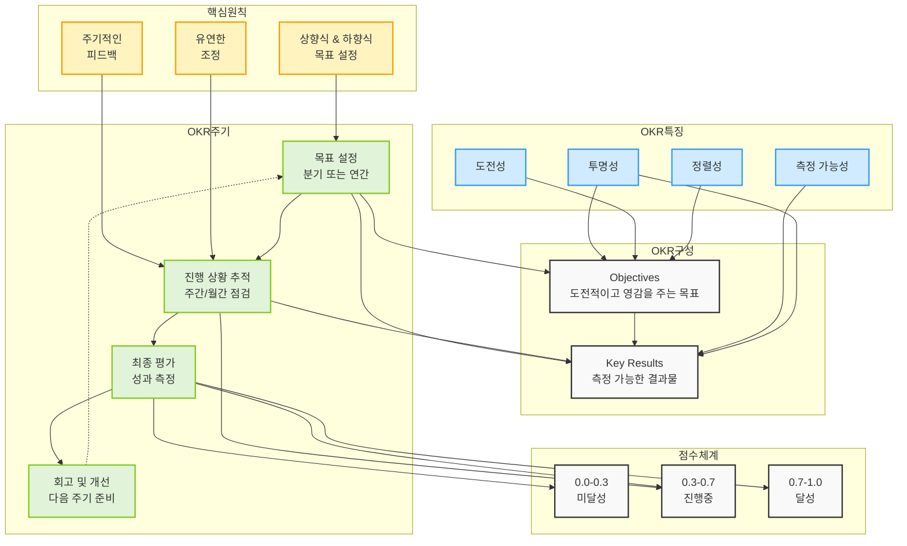

# OKR (Objectives and Key Results): 효과적인 목표 설정과 성과 관리

<!-- mtoc-start -->

- [정의 및 개념](#정의-및-개념)
- [주요 특징](#주요-특징)
- [OKR의 구조](#okr의-구조)
- [OKR 시스템 구조도](#okr-시스템-구조도)
  - [1. OKR의 기본 구조](#1-okr의-기본-구조)
  - [2. OKR의 주요 특징](#2-okr의-주요-특징)
  - [3. OKR 실행 주기](#3-okr-실행-주기)
  - [4. 성공적인 OKR 운영을 위한 핵심 원칙](#4-성공적인-okr-운영을-위한-핵심-원칙)
  - [5. OKR 특징과 구성요소 간의 관계:](#5-okr-특징과-구성요소-간의-관계)
  - [6. OKR 주기와 다른 요소들의 관계:](#6-okr-주기와-다른-요소들의-관계)
  - [7. 핵심원칙과 프로세스의 관계:](#7-핵심원칙과-프로세스의-관계)
- [OKR과 다른 성과관리 방법과의 비교](#okr과-다른-성과관리-방법과의-비교)
- [활용 사례](#활용-사례)
- [기대 효과 및 필요성](#기대-효과-및-필요성)
- [마무리](#마무리)
- [Keywords](#keywords)

<!-- mtoc-end -->

OKR(Objectives and Key Results)은 목표(Objectives)와 핵심 결과(Key Results)를 설정하여 성과를 측정하는 프레임워크이다. 구글, 링크드인 등 혁신 기업들이 도입하여 성공적으로 활용하면서 주목받게 되었다. OKR은 조직과 개인의 목표를 명확히 하고, 측정 가능한 결과를 통해 성과를 평가하는 체계적인 방법론이다.

## 정의 및 개념

OKR은 목표(Objectives)와 핵심 결과(Key Results)로 구성된 성과 관리 기법.

- **목표(Objectives)**: 조직 또는 개인이 달성하고자 하는 방향성과 비전
- **핵심 결과(Key Results)**: 목표 달성을 측정하는 구체적이고 정량적인 지표

## 주요 특징

1. **도전적이고 명확한 목표 설정**: OKR은 현실적으로 도달 가능한 수준보다 약간 더 높은 목표를 설정하여 도전 정신을 자극.
2. **정량적이고 측정 가능한 핵심 결과**: 핵심 결과는 구체적인 수치와 데이터를 기반으로 성과를 평가할 수 있도록 설계.
3. **주기적인 평가 및 피드백**: 일반적으로 분기별로 OKR을 설정하고, 진행 상황을 지속적으로 점검하여 보완.
4. **투명성 및 공유 가능성**: 조직 내에서 OKR을 공개하여 구성원들이 목표를 명확히 이해하고 협업을 강화.
5. **유연성과 조정 가능성**: 필요에 따라 핵심 결과를 조정하여 변화하는 환경에 대응.

## OKR의 구조

- **목표(Objective)**: 고객 만족도를 높인다.
- **핵심 결과(Key Results)**:
  1. 고객 만족도 점수를 4.2에서 4.7로 향상
  2. 고객 불만 접수 건수를 20% 감소
  3. 고객 지원 응답 시간을 12시간에서 6시간으로 단축

## OKR 시스템 구조도

### 1. OKR의 기본 구조

- Objectives(목표): 영감을 주는 도전적인 목표로, "무엇을" 달성할 것인지를 명확히 정의
- Key Results(핵심 결과): 목표 달성을 측정할 수 있는 구체적인 수치화된 결과물

### 2. OKR의 주요 특징

- 측정 가능성: 모든 KR은 정량적으로 측정이 가능해야 함
- 투명성: 조직 전체가 서로의 OKR을 확인하고 이해할 수 있어야 함
- 도전성: 달성하기 어려운 수준(60-70%)의 목표를 설정하여 혁신을 추구
- 정렬성: 회사, 팀, 개인의 목표가 서로 연계되어 있어야 함

### 3. OKR 실행 주기

- 목표 설정: 분기 또는 연간 단위로 설정
- 진행 상황 추적: 주간 또는 월간 단위로 진척도 확인
- 최종 평가: 기간 종료 시 목표 달성도 측정
- 회고 및 개선: 다음 주기를 위한 학습과 조정

### 4. 성공적인 OKR 운영을 위한 핵심 원칙

- 상향식과 하향식 목표 설정의 균형
- 지속적이고 정기적인 피드백
- 환경 변화에 따른 유연한 목표 조정
- 실패를 허용하는 문화 조성

### 5. OKR 특징과 구성요소 간의 관계:

- 측정 가능성은 Key Results에 직접적인 영향
- 투명성은 Objectives와 Key Results 모두에 영향
- 도전성과 정렬성은 주로 Objectives 설정에 영향

### 6. OKR 주기와 다른 요소들의 관계:

- 목표 설정 단계는 Objectives와 Key Results 모두와 연결
- 진행 상황 추적은 Key Results와 점수체계의 '진행중' 상태와 연결
- 최종 평가는 모든 점수체계(미달성, 진행중, 달성)와 연결

### 7. 핵심원칙과 프로세스의 관계:

- 상향식 & 하향식 목표 설정은 목표 설정 단계에 영향
- 주기적인 피드백과 유연한 조정은 진행 상황 추적 단계와 연결

OKR은 단순한 목표 관리 도구를 넘어 조직의 방향성을 명확히 하고, 구성원들의 집중도를 높이며, 측정 가능한 성과를 도출하는 종합적인 성과 관리 시스템.

## OKR과 다른 성과관리 방법과의 비교

| 방법론 | 주요 개념                                                  | 장점                          | 단점                       | 대표 활용 사례   |
| ------ | ---------------------------------------------------------- | ----------------------------- | -------------------------- | ---------------- |
| OKR    | 도전적인 목표와 측정 가능한 핵심 결과 설정                 | 명확한 목표, 유연한 적용 가능 | 측정 기준이 모호할 수 있음 | 구글, IT 기업    |
| KPI    | 성과를 수치화하여 평가                                     | 명확한 목표 설정 가능         | 정성적 목표 관리 어려움    | 영업, 마케팅     |
| BSC    | 재무, 고객, 내부 프로세스, 학습 및 성장 관점에서 성과 평가 | 조직 전반의 균형적 성과 관리  | 도입 및 운영 복잡          | 대기업, 공공기관 |
| MBO    | 목표 설정 후 조직 구성원과 합의                            | 개인 및 팀 단위 성과 강화     | 실행 및 관리 부담          | 중간 관리자      |

## 활용 사례

1. **구글(Google)**: OKR을 활용하여 전사적 목표를 설정하고, 혁신적인 성과를 창출
2. **링크드인(LinkedIn)**: 조직과 팀별 OKR을 설정하여 협업과 성과 관리 최적화
3. **유니콘 스타트업**: 빠르게 성장하는 스타트업에서 OKR을 도입하여 민첩한 목표 관리

## 기대 효과 및 필요성

- **조직 및 개인의 목표 정렬**: 전사적인 목표와 개인 목표를 조화롭게 맞출 수 있음
- **성과 측정 및 개선 가능**: 측정 가능한 핵심 결과를 통해 지속적인 개선 가능
- **동기 부여와 도전 문화 형성**: 도전적인 목표 설정을 통해 구성원의 동기 부여
- **유연성과 적응성 강화**: 빠르게 변화하는 비즈니스 환경에서 신속한 대응 가능

## 마무리

OKR은 조직과 개인이 명확한 목표를 설정하고, 성과를 체계적으로 관리하는 강력한 도구이다. 특히 IT 및 스타트업 기업에서 혁신을 촉진하고 목표를 효과적으로 달성하는 방법으로 널리 활용되고 있다. OKR을 적절히 도입하고 운영하면 조직의 성과를 극대화하고 성장 가능성을 높일 수 있다.

## Keywords

OKR, 목표설정, 성과 관리, 핵심 결과, Google OKR, 성과 측정, 조직 성과, 목표 정렬, 성과 평가, KPI 비교
