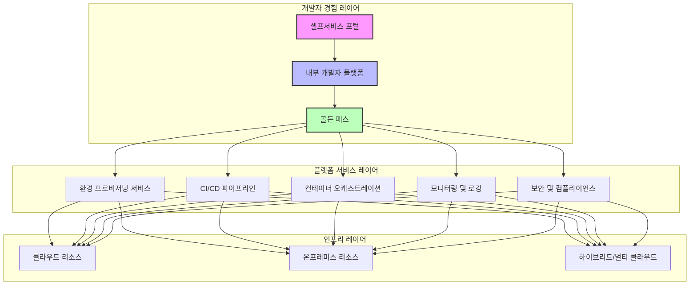

# 플랫폼 엔지니어링: 개발자 중심 셀프서비스 인프라 구현 전략

<!-- mtoc-start -->

- [정의 및 개념](#정의-및-개념)
- [주요 특징](#주요-특징)
- [아키텍처](#아키텍처)
- [활용 사례](#활용-사례)
- [기대 효과 및 필요성](#기대-효과-및-필요성)
- [마무리](#마무리)
- [Keywords](#keywords)

<!-- mtoc-end -->

플랫폼 엔지니어링(Platform Engineering)은 최근 IT 업계에서 주목받는 패러다임으로, 개발자가 필요한 인프라 및 도구를 셀프서비스 형태로 활용할 수 있게 해주는 전문 분야입니다. 이는 개발팀의 생산성을 높이고 운영 부담을 줄이는 동시에 표준화된 환경을 제공하여 일관성과 안정성을 확보하는 접근 방식입니다. 플랫폼 엔지니어링은 DevOps 문화의 진화된 형태로, 인프라 운영 복잡성을 추상화하여 개발자가 비즈니스 가치 창출에 더 집중할 수 있도록 지원합니다.

## 정의 및 개념

- 플랫폼 엔지니어링: 개발자 경험을 최우선으로 고려한 셀프서비스 인프라 플랫폼을 구축하고 운영하는 전문 분야. 개발팀이 직접 인프라를 구성하고 관리하는 부담 없이 필요한 서비스를 쉽게 사용할 수 있는 환경 제공.

- 목적: 개발 생산성 향상, 운영 복잡성 감소, 일관된 인프라 환경 제공, 개발자 경험(DX) 개선, 비즈니스 가치 창출 가속화.

- 필요성: 클라우드 환경의 복잡성 증가, 인프라 관리 부담으로 인한 개발 지연, 표준화된 환경 부재로 인한 운영 리스크 발생, DevOps 역량 격차 해소.

## 주요 특징

- **셀프서비스 포털**: 개발자가 필요한 인프라 자원을 직관적인 인터페이스를 통해 직접 프로비저닝하고 관리할 수 있는 중앙화된 포털 제공. 복잡한 인프라 구성 과정을 자동화하여 개발자 중심의 경험 제공.

- **내부 개발자 플랫폼(IDP)**: 코드 저장소, CI/CD 파이프라인, 컨테이너 관리, 모니터링 도구 등 개발에 필요한 모든 요소를 통합적으로 제공하는 플랫폼. 개발자가 코드 작성에서 배포까지 원활하게 진행할 수 있도록 지원.

- **골든 패스(Golden Path)**: 조직에서 검증된 모범 사례와 표준화된 작업 흐름을 제공하여 개발자가 안전하고 효율적으로 애플리케이션을 개발하고 배포할 수 있는 경로. 재사용 가능한 템플릿과 자동화된 워크플로우 제공.

- **인프라 추상화**: 복잡한 인프라 기술과 구성 요소를 추상화하여 개발자가 기술적 세부사항에 대한 깊은 이해 없이도 필요한 자원을 활용할 수 있도록 지원. 클라우드 리소스, 네트워킹, 보안 정책 등의 복잡성 은닉.

- **표준화된 환경**: 개발, 테스트, 스테이징, 프로덕션 환경을 일관되게 구성하여 환경 간 차이로 인한 문제 발생 방지. 인프라 구성의 변동성 감소로 신뢰성 향상.

## 아키텍처

플랫폼 엔지니어링 아키텍처는 개발자 경험 레이어, 플랫폼 서비스 레이어, 인프라 레이어의 3계층으로 구성됩니다. 개발자는 셀프서비스 포털을 통해 내부 개발자 플랫폼에 접근하고, 골든 패스를 따라 표준화된 서비스를 활용하여 복잡한 인프라를 추상화된
형태로 사용할 수 있습니다.

## 활용 사례

- **클라우드 네이티브 애플리케이션 개발**: 개발팀이 쿠버네티스 클러스터, 서버리스 함수, 관리형 데이터베이스 등 클라우드 네이티브 서비스를 셀프서비스로 프로비저닝하고 관리. 인프라 구성 시간을 기존 대비 80% 이상 단축.

- **마이크로서비스 아키텍처 지원**: 표준화된 서비스 메시, API 게이트웨이, 서비스 디스커버리 등의 컴포넌트를 제공하여 마이크로서비스 아키텍처 구현 가속화. 개발자가 서비스 간 통신, 인증 등의 복잡성에 신경 쓰지 않고 비즈니스 로직에 집중 가능.

- **멀티테넌트 SaaS 플랫폼**: 고객별 격리된 환경을 자동으로 프로비저닝하고 관리할 수 있는 플랫폼 제공. 수작업으로 인한 구성 오류 감소와 신규 고객 온보딩 시간 단축.

- **대규모 엔터프라이즈 DevOps 환경**: 수백 개의 애플리케이션과 개발팀을 지원하는 통합 DevOps 환경 구축. 일관된 거버넌스와 보안 정책을 유지하면서 개발 자율성 보장.

## 기대 효과 및 필요성

- **개발 생산성 향상**: 인프라 구성과 운영에 소요되는 시간을 최소화하여 개발자가 코드 작성과 비즈니스 가치 창출에 집중할 수 있는 환경 제공. 개발 주기 단축으로 시장 출시 시간(Time to Market) 단축.

- **운영 부담 감소**: 반복적인 인프라 작업을 자동화하고 표준화하여 운영팀의 부담 경감. 인프라 관리에 필요한 인력과 비용 절감으로 리소스 최적화.

- **표준 준수 및 거버넌스 강화**: 조직의 보안, 규정 준수, 아키텍처 표준을 플랫폼에 내장하여 자연스럽게 모범 사례를 따르도록 유도. 개발자의 선택을 제한하지 않으면서도 중요한 표준 적용.

- **기술 부채 감소**: 검증된 아키텍처와 패턴을 제공하여 잘못된 설계로 인한 기술 부채 발생 방지. 장기적인 유지보수성과 확장성 확보.

- **팀 간 협업 강화**: 개발, 운영, 보안 등 다양한 팀이 공통 플랫폼을 통해 협업하며 전체 소프트웨어 개발 수명주기를 가속화. 사일로(Silo) 해소와 유기적 협업 문화 조성.

## 마무리

플랫폼 엔지니어링은 개발자 경험을 중심에 두고 인프라의 복잡성을 효과적으로 추상화하여 조직의 소프트웨어 개발 역량을 한 단계 향상시키는 접근 방식입니다. 셀프서비스 모델과 내부 개발자 플랫폼을 통해 개발팀은 인프라 구성에 대한 부담 없이 핵심 비즈니스 가치 창출에 집중할 수 있습니다. 조직의 규모와 복잡성이 증가할수록 플랫폼 엔지니어링의 가치는 더욱 커지며, 디지털 전환을 가속화하고 비즈니스 민첩성을 확보하려는 기업에게 필수적인 전략이 될 것입니다.

## Keywords

Platform Engineering, Internal Developer Platform, Golden Path, 셀프서비스 인프라, 개발자 경험(DX), 인프라 추상화, 플랫폼 서비스, 셀프서비스 포털, 인프라 자동화, DevOps 진화
