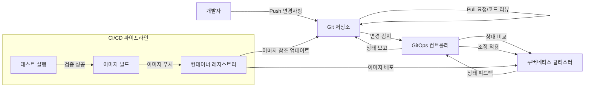

# GitOps: 데이터 기반 운영 패러다임의 진화

<!-- mtoc-start -->

- [정의 및 개념](#정의-및-개념)
- [주요 특징](#주요-특징)
- [아키텍처](#아키텍처)
- [활용 사례](#활용-사례)
- [기대 효과 및 필요성](#기대-효과-및-필요성)
- [마무리](#마무리)
- [Keywords](#keywords)

<!-- mtoc-end -->

GitOps(깃옵스)는 인프라스트럭처 관리와 애플리케이션 배포를 위한 현대적인 운영 모델로, Git을 단일 진실 원천(Single Source of Truth)으로 활용하여 선언적 인프라와 애플리케이션 구성을 자동화하는 접근 방식입니다. 클라우드 네이티브 환경에서 특히 강력한 이점을 제공하며, 데브옵스(DevOps) 원칙을 확장하여 인프라스트럭처 및 애플리케이션 구성을 코드로 관리합니다.

## 정의 및 개념

- GitOps: Git 저장소를 단일 진실 원천으로 활용하여 인프라스트럭처와 애플리케이션의 선언적 구성을 자동화하는 운영 모델.
- 목적: 애플리케이션과 인프라스트럭처 구성의 버전 관리, 자동화된 배포 및 지속적인 조정을 통한 시스템 일관성 보장.
- 핵심 원칙: 선언적 시스템 정의, Git 기반 버전 관리, 자동화된 조정 및 검증, 시스템 상태의 가시성 확보.

## 주요 특징

1. **선언적 인프라(Declarative Infrastructure)**: 시스템의 원하는 상태를 코드로 명시적으로 정의하여 관리하며, 구성 관리와 인프라스트럭처의 재현성을 보장.

2. **Git 중심 워크플로우(Git-Centric Workflow)**: 모든 변경사항이 Git을 통해 관리되어 감사 추적, 롤백 기능 및 협업 프로세스를 향상시키고 변경 이력의 완전한 추적성 제공.

3. **자동화된 조정(Automated Reconciliation)**: 실제 시스템 상태와 Git에 정의된 원하는 상태 간의 차이를 자동으로 감지하고 조정하는 컨트롤러 패턴을 적용하여 시스템 드리프트 방지.

4. **지속적 배포(Continuous Deployment)**: Git 저장소에 변경사항이 커밋되면 자동으로 배포되는 파이프라인을 구성하여 배포 주기를 단축하고 수동 작업 오류 감소.

5. **환경 일관성(Environment Consistency)**: 개발, 테스트, 프로덕션 환경 간의 구성 일관성을 보장하여 "works on my machine" 문제를 해결하고 안정적인 릴리스 관리 지원.

## 아키텍처

GitOps 아키텍처는 Git 저장소를 중심으로 개발자의 변경사항이 컨트롤러를 통해 클러스터에 자동으로 적용되는 흐름을 보여줍니다. 컨트롤러는 실제 상태와 원하는 상태 간의 차이를 지속적으로 감지하고 조정하여 시스템 일관성을 유지합니다.

## 활용 사례

1. **클라우드 네이티브 애플리케이션 배포**: 쿠버네티스 환경에서 애플리케이션 배포 및 구성 관리를 자동화하여 개발 및 운영 팀의 효율성 향상.

2. **멀티클라우드 인프라 관리**: 여러 클라우드 제공자 또는 하이브리드 환경에서 일관된 인프라 구성을 유지하고 관리하는 데 활용.

3. **마이크로서비스 아키텍처 운영**: 수십 또는 수백 개의 마이크로서비스 배포 및 구성을 효율적으로 관리하고 확장하는 데 적용.

4. **재해 복구 및 비즈니스 연속성**: Git 저장소의 선언적 구성을 기반으로 장애 발생 시 신속하게 시스템을 복구하고 재구성하는 데 활용.

5. **규제 준수 및 감사**: 모든 변경사항이 Git에 기록되므로 금융, 의료 등 규제가 엄격한 산업에서 감사 추적 및 규정 준수 요구사항 충족.

## 기대 효과 및 필요성

1. **변경 관리 향상**: 모든 변경사항이 Git을 통해 관리되므로 변경 이력 추적, 승인 프로세스 개선 및 롤백 기능 강화.

2. **배포 자동화와 일관성**: 수동 구성 오류 감소, 배포 시간 단축 및 여러 환경에서의 일관된 구성 유지.

3. **협업 효율성 증대**: 개발, 운영, 보안 팀 간의 협업 워크플로우 간소화 및 책임 공유 모델 구현.

4. **시스템 안정성 및 신뢰성**: 자동화된 조정 메커니즘을 통한 구성 드리프트 방지와 일관된 시스템 상태 유지.

5. **확장성과 관리 용이성**: 수백 개의 클러스터 또는 애플리케이션을 효율적으로 관리할 수 있는 확장 가능한 접근 방식 제공.

6. **보안 강화**: 인프라 접근에 대한 직접적인 제어를 줄이고 승인된 변경사항만 적용되도록 하여 시스템 보안 향상.

## 마무리

GitOps는 현대적인 클라우드 네이티브 환경에서 인프라스트럭처와 애플리케이션 배포를 관리하기 위한 강력한 패러다임입니다. Git을 단일 진실 원천으로 활용함으로써 투명성, 추적성, 자동화 및 협업을 향상시키며, 궁극적으로 더 빠르고 안정적인 소프트웨어 제공 주기를 구현할 수 있습니다. 조직이 디지털 트랜스포메이션과 클라우드 네이티브 접근 방식을 채택함에 따라 GitOps는 효율적이고 안정적인 운영 모델을 제공하는 핵심 전략으로 자리 잡고 있습니다.

## Keywords

GitOps, Infrastructure as Code, 선언적 인프라, 구성 관리, 지속적 배포(CD), Git 워크플로우, 쿠버네티스, 클라우드 네이티브, 자동화된 조정, 시스템 일관성
