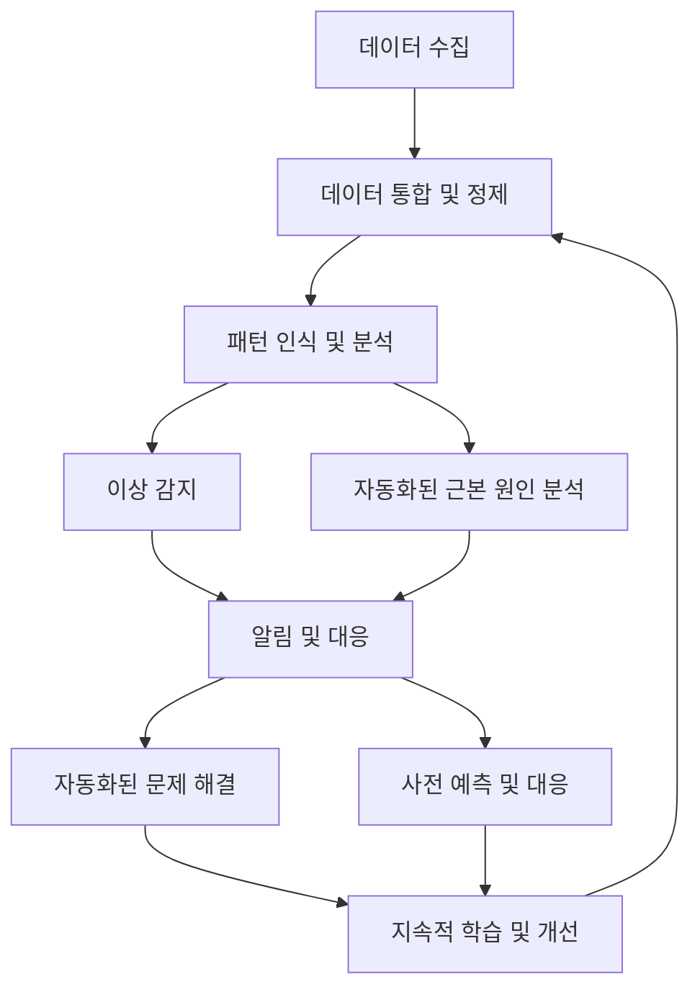

# AIOps: AI를 활용한 효율적인 IT 운영 자동화

<!-- mtoc-start -->

- [정의 및 개념](#정의-및-개념)
- [주요 특징](#주요-특징)
- [메카니즘](#메카니즘)
- [활용 사례](#활용-사례)
- [기대 효과 및 필요성](#기대-효과-및-필요성)
- [마무리](#마무리)
- [Keywords](#keywords)

<!-- mtoc-end -->

AIOps(Artificial Intelligence for IT Operations)는 인공지능과 기계학습을 IT 운영에 접목하여 복잡한 IT 환경에서 발생하는 문제를 효율적으로 감지, 분석, 해결하는 접근 방식입니다. 대규모 데이터에서 의미 있는 패턴을 식별하고 반복적인 작업을 자동화함으로써 IT 운영팀의 업무 효율성을 크게 향상시킵니다.

## 정의 및 개념

- AIOps: IT 운영에 인공지능과 기계학습 기술을 적용하여 데이터 수집, 분석, 문제 감지 및 해결을 자동화하는 프레임워크.
- 목적: 대규모 IT 시스템에서 생성되는 방대한 데이터를 효과적으로 분석하여 성능 최적화, 장애 예측, 자동화된 문제 해결을 통한 서비스 안정성 확보.
- 필요성: 클라우드 환경, 마이크로서비스 아키텍처 등 복잡해진 IT 인프라에서 기존 수동 모니터링 방식의 한계 극복.

## 주요 특징

- **실시간 이상 감지**: 머신러닝 알고리즘을 활용하여 정상 패턴을 학습하고 이상 징후를 실시간으로 감지하여 사전 대응 가능
- **자동화된 근본 원인 분석**: 여러 시스템에서 발생하는 알림과 로그를 상관 분석하여 문제의 근본 원인을 신속하게 식별
- **지능형 알림 관리**: 수많은 알림 중 중요도에 따라 우선순위를 부여하고 유사 알림을 그룹화하여 알림 피로도 감소
- **사전 예측적 분석**: 과거 장애 데이터를 학습하여 미래에 발생 가능한 장애를 예측하고 선제적 조치 수행
- **자동화된 문제 해결**: 반복적으로 발생하는 문제에 대한 해결 방안을 자동으로 실행하여 평균 복구 시간(MTTR) 단축

## 메카니즘

AIOps는 데이터 수집부터 지속적 학습 및 개선까지 순환적인 흐름으로 작동합니다. 시스템은 지속적인 학습을 통해 더 정확한 분석과 예측 능력을 갖추게 되며, 자동화된 문제 해결 능력이 점차 향상됩니다.

## 활용 사례

- **대규모 클라우드 인프라 관리**: 수천 대의 서버와 애플리케이션을 관리하는 클라우드 환경에서 성능 이상을 자동 감지하고 용량 최적화
- **DevOps 파이프라인 최적화**: 코드 변경을 학습하여 자동으로 테스트 케이스를 생성하고 배포 성공률 향상
- **네트워크 트래픽 분석**: 네트워크 행동 패턴을 분석하여 보안 위협이나 성능 저하 요인을 사전에 식별
- **IT 서비스 데스크 자동화**: 반복되는 사용자 요청을 분류하고 자동으로 처리하여 응답 시간 단축 및 사용자 경험 개선
- **사전적 장애 예측**: 과거 데이터를 기반으로 잠재적 시스템 장애를 예측하고 선제적 조치 수행

## 기대 효과 및 필요성

- **운영 효율성 향상**: 자동화된 모니터링과 문제 해결로 IT 운영팀의 반복 작업 감소 및 전략적 업무 집중 가능
- **평균 복구 시간(MTTR) 단축**: 신속한 문제 감지와 자동화된 해결책으로 서비스 중단 시간 최소화
- **비용 절감**: 예방적 유지보수를 통한 대규모 장애 방지 및 인력 리소스 최적화
- **서비스 품질 향상**: 사전 예측 및 자동화된 대응으로 서비스 가용성과 안정성 증대
- **의사결정 개선**: 데이터 기반 인사이트 제공으로 IT 인프라와 서비스에 관한 전략적 결정 지원

## 마무리

AIOps는 복잡해지는 IT 환경에서 필수적인 접근 방식으로 자리잡고 있습니다. 인공지능과 머신러닝을 활용하여 IT 운영의 효율성, 안정성, 예측 가능성을 크게 향상시킬 수 있으며, 디지털 트랜스포메이션을 추진하는 기업에게 중요한 경쟁력이 될 것입니다. 특히 사전적 장애 예측과 자동화된 테스트 케이스 생성과 같은 AI 기반 DevOps 활용은 IT 서비스의 품질을 한 단계 높이는 핵심 요소가 될 것입니다.

## Keywords

AIOps, Artificial Intelligence for IT Operations, 장애 예측, 인공지능 운영, 자동화된 문제 해결, 이상 감지, 머신러닝, 근본 원인 분석, IT 운영 자동화, DevOps 최적화
