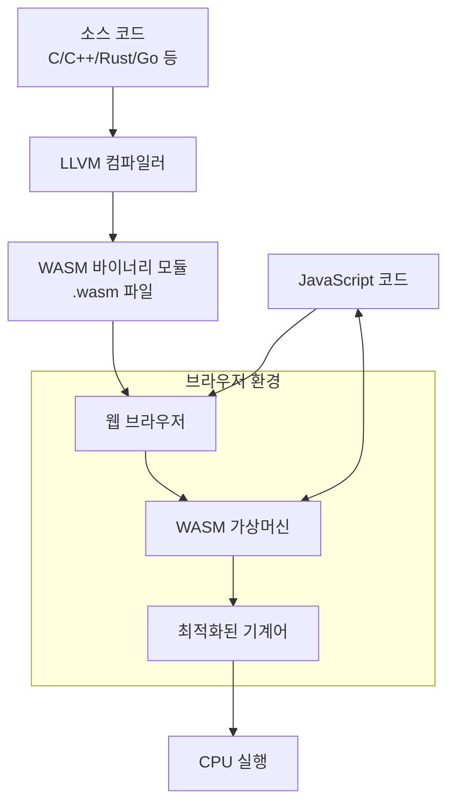

# WebAssembly(WASM): 웹 애플리케이션의 성능 혁신 기술

<!-- mtoc-start -->

- [정의 및 개념](#정의-및-개념)
- [주요 특징](#주요-특징)
- [아키텍처](#아키텍처)
- [활용 사례](#활용-사례)
- [기대 효과 및 필요성](#기대-효과-및-필요성)
- [마무리](#마무리)
- [Keywords](#keywords)

<!-- mtoc-end -->

WebAssembly(WASM)는 최신 웹 브라우저에서 실행할 수 있는 저수준 바이너리 형식으로, 다양한 프로그래밍 언어로 작성된 코드를 웹에서 거의 네이티브 수준의 성능으로 실행할 수 있게 해주는 기술입니다. 웹 어셈블리(WebAssembly)는 자바스크립트를 보완하는 역할을 하며, 웹 플랫폼에 고성능 연산 기능을 제공합니다.

## 정의 및 개념

- 정의: 웹 브라우저에서 실행되는 바이너리 명령어 형식의 프로그래밍 언어. 네이티브에 가까운 속도로 실행되도록 설계된 저수준 가상 머신.
- 목적: 다양한 프로그래밍 언어(C, C++, Rust 등)로 작성된 코드를 웹에서 효율적으로 실행하기 위한 표준 바이너리 형식 제공.
- 특징: 플랫폼 독립적, 안전한 샌드박스 환경, 효율적인 바이너리 형식, 자바스크립트와의 상호 운용성.

## 주요 특징

- **컴팩트한 바이너리 형식**: 네트워크 전송에 최적화된 바이너리 포맷으로 다운로드 크기가 작고 로딩 시간이 빠름.
- **근접 네이티브 성능**: JIT(Just-In-Time) 컴파일러를 통해 거의 네이티브 코드 수준의 실행 속도 제공.
- **언어 독립성**: C, C++, Rust, Go 등 다양한 프로그래밍 언어로 작성된 코드를 웹으로 이식 가능.
- **보안 샌드박스**: 메모리 안전성과 코드 검증을 통한 보안 모델 구현.
- **자바스크립트 연동**: 자바스크립트와 WebAssembly 간 원활한 상호 작용 지원.

## 아키텍처

WebAssembly는 다양한 언어로 작성된 코드를 컴파일하여 브라우저에서 실행 가능한 바이너리 형식으로 변환합니다. 이 바이너리는 브라우저의 가상머신에서 실행되며 자바스크립트와 상호작용할 수 있습니다.

## 활용 사례

- **3D 게임 및 그래픽 애플리케이션**: Unity, Unreal Engine 등의 게임 엔진을 웹으로 포팅하여 고성능 게임 구현.
- **멀티미디어 처리**: 비디오 및 오디오 인코딩/디코딩, 이미지 프로세싱 등 계산 집약적 작업 처리.
- **과학 및 엔지니어링 시뮬레이션**: 물리 엔진, 수학적 모델링, 데이터 시각화 등의 복잡한 계산 수행.
- **데스크톱 애플리케이션 이식**: 기존 데스크톱 애플리케이션을 웹으로 이식하여 크로스 플랫폼 지원.
- **블록체인 및 암호화**: 웹 기반 암호화 작업, 분산 컴퓨팅, 블록체인 애플리케이션 구현.

## 기대 효과 및 필요성

- **웹 애플리케이션 성능 향상**: 자바스크립트보다 빠른 실행 속도로 고성능 웹 애플리케이션 개발 가능.
- **코드 재사용성 증대**: 기존 C/C++/Rust 등의 코드베이스를 웹에서 재활용 가능.
- **다양한 언어 지원**: 웹 개발자가 자바스크립트 외에도 다양한 언어를 선택하여 개발할 수 있는 유연성 제공.
- **사용자 경험 개선**: 복잡한 연산을 클라이언트 측에서 처리하여 서버 의존도 감소 및 반응성 향상.
- **모바일 성능 최적화**: 제한된 자원을 가진 모바일 기기에서도 효율적인 웹 애플리케이션 구동.

## 마무리

WebAssembly는 웹 플랫폼의 성능 한계를 극복하고 더 다양한 애플리케이션을 웹으로 가져올 수 있는 혁신적인 기술입니다. 자바스크립트를 대체하기보다는 보완하는 역할을 하며, 복잡한 연산과 고성능이 요구되는 작업에 특화되어 있습니다. 앞으로 웹 개발 생태계에서 WebAssembly의 활용이 더욱 확대될 것으로 예상되며, 웹 브라우저가 진정한 크로스 플랫폼 애플리케이션 플랫폼으로 발전하는 데 중요한 역할을 할 것입니다.

## Keywords

WebAssembly, WASM, 바이너리 실행 형식, 네이티브 성능, 크로스 컴파일, 웹 최적화, 샌드박스 보안, 다중 언어 지원, 클라이언트 측 처리, 고성능 웹 애플리케이션
