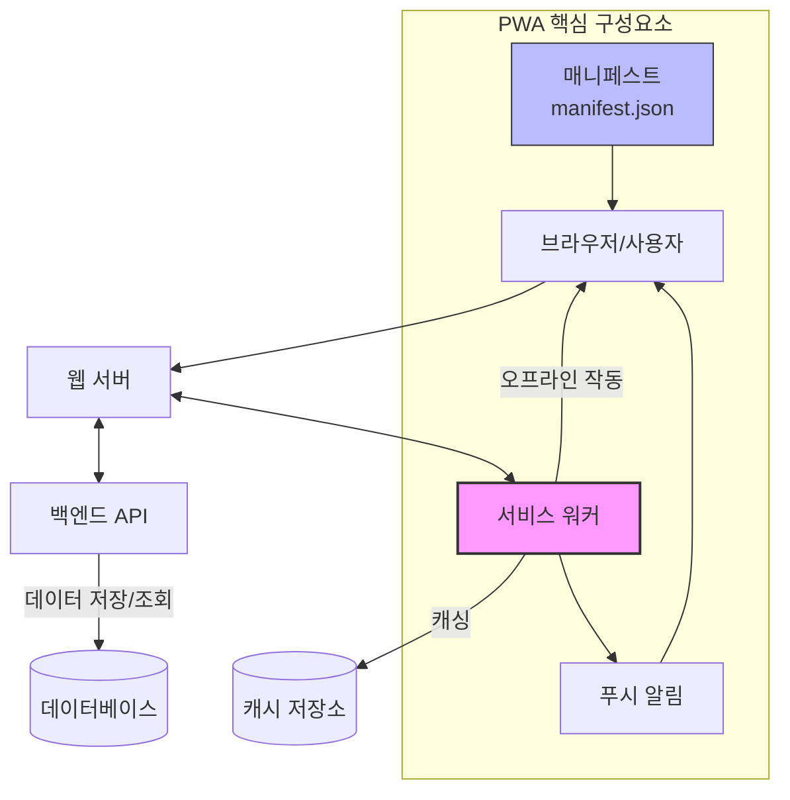

# 프로그레시브 웹 앱(PWA): 웹과 앱의 장점을 결합한 차세대 개발 방식

<!-- mtoc-start -->

- [정의 및 개념](#정의-및-개념)
- [주요 특징](#주요-특징)
- [아키텍처](#아키텍처)
- [핵심 구성요소](#핵심-구성요소)
  - [1. 웹 매니페스트 (Web Manifest)](#1-웹-매니페스트-web-manifest)
  - [2. 서비스 워커 (Service Worker)](#2-서비스-워커-service-worker)
  - [3. 앱 셸 아키텍처 (App Shell Architecture)](#3-앱-셸-아키텍처-app-shell-architecture)
- [활용 사례](#활용-사례)
- [기대 효과 및 필요성](#기대-효과-및-필요성)
- [마무리](#마무리)
- [Keywords](#keywords)

<!-- mtoc-end -->

프로그레시브 웹 앱(Progressive Web Application, PWA)은 웹사이트의 접근성과 네이티브 앱의 사용자 경험을 결합한 혁신적인 개발 패러다임입니다. 모바일 앱의 설치 과정이나 앱스토어 의존성 없이도 오프라인 작동, 푸시 알림, 하드웨어 접근 등 네이티브 앱과 유사한 기능을 제공하는 PWA는 현대 웹 개발의 중요한 트렌드로 자리잡고 있습니다.

## 정의 및 개념

- 개념: 웹 기술(HTML, CSS, JavaScript)로 구현되면서 네이티브 앱의 사용자 경험과 기능을 제공하는 애플리케이션.
- 목적: 단일 코드베이스로 다양한 플랫폼에서 일관된 경험을 제공하며 설치 장벽을 낮추고 사용자 경험 향상.

## 주요 특징

- **반응형 디자인**: 다양한 디바이스와 화면 크기에 맞춰 최적화된 사용자 인터페이스 제공
- **오프라인 기능**: 서비스 워커(Service Worker)를 활용하여 네트워크 연결 없이도 기본 기능 작동
- **앱 유사 경험**: 홈 화면 추가, 전체 화면 모드, 푸시 알림 등 네이티브 앱과 유사한 사용자 경험 제공
- **자체 업데이트**: 앱스토어 검토 과정 없이 자동으로 최신 버전으로 업데이트 가능
- **보안 프로토콜**: HTTPS를 통한 안전한 데이터 전송 및 처리

## 아키텍처

PWA의 핵심 아키텍처는 서비스 워커를 중심으로 구성되며, 웹 매니페스트를 통해 앱 메타데이터를 정의합니다. 서비스 워커는 네트워크 요청을 가로채고 캐싱하여 오프라인 기능을 가능하게 하는 핵심 요소입니다.

## 핵심 구성요소

### 1. 웹 매니페스트 (Web Manifest)

- JSON 파일로 앱의 이름, 아이콘, 시작 URL, 테마 색상 등 메타데이터 정의
- 홈 화면 추가 시 앱 아이콘과 브랜딩 제공

### 2. 서비스 워커 (Service Worker)

- 브라우저와 네트워크 사이에서 동작하는 JavaScript 파일
- 네트워크 요청을 가로채고 캐싱하여 오프라인 기능 구현
- 백그라운드 동기화 및 푸시 알림 처리

### 3. 앱 셸 아키텍처 (App Shell Architecture)

- 애플리케이션의 최소 HTML, CSS, JavaScript 구성요소를 캐싱
- 초기 로딩 속도 향상 및 일관된 사용자 경험 제공

## 활용 사례

- **전자상거래**: 오프라인 환경에서도 상품 브라우징 및 이전 주문 내역 확인 가능
- **콘텐츠 플랫폼**: 뉴스, 블로그 등의 콘텐츠를 오프라인에서도 읽을 수 있도록 제공
- **엔터프라이즈 앱**: 기업 내부 시스템을 PWA로 개발하여 다양한 기기에서 일관된 경험 제공
- **소셜 미디어**: Twitter Lite, Pinterest 등이 PWA 방식으로 리소스 사용량 최적화
- **금융 서비스**: 간편 결제, 계좌 조회 등 기본 금융 서비스를 오프라인에서도 제공

## 기대 효과 및 필요성

- **개발 효율성**: 단일 코드베이스로 여러 플랫폼 지원으로 개발 및 유지보수 비용 절감
- **사용자 확보**: 앱스토어 등록이나 다운로드 과정 없이 즉시 사용 가능하여 사용자 유입 장벽 감소
- **참여도 향상**: 푸시 알림, 오프라인 기능 등을 통해 사용자 참여도 및 재방문율 증가
- **데이터 효율성**: 캐싱을 통한 데이터 사용량 절감 및 저대역폭 환경에서의 접근성 향상
- **검색 엔진 최적화**: 일반 웹사이트와 마찬가지로 검색 엔진에 색인되어 유기적 트래픽 확보 가능

## 마무리

프로그레시브 웹 앱은 웹과 앱의 경계를 허물며 사용자와 개발자 모두에게 이점을 제공하는 혁신적인 접근 방식입니다. 특히 다양한 디바이스와 네트워크 환경을 고려해야 하는 현대 애플리케이션 개발에서, PWA는 비용 효율적이면서도 사용자 친화적인 솔루션으로 자리매김하고 있습니다. 기업과 개발자들은 PWA의 도입을 통해 사용자 경험을 향상시키고 비즈니스 성과를 개선할 수 있는 전략적 기회를 얻을 수 있습니다.

## Keywords

Progressive Web Application, Service Worker, Web Manifest, App Shell, 오프라인 기능, 푸시 알림, 반응형 디자인, 홈 화면 추가, 설치형 웹앱, 크로스 플랫폼
