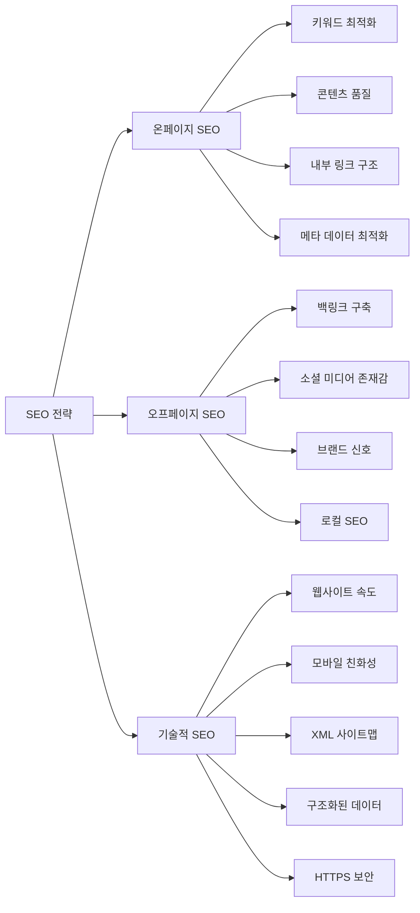

# SEO (Search Engine Optimization): 웹사이트 가시성 및 트래픽 향상 전략

<!-- mtoc-start -->

- [정의 및 개념](#정의-및-개념)
- [주요 특징](#주요-특징)
- [SEO 프레임워크](#seo-프레임워크)
- [SEO 요소별 최적화 방법](#seo-요소별-최적화-방법)
  - [온페이지 SEO](#온페이지-seo)
  - [오프페이지 SEO](#오프페이지-seo)
  - [기술적 SEO](#기술적-seo)
- [활용 사례](#활용-사례)
- [기대 효과 및 필요성](#기대-효과-및-필요성)
- [마무리](#마무리)
- [Keywords](#keywords)

<!-- mtoc-end -->

검색 엔진 최적화(Search Engine Optimization, SEO)는 웹사이트가 검색 엔진 결과 페이지에서 더 높은 순위에 노출되도록 최적화하는 과정입니다. 디지털 마케팅의 핵심 요소로서, 웹사이트의 가시성을 높이고 유기적 트래픽을 증가시키는 데 중요한 역할을 합니다. 효과적인 SEO 전략은 기술적 요소, 콘텐츠 품질, 사용자 경험을 모두 고려하여 검색 엔진 알고리즘에 부합하는 방향으로 웹사이트를 개선합니다.

## 정의 및 개념

- 정의: 웹사이트가 검색 엔진에서 더 높은 순위에 노출되도록 최적화하는 과정. 사용자가 관련 키워드로 검색할 때 해당 웹사이트가 검색 결과 상위에 표시되도록 하는 기술 및 전략의 집합.
- 목적: 웹사이트의 유기적 트래픽 증가, 브랜드 인지도 향상, 전환율 개선을 통한 비즈니스 성과 달성.
- 분류: 온페이지 SEO(On-page SEO), 오프페이지 SEO(Off-page SEO), 기술적 SEO(Technical SEO)로 구분.

## 주요 특징

- **사용자 중심 최적화**: 검색 엔진은 사용자에게 가치 있는 정보를 제공하는 웹사이트를 우선시함. 따라서 고품질 콘텐츠와 사용자 경험이 SEO의 핵심 요소.
- **지속적인 개선 프로세스**: 검색 엔진 알고리즘은 계속 변화하므로, SEO는 일회성 작업이 아닌 지속적인 최적화 과정이 필요.
- **데이터 기반 접근**: 키워드 분석, 트래픽 데이터, 사용자 행동 패턴 등 다양한 데이터를 활용하여 전략 수립 및 성과 측정.
- **경쟁 분석 중요성**: 동일 키워드로 경쟁하는 웹사이트의 전략 분석이 효과적인 SEO 전략 수립에 필수적.
- **알고리즘 이해**: 구글, 빙 등 주요 검색 엔진의 알고리즘 원리와 업데이트 내용을 이해하고 웹사이트를 그에 맞게 최적화.

## SEO 프레임워크

SEO 최적화 프레임워크는 온페이지 SEO, 오프페이지 SEO, 기술적 SEO의 세 가지 핵심 영역으로 구성되며, 각 영역은 서로 상호작용하여 종합적인 검색 엔진 최적화 전략을 형성합니다. 효과적인 SEO는 이 세 가지 영역을 균형 있게 발전시켜야 합니다.

## SEO 요소별 최적화 방법

### 온페이지 SEO

- **키워드 연구 및 최적화**:

  - 타깃 키워드 선정 및 콘텐츠 내 자연스러운 배치
  - 롱테일 키워드(구체적이고 세부적인 검색어) 활용
  - 경쟁 강도와 검색 볼륨 균형 고려

- **콘텐츠 최적화**:

  - 고품질, 독창적, 유용한 콘텐츠 제작
  - 적절한 제목 태그(H1, H2, H3) 구조화
  - 이미지 Alt 태그 최적화

- **메타 데이터 최적화**:
  - 메타 타이틀과 설명 태그에 핵심 키워드 포함
  - 각 페이지별 고유한 메타 데이터 설정
  - 클릭 유도를 위한 설득력 있는 메타 설명 작성

### 오프페이지 SEO

- **백링크 구축**:

  - 관련성 높은 고품질 웹사이트로부터의 링크 획득
  - 자연스러운 링크 프로필 구축
  - 유해한 링크 정기적 모니터링 및 제거

- **소셜 신호**:
  - 소셜 미디어 플랫폼에서의 콘텐츠 공유 및 참여 촉진
  - 브랜드 인지도 구축 및 웹사이트 트래픽 유도

### 기술적 SEO

- **웹사이트 속도 최적화**:

  - 이미지 압축 및 브라우저 캐싱 활용
  - 불필요한 코드 및 리다이렉트 제거
  - 서버 응답 시간 개선

- **모바일 최적화**:

  - 반응형 웹 디자인 적용
  - 모바일 사용자 경험 개선
  - Google의 모바일 우선 색인 기준 충족

- **구조적 요소**:
  - XML 사이트맵 생성 및 제출
  - 로봇 텍스트 파일 최적화
  - 구조화된 데이터(스키마 마크업) 구현

## 활용 사례

- **이커머스 플랫폼**: 제품 페이지 최적화, 구조화된 데이터를 통한 상품 정보 강화, 사용자 리뷰 활용을 통한 검색 가시성 향상.
- **콘텐츠 기반 웹사이트**: 키워드 연구를 통한 콘텐츠 전략 수립, 정보성 콘텐츠 제작, 내부 링크 구조 최적화를 통한 검색 순위 개선.
- **로컬 비즈니스**: Google 비즈니스 프로필 최적화, 로컬 키워드 타겟팅, 지역 기반 백링크 구축을 통한 지역 검색 결과 상위 노출.
- **B2B 기업**: 전문적 콘텐츠 마케팅, 업계 관련 키워드 최적화, 권위 있는 웹사이트로부터의 백링크 획득을 통한 전문성 확립.

## 기대 효과 및 필요성

- **비용 효율적인 마케팅**: 유료 광고에 비해 장기적으로 더 높은 ROI를 제공하는 지속 가능한 마케팅 채널.
- **브랜드 신뢰성 강화**: 검색 결과 상위 노출은 사용자에게 해당 브랜드의 신뢰성과 권위를 인식시키는 효과.
- **타겟 오디언스 확보**: 특정 키워드로 검색하는 사용자는 이미 해당 제품이나 서비스에 관심이 있는 잠재 고객이므로 전환율이 높음.
- **경쟁 우위 확보**: 동일 산업 내 경쟁업체보다 검색 결과에서 상위 노출됨으로써 시장 점유율 향상.
- **사용자 경험 개선**: SEO 최적화 과정에서 웹사이트의 사용성과 접근성이 함께 개선되어 전반적인 사용자 만족도 향상.

## 마무리

검색 엔진 최적화(SEO)는 디지털 시대에 기업의 온라인 가시성을 높이는 필수적인 전략입니다. 기술적 요소, 콘텐츠 품질, 외부 신호 등 다양한 요소를 종합적으로 고려한 체계적인 접근이 필요합니다. 검색 엔진 알고리즘은 지속적으로 변화하므로, 최신 트렌드와 모범 사례를 따르는 유연한 SEO 전략 수립이 중요합니다. 효과적인 SEO 구현을 통해 웹사이트 트래픽 증가, 브랜드 인지도 향상, 비즈니스 성과 개선을 이룰 수 있습니다.

## Keywords

Search Engine Optimization, 키워드 최적화, 백링크 구축, On-page SEO, Off-page SEO, Technical SEO, 메타데이터, 콘텐츠 마케팅, 유기적 트래픽, 검색 알고리즘
