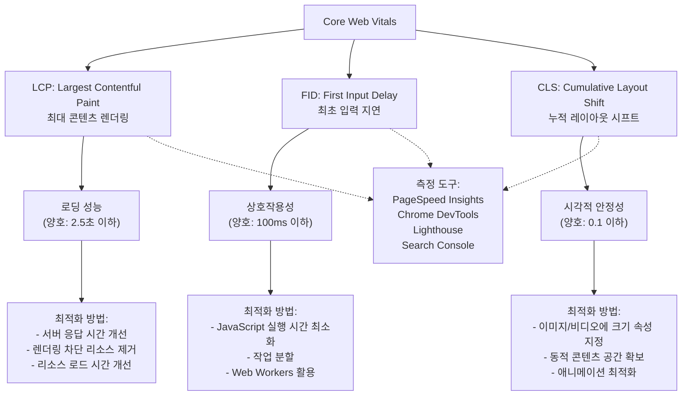

# Core Web Vitals: 웹사이트 사용자 경험 향상을 위한 핵심 성능 지표

<!-- mtoc-start -->

- [정의 및 개념](#정의-및-개념)
- [주요 특징](#주요-특징)
- [구성 요소](#구성-요소)
  - [LCP (Largest Contentful Paint, 최대 콘텐츠 렌더링)](#lcp-largest-contentful-paint-최대-콘텐츠-렌더링)
  - [FID (First Input Delay, 최초 입력 지연)](#fid-first-input-delay-최초-입력-지연)
  - [CLS (Cumulative Layout Shift, 누적 레이아웃 시프트)](#cls-cumulative-layout-shift-누적-레이아웃-시프트)
- [측정 도구](#측정-도구)
- [활용 사례](#활용-사례)
- [기대 효과 및 필요성](#기대-효과-및-필요성)
- [마무리](#마무리)
- [Keywords](#keywords)

<!-- mtoc-end -->

코어 웹 바이탈스(Core Web Vitals)는 구글이 웹사이트의 사용자 경험을 측정하기 위해 도입한 핵심 성능 지표입니다. 이는 웹페이지의 로딩 속도, 상호작용 및 시각적 안정성을 평가하여 웹사이트 품질을 객관적으로 측정할 수 있게 해주는 표준화된 지표입니다. 이러한 지표는 사용자 중심의 경험을 정량화하여 개발자와 비즈니스 담당자들이 웹 성능을 향상시키는 데 중요한 기준점을 제공합니다.

## 정의 및 개념

- 정의: 구글이 웹사이트의 사용자 경험을 객관적으로 측정하기 위해 개발한 핵심 성능 지표의 집합. 웹페이지의 로딩 성능, 상호작용성, 시각적 안정성 등을 평가하는 지표.

- 목적: 사용자 중심의 웹 경험 측정을 통한 웹사이트 품질 향상 및 검색 엔진 최적화(SEO) 개선.

- 필요성: 웹사이트 사용자 경험의 객관적 측정 기준 제공, 웹 개발 방향성 설정, 구글 검색 순위 알고리즘의 핵심 요소로 활용.

## 주요 특징

- **사용자 중심 측정**: 실제 사용자가 체감하는 경험을 기반으로 하여 기술적 요소보다 사용자 인식에 초점을 맞춘 지표.

- **필드 데이터 활용**: Chrome User Experience Report(CrUX)를 통해 실제 사용자의 데이터를 수집하여 성능 평가에 활용.

- **검색 랭킹 요소**: 구글 검색 알고리즘의 페이지 경험 신호로 활용되어 SEO에 직접적인 영향 제공.

- **지속적인 발전**: 웹 기술과 사용자 기대치의 변화에 따라 정기적으로 업데이트되는 진화하는 지표 체계.

- **크로스 디바이스 측정**: 데스크톱, 모바일 등 다양한 기기 환경에서의 성능 측정 지원.

## 구성 요소

Core Web Vitals는 LCP(로딩), FID(상호작용성), CLS(시각적 안정성)의 세 가지 핵심 지표로 구성되며, 각 지표별로 최적화 방법과 측정 도구가 제공됩니다. 이러한 구성요소는 웹사이트의 전반적인 사용자 경험을 객관적으로 평가하는 기준이 됩니다.

### LCP (Largest Contentful Paint, 최대 콘텐츠 렌더링)

- 정의: 페이지가 로드되기 시작한 시점부터 뷰포트 내에서 가장 큰 콘텐츠 요소(이미지, 텍스트 블록 등)가 화면에 렌더링되는 시점까지의 시간.
- 기준값: 2.5초 이하(양호), 2.5초~4.0초(개선 필요), 4.0초 초과(불량)
- 최적화 방법:
  - 서버 응답 시간 개선
  - 중요 리소스의 사전 로드
  - 렌더링 차단 JavaScript와 CSS 최소화
  - 이미지 최적화 및 차세대 포맷 활용

### FID (First Input Delay, 최초 입력 지연)

- 정의: 사용자가 페이지와 처음 상호작용(링크 클릭, 버튼 탭 등)한 시점부터 브라우저가 해당 상호작용에 응답하기 시작하는 시점까지의 시간.
- 기준값: 100ms 이하(양호), 100ms~300ms(개선 필요), 300ms 초과(불량)
- 최적화 방법:
  - JavaScript 실행 시간 최소화
  - 긴 작업 분할
  - 상호작용 준비 개선
  - Web Workers 활용

### CLS (Cumulative Layout Shift, 누적 레이아웃 시프트)

- 정의: 페이지 로딩 과정에서 예상치 못한 레이아웃 이동으로 인한 시각적 불안정성을 측정하는 지표.
- 기준값: 0.1 이하(양호), 0.1~0.25(개선 필요), 0.25 초과(불량)
- 최적화 방법:
  - 이미지와 비디오 요소에 크기 속성 지정
  - 광고나 임베드 등 동적 콘텐츠를 위한 공간 미리 확보
  - 애니메이션 최적화

## 측정 도구

- **PageSpeed Insights**: 실제 사용자 데이터(필드 데이터)와 실험실 데이터를 기반으로 웹사이트의 Core Web Vitals 성능 측정 및 개선점 제안.

- **Chrome DevTools**: 개발자가 로컬에서 실시간으로 Core Web Vitals 지표를 모니터링하고 디버깅할 수 있는 도구.

- **Lighthouse**: 웹페이지의 품질을 측정하는 자동화 도구로, Core Web Vitals를 포함한 성능 지표 측정.

- **Search Console**: 웹사이트 소유자가 자신의 사이트 페이지들의 Core Web Vitals 상태를 확인하고 문제점을 파악할 수 있는 도구.

- **Web Vitals JavaScript 라이브러리**: 개발자가 자체적으로 Core Web Vitals를 측정할 수 있도록 지원하는 라이브러리.

## 활용 사례

- **전자상거래 웹사이트**: 페이지 로딩 속도와 상호작용성 개선으로 장바구니 이탈률 감소 및 전환율 증가. 한 대형 온라인 쇼핑몰은 Core Web Vitals 최적화 후 전환율 18% 상승 실현.

- **뉴스 및 미디어 사이트**: 콘텐츠 빠른 로드와 시각적 안정성 확보로 페이지 체류 시간 증가 및 광고 수익 향상. 국내 유명 포털은 CLS 개선 후 평균 체류시간 15% 증가.

- **모바일 앱 웹뷰**: 하이브리드 앱 내 웹뷰 성능 최적화를 통한 앱 사용자 경험 향상 및 앱 평점 개선.

- **글로벌 서비스**: 다양한 네트워크 환경과 기기에서의 일관된 사용자 경험 제공으로 글로벌 시장 침투율 향상.

## 기대 효과 및 필요성

- **검색 엔진 순위 개선**: 구글 검색 알고리즘에서 페이지 경험 신호로 활용되어 SEO 순위 향상.

- **사용자 이탈률 감소**: 페이지 로딩 시간이 3초에서 1초로 개선 시, 이탈률 최대 32% 감소 효과.

- **전환율 향상**: 웹사이트 로딩 시간이 0.1초만 개선되어도 전환율 최대 8% 증가 가능.

- **브랜드 신뢰도 향상**: 빠르고 안정적인 웹사이트는 사용자에게 전문성과 신뢰감 제공.

- **모바일 사용자 경험 개선**: 모바일 기기에서의 사용성 향상으로 모바일 트래픽 증가 및 참여도 향상.

- **접근성 향상**: 성능 최적화는 느린 네트워크나 저사양 기기 사용자의 접근성 개선에 기여.

## 마무리

Core Web Vitals는 웹사이트의 사용자 경험을 객관적으로 측정하고 개선하기 위한 필수적인 지표 체계입니다. LCP, FID, CLS의 세 가지 핵심 지표를 통해 로딩 성능, 상호작용성, 시각적 안정성을 최적화함으로써 사용자 만족도를 높이고 비즈니스 성과를 향상시킬 수 있습니다. 특히 구글 검색 알고리즘의 중요한 요소로 활용되는 만큼, 웹 개발자와 비즈니스 담당자 모두가 Core Web Vitals 최적화에 주목할 필요가 있습니다. 지속적인 모니터링과 개선을 통해 웹사이트의 경쟁력을 강화하고 디지털 비즈니스의 성공을 이끌어낼 수 있을 것입니다.

## Keywords

Core Web Vitals, Largest Contentful Paint, First Input Delay, Cumulative Layout Shift, 웹 성능 지표, 사용자 경험 최적화, 페이지 로딩 속도, 상호작용성, 시각적 안정성, 검색 엔진 최적화
