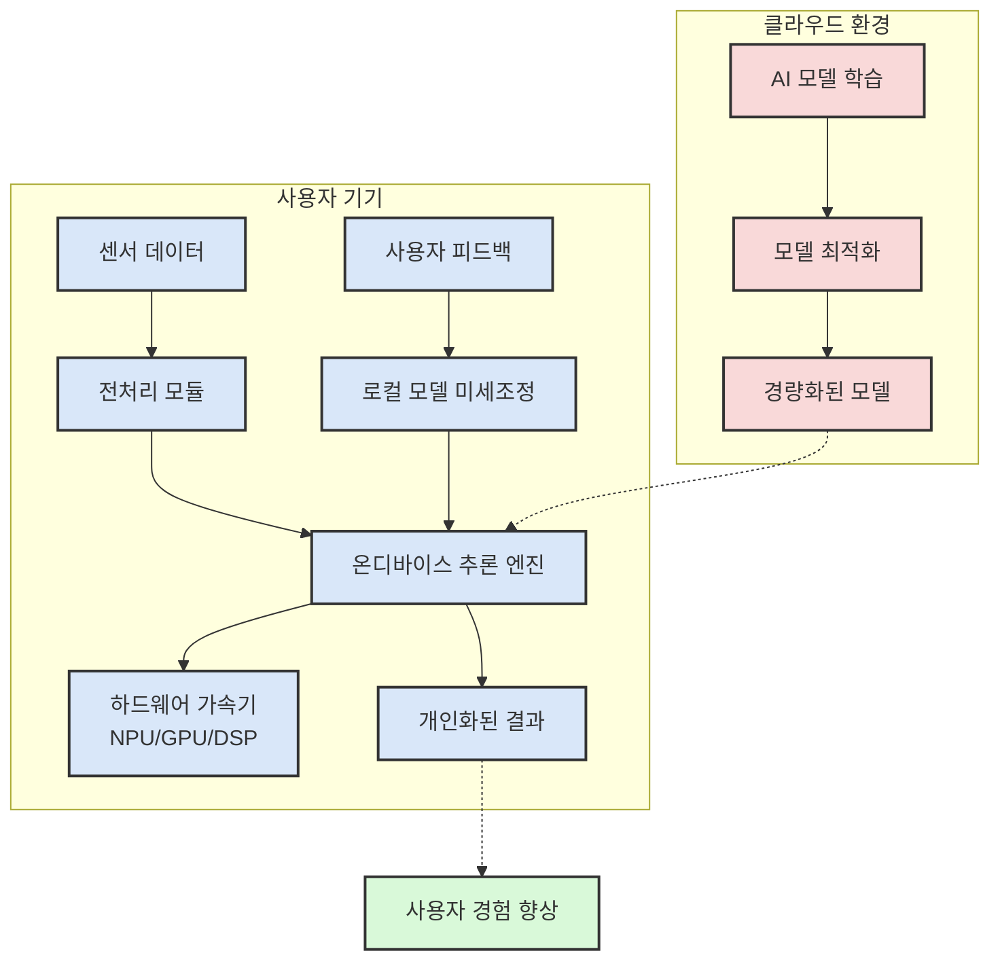

# 온디바이스 AI: 사용자 중심 지능형 컴퓨팅의 새로운 패러다임

<!-- mtoc-start -->

- [정의 및 개념](#정의-및-개념)
- [주요 특징](#주요-특징)
- [아키텍처](#아키텍처)
- [활용 사례](#활용-사례)
- [기대 효과 및 필요성](#기대-효과-및-필요성)
- [마무리](#마무리)
- [Keywords](#keywords)

<!-- mtoc-end -->

온디바이스 AI(On-Device AI)는 클라우드나 서버에 의존하지 않고 스마트폰, 웨어러블 기기, IoT 장치와 같은 사용자 기기에서 직접 인공지능 모델을 실행하는 기술입니다. 이 접근법은 개인정보 보호 강화, 지연 시간 감소, 네트워크 연결 없이도 AI 기능 사용이 가능하다는 장점을 제공합니다. 최근 하드웨어 성능 향상과 경량화된 AI/ML 프레임워크의 발전으로 온디바이스 AI는 모바일 및 엣지 컴퓨팅 환경에서 빠르게 확산되고 있습니다.

## 정의 및 개념

- 온디바이스 AI: 중앙 서버나 클라우드 대신 사용자의 로컬 기기에서 직접 인공지능 알고리즘과 모델을 실행하는 기술. 데이터가 기기를 떠나지 않고 처리되어 개인정보 보호 강화 및 실시간 응답성 제공.
- AL/ML 프레임워크: 온디바이스 환경에 최적화된 TensorFlow Lite, Core ML, PyTorch Mobile 등의 경량화된 머신러닝 프레임워크. 제한된 연산 능력과 메모리를 고려한 모델 최적화 지원.

- 특징: 로컬 처리, 개인정보 보호 중심, 낮은 지연 시간, 오프라인 작동 가능
- 목적: 사용자 경험 개선, 개인화된 서비스 제공, 데이터 주권 보장
- 필요성: 실시간 의사결정, 네트워크 의존도 감소, 프라이버시 강화

## 주요 특징

1. **로컬 처리 중심**: 데이터가 기기를 떠나지 않고 처리되므로 개인정보 보호가 강화되고 데이터 전송 비용이 절감됩니다. 특히 민감한 사용자 데이터를 다루는 애플리케이션에서 중요합니다.

2. **실시간 응답성**: 클라우드 서버와의 통신이 필요 없어 지연 시간이 크게 감소하며, 네트워크 연결 상태와 무관하게 일관된 성능을 제공합니다. 이는 실시간 번역, 음성 인식 등의 서비스에서 특히 중요합니다.

3. **리소스 최적화**: 제한된 하드웨어 리소스에서 작동할 수 있도록 모델 양자화, 가지치기, 지식 증류 등 다양한 최적화 기법을 활용합니다. 배터리 수명과 메모리 사용량 절약에 기여합니다.

4. **개인화**: 사용자의 행동과 선호도에 기반한 맞춤형 경험을 제공하면서도 개인 데이터의 외부 유출 없이 개인화 서비스를 구현할 수 있습니다. 개인 비서, 추천 시스템 등에 적용됩니다.

5. **하이브리드 접근법**: 복잡한 작업은 클라우드로, 간단하거나 민감한 작업은 온디바이스로 처리하는 하이브리드 모델을 통해 효율성과 보안성의 균형을 유지합니다. 사용 맥락에 따라 유연하게 처리 위치를 결정합니다.

## 아키텍처

온디바이스 AI 아키텍처는 클라우드 환경에서 학습된 모델을 사용자 기기에 최적화하여 배포하고, 로컬에서 추론과 경우에 따라 미세조정을 수행하는 구조입니다. 하드웨어 가속기(NPU/GPU/DSP)를 활용해 효율적인 연산을 수행하며, 사용자 데이터의 프라이버시를 보호하면서도 개인화된 경험을 제공합니다.

## 활용 사례

1. **스마트폰 카메라 지능화**: 실시간 이미지 처리와 장면 인식을 통해 최적의 촬영 모드를 자동으로 선택하고, 얼굴 인식과 포트레이트 모드 등 고급 기능을 오프라인 상태에서도 제공합니다.

2. **스마트 비서 및 음성 인식**: 기본적인 명령어 인식과 처리를 온디바이스에서 수행하여 네트워크 연결 없이도 즉각적인 응답이 가능하며, 개인 대화 내용이 클라우드로 전송되지 않아 프라이버시를 보호합니다.

3. **건강 모니터링 웨어러블**: 심박수, 수면 패턴, 활동량 등을 분석하여 사용자의 건강 상태를 실시간으로 모니터링하고, 이상 징후 감지 시 즉각적인 알림을 제공합니다.

4. **AR/VR 환경의 실시간 처리**: 증강현실과 가상현실 애플리케이션에서 실시간 객체 인식, 동작 추적, 공간 매핑 등을 지연 없이 수행하여 몰입감 있는 경험을 제공합니다.

5. **자율주행 및 ADAS 시스템**: 차량 내 센서 데이터를 실시간으로 처리하여 긴급 상황에서 즉각적인 의사결정이 가능하며, 네트워크 연결 불안정 상황에서도 안전성을 유지합니다.

## 기대 효과 및 필요성

1. **개인정보 보호 강화**: 사용자 데이터가 기기를 떠나지 않고 처리되므로 데이터 유출 위험이 감소하고, 개인정보 보호 규제(GDPR, CCPA 등)를 준수하기 용이합니다.

2. **네트워크 비용 절감**: 데이터 전송량이 감소하여 네트워크 대역폭 사용량과 관련 비용이 절감되며, 서버 인프라 확장 필요성이 줄어듭니다.

3. **사용자 경험 향상**: 지연 시간 감소와 오프라인 작동으로 끊김 없는 서비스 경험을 제공하며, 개인화된 서비스로 사용자 만족도가 증가합니다.

4. **에너지 효율성**: 최적화된 모델과 하드웨어 가속으로 배터리 사용량을 최소화하며, 데이터 전송에 필요한 에너지도 절약됩니다.

5. **접근성 확대**: 네트워크 인프라가 제한적인 지역에서도 AI 기능을 활용할 수 있어 디지털 격차 해소에 기여합니다.

## 마무리

온디바이스 AI는 개인정보 보호와 실시간 응답성이 중요한 현대 모바일 환경에서 필수적인 기술 패러다임으로 자리잡고 있습니다. 하드웨어 성능 향상과 AI 모델 최적화 기술의 발전에 따라 더 복잡한 AI 기능들이 사용자 기기에서 직접 구현될 것으로 전망됩니다. 기업과 개발자들은 이러한 트렌드에 맞춰 온디바이스 AI를 적극적으로 도입하고, 클라우드 기반 시스템과의 효과적인 하이브리드 접근법을 개발하는 것이 경쟁력 확보에 중요할 것입니다.

## Keywords

On-Device AI, 엣지 컴퓨팅, 모델 경량화, 개인정보 보호, AI 하드웨어 가속, NPU(Neural Processing Unit), 저지연 추론, 오프라인 AI, 개인화 학습, Federated Learning
