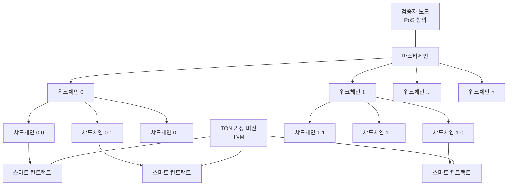

# TON 코어 프로젝트: 블록체인 생태계 확장을 위한 핵심 기술

<!-- mtoc-start -->

- [정의 및 개념](#정의-및-개념)
- [주요 특징](#주요-특징)
- [아키텍처](#아키텍처)
- [활용 사례](#활용-사례)
- [기대 효과 및 필요성](#기대-효과-및-필요성)
- [마무리](#마무리)
- [Keywords](#keywords)

<!-- mtoc-end -->

TON 코어 프로젝트(TON Core Project)는 블록체인 기술의 확장성과 실용성을 높이기 위해 설계된 분산형 인프라스트럭처입니다. 텔레그램 오픈 네트워크(Telegram Open Network)에서 시작되어 현재는 독립적인 블록체인 생태계로 발전하였으며, 다양한 분산 애플리케이션과 서비스를 지원하기 위한 기반 기술을 제공합니다.

## 정의 및 개념

- TON 코어: 초당 수백만 건의 트랜잭션을 처리할 수 있는 확장성을 갖춘 블록체인 플랫폼. 샤딩 기술을 기반으로 하는 멀티체인 구조 채택.
- 목적: 대규모 사용자 기반을 위한 고성능 블록체인 인프라 구축 및 실생활 애플리케이션 지원.
- 필요성: 기존 블록체인의 확장성 한계 극복 및 실용적인 분산 응용 프로그램 생태계 조성.

## 주요 특징

- **멀티블록체인 아키텍처**: 마스터체인과 수많은 워크체인, 샤드체인으로 구성되어 병렬 처리 능력 극대화.
- **샤딩 메커니즘**: 네트워크를 여러 샤드로 분할하여 처리 부하를 분산시키고 전체 처리량 향상.
- **스마트 컨트랙트**: TON 가상 머신(TVM)을 통해 효율적으로 실행되는 스마트 컨트랙트 지원.
- **Proof-of-Stake 합의**: 에너지 효율적인 PoS 합의 알고리즘 활용으로 검증자 노드의 참여 유도.
- **인스턴트 하이퍼큐브 라우팅**: 노드 간 메시지 전달을 최적화하여 네트워크 지연 시간 최소화.

## 아키텍처

TON 코어는 마스터체인을 중심으로 다수의 워크체인과 샤드체인으로 구성된 계층적 구조를 갖습니다. 각 체인은 독립적으로 작동하면서도 전체 네트워크의 일관성을 유지하며, TVM을 통해 스마트 컨트랙트가 실행됩니다.

## 활용 사례

- **DeFi 애플리케이션**: 분산형 금융 서비스를 위한 기반 인프라 제공
- **디지털 자산 관리**: TON 블록체인 상에서 다양한 디지털 자산의 발행 및 거래 지원
- **메시징 플랫폼 통합**: 텔레그램과 같은 메시징 플랫폼과의 연동을 통한 암호화폐 결제 및 서비스 이용
- **NFT 마켓플레이스**: 디지털 콘텐츠의 소유권 증명 및 거래를 위한 플랫폼 구축
- **분산형 신원 관리**: 사용자 개인정보 보호를 강화한 탈중앙화 신원 확인 시스템

## 기대 효과 및 필요성

- **확장성 향상**: 샤딩 기술을 통해 초당 수백만 건의 트랜잭션 처리 가능
- **사용자 경험 개선**: 빠른 트랜잭션 처리와 낮은 수수료로 사용자 만족도 증가
- **개발자 친화적 환경**: 다양한 개발 도구와 API 제공으로 생태계 확장 촉진
- **상호운용성**: 다른 블록체인 네트워크와의 연결성 강화로 디지털 자산 이동성 확보
- **분산화 강화**: 중앙 집중형 시스템의 의존도를 낮추고 네트워크 보안성 향상

## 마무리

TON 코어 프로젝트는 블록체인 기술의 실용화를 위한 중요한 발전을 제시합니다. 높은 확장성과 효율성을 갖춘 이 플랫폼은 다양한 산업 분야에서의 블록체인 응용을 가능하게 하며, 디지털 경제의 새로운 기반을 마련하고 있습니다. 기업과 개발자들은 TON 생태계에 참여함으로써 차세대 분산 애플리케이션의 개발 및 운영 기회를 얻을 수 있을 것입니다.

## Keywords

TON Core Project, Telegram Open Network, 블록체인 확장성, 샤딩 기술, 멀티체인 아키텍처, 스마트 컨트랙트, PoS 합의, 분산 애플리케이션, 디지털 자산, 하이퍼큐브 라우팅
