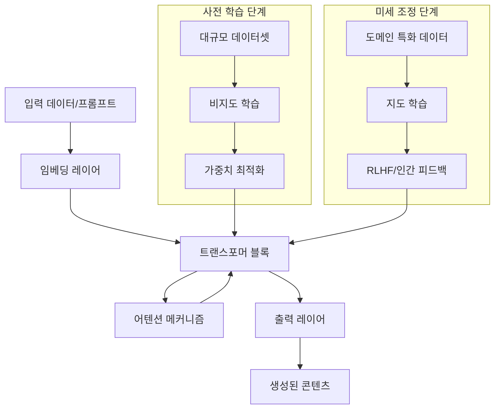

# Generative AI: 차세대 콘텐츠 생성 혁명의 중심

<!-- mtoc-start -->

- [정의 및 개념](#정의-및-개념)
- [주요 특징](#주요-특징)
- [아키텍처 및 작동 원리](#아키텍처-및-작동-원리)
- [주요 응용 분야](#주요-응용-분야)
  - [소프트웨어 개발](#소프트웨어-개발)
  - [콘텐츠 제작](#콘텐츠-제작)
  - [비즈니스 프로세스](#비즈니스-프로세스)
- [기대 효과 및 필요성](#기대-효과-및-필요성)
- [구현 시 고려사항](#구현-시-고려사항)
  - [윤리적 측면](#윤리적-측면)
  - [기술적 측면](#기술적-측면)
- [마무리](#마무리)
- [Keywords](#keywords)

<!-- mtoc-end -->

생성형 인공지능(Generative AI)은 대규모 데이터셋으로 훈련된 인공지능 모델이 텍스트, 이미지, 음악, 코드 등 새로운 콘텐츠를 생성하는 혁신적인 기술입니다. ChatGPT, GitHub Copilot, DALL-E, MidJourney 등이 대표적인 예로, 최근 몇 년간 급속도로 발전하며 다양한 산업 분야에서 업무 프로세스와 콘텐츠 제작 방식을 근본적으로 변화시키고 있습니다. 특히 개발자의 생산성 향상과 창의적 작업 지원 측면에서 큰 주목을 받고 있는 기술입니다.

## 정의 및 개념

- 생성형 AI(Generative AI): 대규모 데이터셋으로 학습한 인공지능이 새로운 콘텐츠를 생성할 수 있는 기술. 기존 데이터의 패턴을 학습하여 유사하지만 독창적인 결과물 창출.
- 핵심 원리: 트랜스포머(Transformer) 아키텍처와 대규모 언어 모델(LLM)을 기반으로 문맥을 이해하고 확률적 예측을 통해 다양한 형태의 콘텐츠 생성.

## 주요 특징

- **자연어 이해 및 생성**: 인간의 언어를 이해하고 자연스러운 텍스트를 생성하는 능력을 보유하여 대화형 인터페이스와 콘텐츠 제작 지원
- **맥락 인식 능력**: 주어진 프롬프트의 맥락을 파악하고 적절한 응답이나 콘텐츠를 생성하는 능력 보유
- **다양한 모달리티 지원**: 텍스트뿐만 아니라 이미지, 오디오, 비디오, 코드 등 다양한 형태의 콘텐츠 생성 가능
- **적응형 학습**: 피드백을 통해 지속적으로 개선되며 특정 도메인에 특화된 생성 능력 개발 가능
- **창의성 지원**: 인간 창작자의 아이디어를 확장하고 새로운 관점과 가능성을 제시하는 보조 도구로 기능

## 아키텍처 및 작동 원리

생성형 AI의 핵심은 대규모 트랜스포머 기반 모델로, 자기주의(Self-Attention) 메커니즘을 통해 입력 데이터의 문맥을 이해하고 다음 토큰을 예측하는 방식으로 작동합니다. 사전 학습과 미세 조정 과정을 통해 특정 작업과 도메인에 최적화된 결과물을 생성할 수 있습니다.

## 주요 응용 분야

### 소프트웨어 개발

- **코드 자동 생성**: GitHub Copilot과 같은 도구를 통한 코드 작성 지원 및 자동 완성
- **버그 수정 및 리팩토링**: 코드 분석을 통한 버그 식별 및 수정 제안
- **API 및 문서 생성**: 코드베이스 분석을 통한 API 문서 자동 생성

### 콘텐츠 제작

- **텍스트 생성**: 마케팅 카피, 블로그 포스트, 보고서 등 다양한 텍스트 콘텐츠 제작
- **이미지 및 그래픽 디자인**: DALL-E, Midjourney 등을 활용한 시각적 콘텐츠 생성
- **음악 및 오디오 제작**: 작곡, 사운드 디자인, 음성 합성 등 오디오 콘텐츠 생성

### 비즈니스 프로세스

- **고객 서비스**: 챗봇 및 가상 비서를 통한 24/7 고객 지원
- **데이터 분석 및 인사이트 도출**: 대규모 데이터 분석 및 보고서 자동화
- **프로토타이핑 가속화**: 개발 및 디자인 프로토타입 신속 제작

## 기대 효과 및 필요성

- **생산성 향상**: 반복적이고 시간 소모적인 작업 자동화를 통한 업무 효율성 증대
- **창의성 증폭**: 인간 창작자에게 영감과 새로운 아이디어 제공
- **접근성 확대**: 전문 지식 없이도 고품질 콘텐츠 제작 가능
- **비용 절감**: 콘텐츠 제작 및 소프트웨어 개발 비용 감소
- **혁신 가속화**: 아이디어에서 구현까지의 시간 단축으로 혁신 주기 가속

## 구현 시 고려사항

### 윤리적 측면

- **저작권 및 소유권 문제**: AI 생성 콘텐츠의 저작권 귀속 및 법적 지위
- **편향성 및 공정성**: 학습 데이터의 편향이 결과물에 미치는 영향
- **진위 구분의 어려움**: 딥페이크 및 허위정보 생성 가능성

### 기술적 측면

- **컴퓨팅 리소스 요구**: 대규모 모델 운영을 위한 고성능 하드웨어 필요
- **품질 관리 및 검증**: AI 생성 콘텐츠의 품질과 정확성 검증 메커니즘
- **사용자 인터페이스 최적화**: 효과적인 프롬프트 엔지니어링과 사용자 경험 디자인

## 마무리

생성형 AI는 단순한 기술 트렌드를 넘어 창작과 생산성의 패러다임을 변화시키는 혁명적 도구로 자리매김하고 있습니다. 개발자, 디자이너, 마케터 등 다양한 전문가들의 작업 방식을 보완하고 확장하는 동시에, 기존에 불가능했던 새로운 형태의 콘텐츠와 서비스 창출을 가능하게 합니다. 기업들은 이러한 기술을 효과적으로 도입하고 활용하기 위한 전략과 윤리적 가이드라인을 수립하여 생성형 AI의 혜택을 극대화하는 동시에 잠재적 위험을 최소화하는 균형점을 찾아야 할 것입니다.

## Keywords

Generative AI, 생성형 인공지능, Large Language Models, 대규모 언어 모델, Transformer Architecture, 트랜스포머 아키텍처, Prompt Engineering, 프롬프트 엔지니어링, Content Generation, 콘텐츠 생성, AI Ethics, 인공지능 윤리
