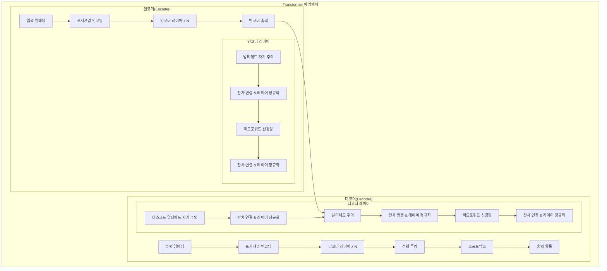

# Transformer Architecture: 딥러닝의 혁신적 신경망 구조

<!-- mtoc-start -->

- [정의 및 개념](#정의-및-개념)
- [주요 특징](#주요-특징)
  - [자기 주의 메커니즘(Self-Attention)](#자기-주의-메커니즘self-attention)
  - [멀티헤드 어텐션(Multi-Head Attention)](#멀티헤드-어텐션multi-head-attention)
  - [포지셔널 인코딩(Positional Encoding)](#포지셔널-인코딩positional-encoding)
  - [잔차 연결(Residual Connection)과 레이어 정규화(Layer Normalization)](#잔차-연결residual-connection과-레이어-정규화layer-normalization)
- [아키텍처 구조](#아키텍처-구조)
- [작동 메커니즘](#작동-메커니즘)
  - [인코더(Encoder)](#인코더encoder)
  - [디코더(Decoder)](#디코더decoder)
- [활용 사례](#활용-사례)
  - [자연어 처리(NLP)](#자연어-처리nlp)
  - [컴퓨터 비전](#컴퓨터-비전)
  - [생물정보학](#생물정보학)
  - [오디오 처리](#오디오-처리)
- [기대 효과 및 필요성](#기대-효과-및-필요성)
  - [성능 향상](#성능-향상)
  - [계산 효율성](#계산-효율성)
  - [확장성](#확장성)
  - [기술 혁신 기반](#기술-혁신-기반)
- [한계 및 도전 과제](#한계-및-도전-과제)
  - [컴퓨팅 자원](#컴퓨팅-자원)
  - [해석 가능성](#해석-가능성)
- [마무리](#마무리)
- [Keywords](#keywords)

<!-- mtoc-end -->

Transformer 아키텍처(Transformer Architecture)는 2017년 Google Brain 팀이 "Attention Is All You Need" 논문에서 제안한 혁신적인 신경망 구조입니다. 기존의 순환 신경망(RNN)이나 합성곱 신경망(CNN)과 달리 자기 주의(self-attention) 메커니즘을 핵심으로 하여 병렬 처리가 가능하며, 자연어 처리와 컴퓨터 비전 등 다양한 분야에서 혁명적인 성능 향상을 이끌어 냈습니다. 현재 GPT, BERT, T5와 같은 최신 언어 모델의 기반이 되는 이 구조는 시퀀스 데이터를 효과적으로 처리하는 새로운 패러다임을 제시했습니다.

## 정의 및 개념

- 정의: 순환 구조 없이 전적으로 어텐션 메커니즘에 기반한 인코더-디코더 신경망 아키텍처. 시퀀스 데이터의 장거리 의존성을 효과적으로 포착.
- 목적: 기존 RNN의 한계(병렬화 어려움, 장거리 의존성 문제)를 극복하고 시퀀스 데이터 처리의 성능과 효율성 향상.
- 핵심 요소: 자기 주의(Self-Attention) 메커니즘을 통한 입력 시퀀스의 모든 위치 간 관계성 계산.
- 특징: 병렬 처리 가능, 위치 정보 인코딩, 멀티헤드 어텐션, 잔차 연결(Residual Connection)과 레이어 정규화(Layer Normalization).

## 주요 특징

### 자기 주의 메커니즘(Self-Attention)

- 입력 시퀀스의 각 토큰이 다른 모든 토큰과 어떻게 관련되는지 계산
- 쿼리(Query), 키(Key), 값(Value) 벡터를 사용하여 가중치 결정
- 장거리 의존성을 효과적으로 포착하여 문맥 이해 능력 향상

### 멀티헤드 어텐션(Multi-Head Attention)

- 여러 개의 어텐션 메커니즘을 병렬로 수행
- 서로 다른 표현 공간에서 정보를 포착하여 모델의 표현력 증가
- 각 헤드가 서로 다른 패턴과 관계에 집중할 수 있어 다양한 특성 학습

### 포지셔널 인코딩(Positional Encoding)

- 자기 주의 메커니즘은 순서 정보를 내재적으로 포함하지 않음
- 위치 정보를 삽입하기 위한 사인, 코사인 함수 기반 인코딩 사용
- 토큰의 상대적/절대적 위치 정보 제공으로 시퀀스 순서 유지

### 잔차 연결(Residual Connection)과 레이어 정규화(Layer Normalization)

- 그래디언트 소실 문제 해결과 학습 안정화
- 각 서브레이어 후에 적용되어 깊은 네트워크 학습을 용이하게 함
- 모델의 수렴 속도 향상 및 일반화 성능 개선에 기여

## 아키텍처 구조

Transformer 아키텍처는 인코더와 디코더로 구성되며, 각각 N개의 동일한 레이어를 포함합니다. 인코더는 입력 시퀀스를 표현으로 변환하고, 디코더는 이 표현과 이전 출력을 기반으로 다음 토큰을 생성합니다. 각 레이어는 자기 주의 메커니즘, 피드포워드 신경망, 잔차 연결 및 레이어 정규화로 구성됩니다.

## 작동 메커니즘

### 인코더(Encoder)

1. **입력 임베딩**: 토큰을 벡터로 변환
2. **포지셔널 인코딩**: 위치 정보 추가
3. **멀티헤드 자기 주의**: 토큰 간 관계 계산
4. **피드포워드 신경망**: 표현력 강화
5. **잔차 연결 및 레이어 정규화**: 학습 안정화

### 디코더(Decoder)

1. **출력 임베딩 및 포지셔널 인코딩**: 이전 출력 시퀀스 처리
2. **마스크드 멀티헤드 자기 주의**: 미래 토큰 참조 방지
3. **인코더-디코더 멀티헤드 주의**: 인코더 출력 활용
4. **피드포워드 및 정규화 단계**: 표현 강화 및 안정화
5. **선형 투영 및 소프트맥스**: 출력 확률 생성

## 활용 사례

### 자연어 처리(NLP)

- **기계 번역**: Google 번역, DeepL 등 최신 번역 시스템
- **텍스트 요약**: 뉴스 및 문서의 자동 요약 생성
- **질의응답 시스템**: 사용자 질문에 맥락을 고려한 정확한 답변 제공
- **대화 시스템**: 챗봇, 가상 비서 등의 대화형 AI

### 컴퓨터 비전

- **이미지 인식 및 분류**: Vision Transformer(ViT)를 통한 이미지 처리
- **객체 검출**: DETR(DEtection TRansformer)을 활용한 물체 검출
- **이미지 생성**: DALL-E, Stable Diffusion 등 생성형 AI

### 생물정보학

- **단백질 구조 예측**: AlphaFold 2에서 활용되어 단백질 구조 예측 혁신
- **약물 발견**: 분자 구조 모델링 및 약물 상호작용 예측

### 오디오 처리

- **음성 인식**: 발화 패턴 분석을 통한 정확한 음성-텍스트 변환
- **음악 생성**: 멜로디 및 화성 패턴 학습을 통한 음악 작곡

## 기대 효과 및 필요성

### 성능 향상

- 기존 RNN, CNN 대비 우수한 정확도와 효율성
- 장거리 의존성 문제 해결로 문맥 이해력 향상
- 복잡한 패턴 인식 능력 강화

### 계산 효율성

- 병렬 처리 가능으로 학습 시간 단축
- GPU/TPU 활용 최적화 구조
- 대규모 데이터셋 처리에 효과적

### 확장성

- 모델 크기 확장에 따른 성능 향상 (GPT, T5 등)
- 다양한 도메인 적용 가능성
- 전이 학습을 통한 자원 효율적 활용

### 기술 혁신 기반

- 생성형 AI의 근간 기술
- 멀티모달(텍스트, 이미지, 오디오) 통합 처리
- AGI(인공 일반 지능) 발전 방향 제시

## 한계 및 도전 과제

### 컴퓨팅 자원

- 대규모 모델 학습에 막대한 컴퓨팅 자원 요구
- 추론 시 자원 소모가 큰 편
- 그린 AI 관점에서의 환경적 영향 고려 필요

### 해석 가능성

- 복잡한 구조로 인한 블랙박스 특성
- 결정 과정에 대한 설명력 부족
- 규제 및 윤리적 측면에서의 과제

## 마무리

Transformer 아키텍처는 딥러닝 분야에 혁명적인 변화를 가져온 핵심 기술로, 자기 주의 메커니즘을 통해 시퀀스 데이터 처리의 새로운 패러다임을 제시했습니다. 현재 자연어 처리, 컴퓨터 비전, 생물정보학 등 다양한 분야에서 활용되며 혁신을 이끌고 있습니다. 기존 RNN, CNN의 한계를 극복하고 병렬 처리와 장거리 의존성 포착 능력을 향상시켜 딥러닝 모델의 성능과 효율성을 크게 개선했습니다. 미래 AI 발전의 중요한 기반 기술로서, 지속적인 연구와 개선을 통해 더 강력하고 효율적인 AI 시스템 개발에 활용될 것입니다.

## Keywords

Transformer Architecture, Self-Attention Mechanism, 자기 주의 메커니즘, Encoder-Decoder 구조, 인코더-디코더 구조, Multi-Head Attention, 멀티헤드 어텐션, Positional Encoding, 포지셔널 인코딩, Layer Normalization, 레이어 정규화, Residual Connection, 잔차 연결, Parallel Processing, 병렬 처리
