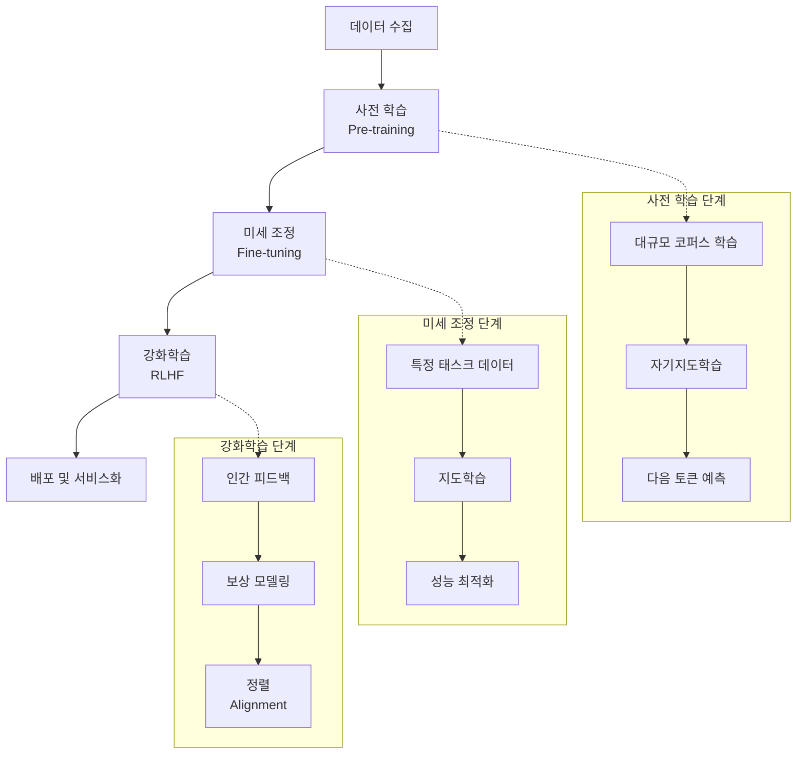

# LLM (Large Language Model): 인간과 유사한 언어 기반 AI 기술

<!-- mtoc-start -->

- [정의 및 개념](#정의-및-개념)
- [주요 아키텍처 및 진화](#주요-아키텍처-및-진화)
- [학습 및 추론 메커니즘](#학습-및-추론-메커니즘)
- [주요 과제 및 한계](#주요-과제-및-한계)
- [활용 사례](#활용-사례)
- [기술 발전 동향](#기술-발전-동향)
- [기대 효과 및 필요성](#기대-효과-및-필요성)
- [마무리](#마무리)
- [Keywords](#keywords)

<!-- mtoc-end -->

거대 언어 모델(Large Language Model, LLM)은 방대한 텍스트 데이터로 학습되어 인간과 유사한 언어 생성 및 이해 능력을 갖춘, 현대 AI 기술의 핵심 이정표입니다. ChatGPT, Claude, Gemini와 같은 서비스의 기반 기술로 자리잡은 LLM은 코드 작성 보조에서부터 창의적 콘텐츠 생성, 복잡한 질의응답까지 다양한 개발 및 비즈니스 영역에서 혁신적인 변화를 주도하고 있습니다.

## 정의 및 개념

- 대규모 언어 모델: 수십억에서 수조 개의 매개변수를 가진 심층 신경망 기반 모델로, 방대한 텍스트 데이터를 학습하여 언어 패턴을 이해하고 생성하는 능력 보유.
- 자기지도학습(Self-supervised Learning) 기반: 명시적인 레이블 없이 텍스트 데이터 자체에서 패턴을 학습하는 방식으로, 대량의 비구조화된 데이터를 활용 가능.

- 특징:

  - 광범위한 맥락 이해 및 활용
  - 다양한 언어 작업 수행 능력
  - 제로샷/퓨샷 학습을 통한 새로운 태스크 적응력
  - 스케일에 따른 발현적 능력(Emergent Capabilities) 증가

- 목적: 인간의 언어 이해 및 생성 능력을 모방하여 자연어 처리 분야의 다양한 문제 해결과 지식 기반 작업 자동화 지원.

## 주요 아키텍처 및 진화

- **트랜스포머(Transformer) 구조**: 2017년 "Attention is All You Need" 논문에서 소개된 병렬 처리에 최적화된 아키텍처로, 자기주의(Self-attention) 메커니즘 기반.

- **모델 규모의 진화**:

  - GPT-1 (1.5억 매개변수) → GPT-3 (1,750억 매개변수) → GPT-4 (수조 매개변수 추정)
  - 매개변수 증가에 따른 성능 향상과 함께 학습 데이터의 품질과 다양성 중요성 증대

- **아키텍처 유형**:
  - 인코더 중심: BERT, RoBERTa (양방향 문맥 이해에 강점)
  - 디코더 중심: GPT 시리즈, LLaMA (텍스트 생성에 최적화)
  - 인코더-디코더 결합: T5, BART (번역, 요약 등 변환 작업에 적합)

## 학습 및 추론 메커니즘

LLM의 학습 과정은 일반적인 언어 패턴을 습득하는 사전 학습과 특정 목적에 맞춰 조정하는 미세 조정, 인간의 선호와 가치에 맞추는 강화학습 단계로 구성됩니다. 각 단계는 모델의 성능과 실용성을 점진적으로 향상시키는 역할을 합니다.

## 주요 과제 및 한계

- **편향성 문제**: 학습 데이터에 존재하는 사회적, 문화적 편향이 모델에 반영되어 윤리적 문제 발생 가능성.

- **환각(Hallucination)**: 실제로 존재하지 않는 정보를 사실처럼 제시하는 현상으로, 신뢰성 저하의 원인.

- **블랙박스 특성**: 내부 의사결정 과정의 불투명성으로 인한 설명 가능성 및 신뢰성 문제.

- **자원 소모**: 모델 학습 및 추론에 필요한 대규모 컴퓨팅 자원과 에너지 소비에 따른 환경적, 경제적 부담.

- **컨텍스트 제한**: 입력 토큰 수의 제한으로 인한 장기 의존성(long-term dependency) 처리 한계.

## 활용 사례

- **개발 지원**: 코드 자동 생성 및 디버깅, API 설계 및 문서화, 테스트 케이스 작성 자동화.

- **기술 문서화**: 기술 스펙, 사용자 매뉴얼, API 문서 등의 작성 및 번역 지원.

- **지식 관리**: 기업 내 축적된 문서 분석, 요약 및 질의응답 시스템 구축으로 업무 효율화.

- **비즈니스 인텔리전스**: 시장 동향 분석, 경쟁사 정보 요약, 데이터 기반 의사결정 지원.

- **고객 서비스**: 24/7 지원 가능한 챗봇 구축으로 사용자 문의 대응 및 문제 해결 자동화.

## 기술 발전 동향

- **다중 모달리티 통합**: 텍스트뿐 아니라 이미지, 오디오, 비디오 등 다양한 형태의 입력을 처리하는 멀티모달 LLM 개발 확산.

- **소형화 및 효율화**: 소규모 기업과 개인 개발자도 활용 가능한 경량화 모델(TinyLLM, DistilBERT 등) 개발.

- **RAG(Retrieval-Augmented Generation)**: 외부 지식 베이스와 연계하여 정확성과 최신성 향상.

- **도메인 특화 모델**: 의료, 법률, 금융 등 특정 도메인에 최적화된 LLM 개발로 전문성 강화.

- **연합 학습(Federated Learning)**: 데이터 프라이버시를 보존하면서 분산된 데이터 소스에서 학습하는 방식 발전.

## 기대 효과 및 필요성

- **개발 생산성 향상**: 반복적인 코딩 작업 자동화로 개발자의 창의적 업무 집중 시간 확보.

- **지식 민주화**: 전문적 지식에 대한 접근성 향상으로 기술 격차 해소 및 혁신 가속화.

- **비즈니스 프로세스 최적화**: 데이터 분석, 문서 처리, 고객 응대 등 다양한 업무 자동화로 효율성 증대.

- **지능형 의사결정 지원**: 복잡한 데이터와 정보를 분석하여 인사이트 제공 및 의사결정 품질 향상.

- **지속 가능한 혁신**: IT 인력 부족 문제 해소 및 기존 인력의 고부가가치 업무 전환 지원.

## 마무리

거대 언어 모델은 단순한 기술 발전을 넘어 IT 산업과 비즈니스 환경 전반에 패러다임 전환을 가져오고 있습니다. 그러나 기술적 잠재력을 최대한 활용하기 위해서는 윤리적 고려사항과 기술적 한계를 균형 있게 다루는 책임감 있는 접근이 필요합니다. 정보관리기술사로서 LLM의 비즈니스 가치와 기술적 특성을 이해하고, 조직 내 적절한 도입 전략을 수립하는 것이 미래 경쟁력 확보의 중요한 열쇠가 될 것입니다.

## Keywords

Large Language Model, 거대 언어 모델, Transformer Architecture, 자기주의 메커니즘, Self-supervised Learning, 인간 피드백 강화학습(RLHF), 프롬프트 엔지니어링, 환각(Hallucination), 미세조정(Fine-tuning), RAG(Retrieval-Augmented Generation)
