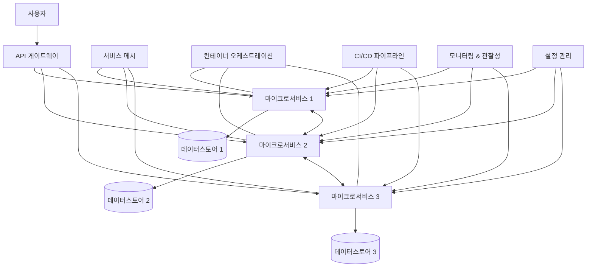

# 클라우드 네이티브: 새로운 애플리케이션 개발 및 운영 패러다임

<!-- mtoc-start -->

- [정의 및 개념](#정의-및-개념)
- [주요 특징](#주요-특징)
- [아키텍처 구성도](#아키텍처-구성도)
- [핵심 기술 스택](#핵심-기술-스택)
- [활용 사례](#활용-사례)
- [기대 효과 및 필요성](#기대-효과-및-필요성)
- [도입 시 고려사항](#도입-시-고려사항)
- [마무리](#마무리)
- [Keywords](#keywords)

<!-- mtoc-end -->

클라우드 네이티브(Cloud Native)는 현대 IT 환경에서 애플리케이션을 설계, 구축, 운영하는 접근 방식으로, 클라우드 컴퓨팅의 이점을 최대한 활용하도록 설계된 아키텍처와 기술 스택을 의미합니다. 이는 단순히 애플리케이션을 클라우드에 호스팅하는 것이 아니라, 클라우드 환경의 특성에 맞게 처음부터 설계하는 철학을 담고 있습니다. 클라우드 네이티브 접근 방식은 확장성, 복원력, 관리 용이성을 향상시켜 비즈니스의 민첩성과 혁신을 가속화하는 데 중요한 역할을 합니다.

## 정의 및 개념

- 클라우드 네이티브: 클라우드 컴퓨팅 모델의 장점을 최대한 활용하도록 설계된 애플리케이션 개발 및 운영 접근 방식.
- 설계 철학: 확장성, 복원력, 자동화, 관찰 가능성을 핵심 원칙으로 하는 시스템 구축 방법론.

- 특징: 마이크로서비스 아키텍처, 컨테이너화, 선언적 API, 불변 인프라, CI/CD 자동화
- 목적: 비즈니스 민첩성 향상, 시스템 안정성 증대, 자원 활용 최적화, 혁신 가속화
- 필요성: 빠르게 변화하는 시장 요구에 대응, 확장 가능한 인프라 구축, 개발-운영 간 협업 강화

## 주요 특징

1. **마이크로서비스 아키텍처**: 애플리케이션을 독립적으로 배포 가능한 작은 서비스로 분해하여 개발 및 확장성을 향상시키는 설계 방식. 각 마이크로서비스는 특정 비즈니스 기능에 집중하며 독립적으로 개발, 테스트, 배포 가능.

2. **컨테이너화**: 애플리케이션과 그 종속성을 하나의 패키지로 묶어 일관된 환경에서 실행할 수 있도록 하는 기술. Docker, Kubernetes 등의 도구를 통해 배포와 확장이 용이.

3. **DevOps 문화 및 CI/CD**: 개발과 운영을 통합하는 접근 방식으로, 지속적 통합(CI)과 지속적 배포(CD)를 통해 소프트웨어 개발 주기를 가속화하고 품질을 향상.

4. **서비스 메시와 오케스트레이션**: Kubernetes, Istio 등을 활용하여 마이크로서비스 간 통신, 로드 밸런싱, 장애 복구, 보안 등을 관리하는 인프라 계층.

5. **선언적 API**: 시스템의 원하는 상태를 선언적으로 정의하고, 인프라가 해당 상태를 유지하도록 자동화하는 접근 방식. YAML, JSON 등의 형식으로 정의.

## 아키텍처 구성도

클라우드 네이티브 아키텍처는 독립적인 마이크로서비스, API 게이트웨이, 서비스 메시, 컨테이너 오케스트레이션 등의 요소로 구성됩니다. 각 서비스는 자체 데이터스토어를 가지며, CI/CD 파이프라인을 통해 지속적으로 배포되고, 모니터링 시스템을 통해 관찰됩니다.

## 핵심 기술 스택

1. **컨테이너 기술**

   - Docker: 애플리케이션과 의존성을 패키징하는 컨테이너 플랫폼
   - Kubernetes: 컨테이너 오케스트레이션 및 관리 플랫폼
   - Containerd, CRI-O: 컨테이너 런타임

2. **오케스트레이션 도구**

   - Helm: Kubernetes 애플리케이션 패키지 매니저
   - Istio: 서비스 메시 구현을 위한 플랫폼
   - Linkerd: 경량 서비스 메시 솔루션

3. **CI/CD 및 자동화**

   - Jenkins, GitLab CI, GitHub Actions: 지속적 통합 및 배포 도구
   - ArgoCD, Flux: GitOps 구현을 위한 도구
   - Terraform, Pulumi: 인프라스트럭처 as 코드(IaC) 도구

4. **모니터링 및 관찰성**
   - Prometheus: 메트릭 수집 및 알림
   - Grafana: 데이터 시각화 대시보드
   - Jaeger, Zipkin: 분산 추적 시스템
   - ELK Stack, Loki: 로그 관리 및 분석

## 활용 사례

1. **디지털 트랜스포메이션 프로젝트**: 기존 모노리식 애플리케이션을 마이크로서비스로 전환하여 개발 속도와 확장성을 향상시키는 사례. 넷플릭스, Spotify 등은 클라우드 네이티브 접근 방식을 통해 기존 시스템을 성공적으로 현대화했습니다.

2. **핀테크 및 금융 서비스**: 고가용성과 보안이 중요한 금융 서비스에서 클라우드 네이티브 기술을 활용해 확장성과 복원력을 확보하는 사례. 실시간 결제 처리, 사기 탐지 등의 서비스에 적용됩니다.

3. **IoT 및 에지 컴퓨팅**: 수많은 디바이스에서 생성되는 데이터를 효율적으로 처리하고 관리하기 위해 클라우드 네이티브 아키텍처를 활용하는 사례. 스마트 시티, 산업 자동화 등에 적용됩니다.

4. **글로벌 전자상거래 플랫폼**: 트래픽 변동에 유연하게 대응하고 지역별 서비스를 최적화하기 위해 클라우드 네이티브 기술을 활용하는 사례. 특히 세일 기간과 같은 트래픽 급증 시 자동 확장성의 이점을 활용합니다.

## 기대 효과 및 필요성

1. **비즈니스 민첩성 향상**

   - 빠른 시장 출시: 개발 주기 단축을 통한 신속한 기능 출시
   - 실험 및 혁신 가속화: 소규모 변경을 안전하게 테스트하고 배포하는 능력

2. **운영 효율성 증대**

   - 자원 활용 최적화: 필요에 따른 자동 확장 및 축소
   - 운영 자동화: 선언적 API를 통한 인프라 관리 자동화

3. **시스템 안정성 및 복원력 강화**

   - 장애 격리: 마이크로서비스 아키텍처를 통한 영향 범위 최소화
   - 자가 치유: 실패한 컴포넌트의 자동 복구 메커니즘

4. **비용 최적화**

   - 사용량 기반 과금: 실제 사용한 자원에 대해서만 비용 지불
   - 운영 오버헤드 감소: 자동화를 통한 인력 비용 절감

5. **개발자 생산성 및 경험 향상**
   - 표준화된 개발 환경: 일관된 개발, 테스트, 배포 경험 제공
   - 자동화된 도구 체인: 개발자가 핵심 비즈니스 로직에 집중할 수 있는 환경

## 도입 시 고려사항

1. **조직 문화 및 역량**

   - DevOps 문화 정착: 개발과 운영 간의 협업 강화
   - 기술 역량 개발: 클라우드 네이티브 기술에 대한 교육 및 훈련

2. **기술적 고려사항**

   - 서비스 분할 전략: 마이크로서비스의 경계 정의
   - 데이터 관리: 분산 데이터 환경에서의 일관성 및 무결성 유지
   - 보안: 분산 환경에서의 인증, 권한 부여, 데이터 보호

3. **전환 전략**
   - 점진적 접근: 스트랭글러 패턴(Strangler Pattern)을 통한 단계적 전환
   - 선택적 현대화: 우선순위가 높은 서비스부터 선택적으로 현대화

## 마무리

클라우드 네이티브는 단순한 기술 트렌드를 넘어 디지털 시대의 비즈니스 민첩성과 혁신을 위한 필수적인 접근 방식으로 자리잡고 있습니다. 마이크로서비스, 컨테이너화, DevOps, 자동화 등의 핵심 요소를 통해 기업은 급변하는 시장 환경에 빠르게 대응하고, 확장 가능하고 복원력 있는 시스템을 구축할 수 있습니다. 클라우드 네이티브 전환은 기술적 변화뿐만 아니라 조직 문화와 운영 방식의 변화를 수반하므로 체계적인 계획과 접근이 필요합니다. 이러한 전환을 성공적으로 이끌기 위해서는 명확한 비전과 목표 설정, 단계적 접근, 지속적인 학습과 개선이 중요합니다.

## Keywords

Cloud Native, 마이크로서비스 아키텍처, 컨테이너화, DevOps, CI/CD, 서비스 메시, Kubernetes, 불변 인프라, 관찰 가능성, 자동화
