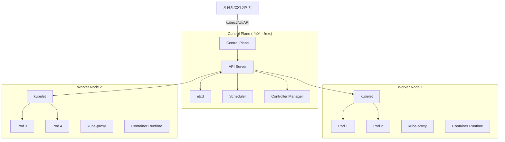

# Kubernetes (쿠버네티스): 클라우드 네이티브 컨테이너 오케스트레이션의 표준

<!-- mtoc-start -->

- [정의 및 개념](#정의-및-개념)
- [주요 특징](#주요-특징)
- [아키텍처](#아키텍처)
- [핵심 구성요소](#핵심-구성요소)
- [활용 사례](#활용-사례)
- [기대 효과 및 필요성](#기대-효과-및-필요성)
- [도입 시 고려사항](#도입-시-고려사항)
- [마무리](#마무리)
- [Keywords](#keywords)

<!-- mtoc-end -->

쿠버네티스(Kubernetes)는 컨테이너화된 애플리케이션의 배포, 확장 및 관리를 자동화하는 오픈소스 플랫폼입니다. 구글이 개발한 내부 시스템인 Borg에서 영감을 받아 탄생한 이 기술은 현재 Cloud Native Computing Foundation(CNCF)에서 관리하며, 마이크로서비스 아키텍처를 운영하는 클라우드 인프라의 사실상 표준 도구로 자리 잡았습니다. 대규모 분산 시스템을 효율적으로 관리하고 확장성, 가용성, 복원력을 보장하는 쿠버네티스의 핵심 개념과 구성 요소를 살펴보겠습니다.

## 정의 및 개념

- 컨테이너 오케스트레이션 플랫폼으로, 분산 시스템 환경에서 컨테이너화된 애플리케이션의 배포, 확장, 운영 자동화를 지원하는 오픈소스 시스템.
- 하나의 논리적 단위로 함께 작동하도록 여러 컨테이너를 그룹화하고, 이러한 워크로드를 여러 호스트에 분산 배치하여 가용성과 확장성을 제공.

- 특징: 자동화된 배포 관리, 자가 치유(Self-healing) 기능, 수평적 확장성, 서비스 디스커버리, 로드 밸런싱
- 목적: 컨테이너 기반 애플리케이션의 운영 복잡성 감소, 인프라 자원의 효율적 활용, 시스템 가용성 향상
- 필요성: 마이크로서비스 아키텍처의 증가, 클라우드 네이티브 개발 방식의 확산, DevOps 문화 채택

## 주요 특징

1. **선언적 구성 관리**: YAML 또는 JSON 형식의 매니페스트 파일을 통해 원하는 상태를 선언하면, 쿠버네티스가 현재 상태를 원하는 상태로 지속적으로 조정

2. **자가 치유 메커니즘**: 노드 장애, 애플리케이션 충돌 등의 문제가 발생하면 자동으로 컨테이너를 재시작하거나 노드를 교체하여 서비스 중단 최소화

3. **수평적 확장 자동화**: CPU 사용량, 메모리 사용량 등의 메트릭을 기반으로 HPA(Horizontal Pod Autoscaler)를 통해 워크로드를 자동으로 확장 또는 축소

4. **롤링 업데이트 및 롤백**: 무중단 배포를 위한 롤링 업데이트 전략을 지원하며, 문제 발생 시 이전 버전으로 자동 롤백 가능

5. **서비스 디스커버리 및 로드 밸런싱**: 내부적으로 DNS를 사용하여 서비스 이름으로 접근할 수 있게 하고, 트래픽을 여러 POD에 분산

## 아키텍처

쿠버네티스 아키텍처는 마스터 노드(Control Plane)와 워커 노드로 구성됩니다. 마스터 노드는 클러스터 상태를 관리하고 워커 노드는 실제 애플리케이션을 실행합니다. API 서버를 중심으로 모든 컴포넌트가 통신하며 선언된 상태를 유지합니다.

## 핵심 구성요소

1. **Control Plane (마스터 노드) 구성요소**

   - **API Server**: 모든 쿠버네티스 컴포넌트 간의 통신을 담당하는 중앙 컴포넌트
   - **etcd**: 클러스터의 모든 상태와 구성 정보를 저장하는 분산형 키-값 저장소
   - **Scheduler**: 새로 생성된 Pod를 어떤 노드에서 실행할지 결정
   - **Controller Manager**: 노드, 레플리케이션, 엔드포인트 등 다양한 컨트롤러 실행

2. **Worker 노드 구성요소**

   - **kubelet**: 각 노드에서 실행되며 컨테이너가 Pod 스펙에 따라 실행되도록 보장
   - **kube-proxy**: 네트워크 규칙을 관리하고 Pod 간 통신 및 외부 통신 담당
   - **Container Runtime**: 컨테이너를 실행하는 소프트웨어(Docker, containerd, CRI-O)

3. **기본 오브젝트**
   - **Pod**: 쿠버네티스의 가장 작은 배포 단위, 하나 이상의 컨테이너 그룹
   - **Service**: Pod 집합에 대한 안정적인 네트워크 엔드포인트 제공
   - **Volume**: 데이터 저장 및 Pod 간 데이터 공유를 위한 디렉토리
   - **Namespace**: 클러스터 내에서 리소스 분리를 위한 가상 클러스터

## 활용 사례

1. **마이크로서비스 아키텍처 운영**

   - Netflix, Spotify, Airbnb 등 대규모 서비스 기업들이 마이크로서비스 기반 애플리케이션을 쿠버네티스로 운영
   - 개별 서비스의 독립적 배포와 확장 지원으로 서비스 안정성과 개발 속도 향상

2. **하이브리드 및 멀티클라우드 환경**

   - AWS, Azure, GCP 등 다양한 클라우드 플랫폼과 온프레미스 환경에서 일관된 배포 및 운영 제공
   - 특정 클라우드 제공업체에 종속되지 않는 이식성 확보

3. **CI/CD 파이프라인 자동화**

   - Jenkins, GitLab CI, GitHub Actions 등과 통합하여 지속적 통합 및 배포 자동화 구현
   - 코드 변경부터 프로덕션 배포까지 완전 자동화된 워크플로우 구성

4. **빅데이터 및 AI/ML 워크로드**
   - Spark, Hadoop, TensorFlow 등 데이터 처리 및 AI/ML 워크로드의 분산 처리 지원
   - 필요에 따라 자원을 동적으로 할당하고 확장하여 비용 효율성 향상

## 기대 효과 및 필요성

1. **운영 효율성 향상**

   - 인프라 자원 활용도 최적화로 비용 절감 효과
   - 자동화된 운영으로 관리 리소스 감소 및 휴먼 에러 최소화

2. **개발 생산성 증대**

   - 개발자가 인프라 구성보다 애플리케이션 개발에 집중할 수 있는 환경 제공
   - 표준화된 배포 환경으로 개발-테스트-운영 환경 간 일관성 확보

3. **시스템 안정성 및 가용성 강화**

   - 자가 치유 메커니즘을 통한 장애 자동 복구
   - 로드밸런싱과 자동 확장으로 트래픽 변동에 효과적 대응

4. **클라우드 네이티브 전환 촉진**
   - DevOps, 지속적 배포, 마이크로서비스 아키텍처 도입 가속화
   - 클라우드 기술 스택과의 원활한 통합으로 디지털 전환 지원

## 도입 시 고려사항

1. **복잡성 관리**

   - 초기 학습 곡선이 가파르므로 단계적 도입과 교육 필요
   - 헬름(Helm), 오퍼레이터(Operator) 등 복잡성을 줄이는 도구 활용

2. **모니터링 및 로깅 전략**

   - Prometheus, Grafana, ELK 스택 등 모니터링 도구 통합
   - 분산 환경에서의 추적성 확보를 위한 전략 수립

3. **보안 설계**

   - RBAC(Role-Based Access Control)를 통한 접근 권한 관리
   - 네트워크 정책, 시크릿 관리, 취약점 스캐닝 등 보안 레이어 구축

4. **인프라 요구사항**
   - 고가용성 구성을 위한 충분한 하드웨어 자원 확보
   - 네트워크, 스토리지 등 기반 인프라 요소의 적절한 설계

## 마무리

쿠버네티스는 현대적인 클라우드 네이티브 애플리케이션 운영의 표준 플랫폼으로 자리매김했습니다. 초기 도입 복잡성에도 불구하고, 확장성, 가용성, 이식성 등의 장점으로 다양한 규모의 조직에서 활용되고 있습니다. 마이크로서비스 아키텍처와 DevOps 방법론을 효과적으로 지원하는 쿠버네티스는 디지털 트랜스포메이션을 추진하는 기업에게 필수적인 기술 인프라로 고려해볼 만합니다. 조직의 요구사항과 현재 역량을 고려한 단계적 도입 전략을 수립하여 클라우드 네이티브 여정을 시작해보시기 바랍니다.

## Keywords

Kubernetes, Container Orchestration, 마이크로서비스, 클라우드 네이티브, Self-healing, Pod, Service, 선언적 구성, Horizontal Pod Autoscaler, DevOps
