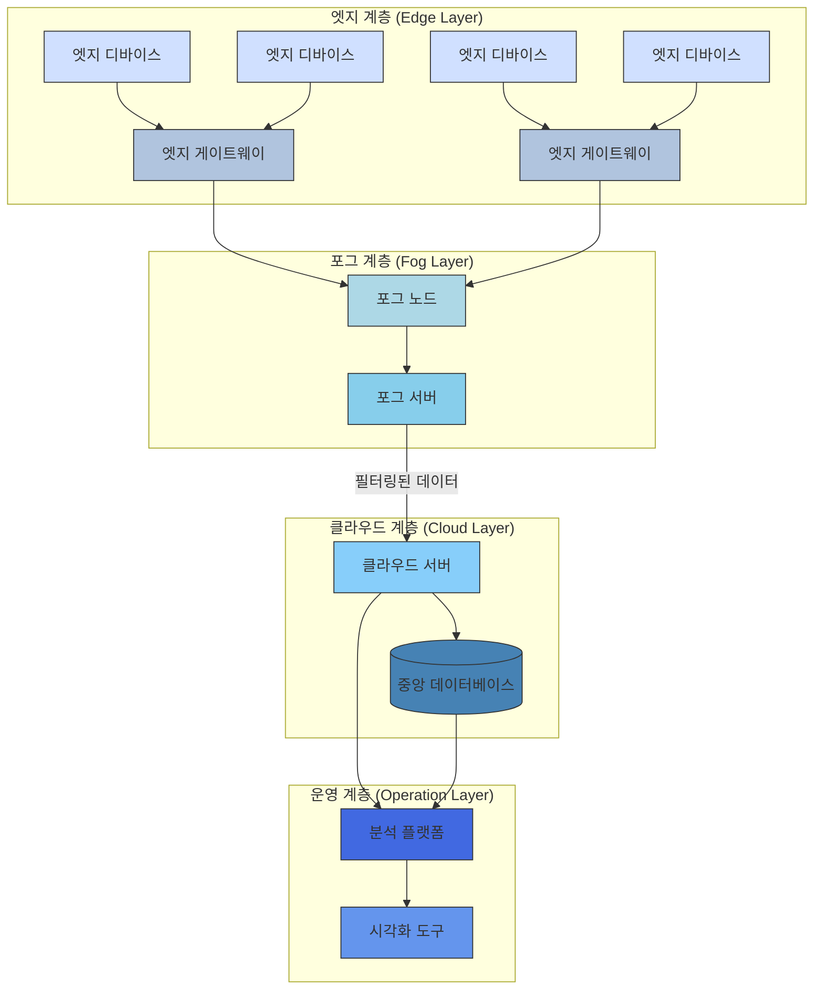

# 에지 컴퓨팅(Edge Computing): 분산 환경에서의 실시간 데이터 처리 기술

<!-- mtoc-start -->

- [정의 및 개념](#정의-및-개념)
- [주요 특징](#주요-특징)
- [아키텍처 구성도](#아키텍처-구성도)
- [활용 사례](#활용-사례)
- [구현 기술 및 프레임워크](#구현-기술-및-프레임워크)
- [기대 효과 및 필요성](#기대-효과-및-필요성)
- [도입 시 고려사항](#도입-시-고려사항)
- [마무리](#마무리)
- [Keywords](#keywords)

<!-- mtoc-end -->

에지 컴퓨팅(Edge Computing)은 데이터가 생성되는 위치 또는 근접한 네트워크 엣지에서 처리하는 분산 컴퓨팅 패러다임입니다. 중앙집중식 클라우드 모델과 달리, 네트워크 경계에서 데이터를 처리함으로써 지연시간을 최소화하고 대역폭 사용을 효율화합니다. 4차 산업혁명과 IoT(Internet of Things) 기기의 폭발적 증가로 인해 실시간 데이터 처리 요구가 높아지면서, 에지 컴퓨팅은 현대 디지털 인프라의 핵심 요소로 자리잡고 있습니다.

## 정의 및 개념

- 에지 컴퓨팅: 데이터 발생 지점 또는 근접 위치에서 데이터를 처리하는 분산형 컴퓨팅 아키텍처. 클라우드 컴퓨팅의 중앙 집중식 처리 방식을 보완하는 접근법.
- 목적: 지연시간 감소, 대역폭 최적화, 실시간 분석 지원 및 데이터 주권 강화를 통한 응용 프로그램의 성능 향상.
- 필요성: IoT 기기 증가, 실시간 처리 요구, 네트워크 부하 분산 및 클라우드 의존성 감소를 위한 기술적 대안.

## 주요 특징

- **분산 처리**: 데이터 처리 작업을 여러 에지 노드에 분산하여 중앙 서버의 부하를 줄이고 처리 효율성 증대
- **지연시간 최소화**: 데이터가 중앙 클라우드까지 이동할 필요 없이 로컬에서 처리되어 응답 시간 단축 (밀리초 단위의 지연시간 보장)
- **대역폭 최적화**: 모든 원시 데이터를 클라우드로 전송하지 않고 현장에서 필터링 및 처리하여 네트워크 효율성 증가
- **자율 운영**: 네트워크 연결이 불안정하거나 끊어진 상황에서도 독립적으로 작동 가능한 복원력
- **보안 강화**: 민감한 데이터를 로컬에서 처리하여 전송 중 발생할 수 있는 보안 위험 감소

## 아키텍처 구성도

에지 컴퓨팅 아키텍처는 데이터 소스(엣지 디바이스)에서 중앙 클라우드까지 여러 계층으로 구성됩니다. 데이터는 발생 지점에서 1차 처리되며, 필요한 정보만 상위 계층으로 전달되어 지연시간을 최소화하고 대역폭 사용을 효율화합니다.

## 활용 사례

- **스마트 제조**: 공장 내 센서와 기계 장비에서 발생하는 데이터를 실시간으로 분석하여 생산 라인 최적화 및 예측 유지보수 구현
- **자율주행 차량**: 차량 센서에서 수집된 데이터를 즉시 처리하여 주행 결정에 활용, 중앙 서버와의 통신 지연으로 인한 사고 위험 감소
- **스마트 시티**: 교통 신호, 공공 안전 카메라, 환경 센서 등에서 수집된 데이터를 로컬에서 처리하여 도시 서비스 최적화
- **의료 모니터링 시스템**: 환자 모니터링 장치에서 수집된 생체 데이터를 현장에서 분석하여 응급 상황 신속 감지
- **AR/VR 응용**: 증강/가상 현실 애플리케이션에서 요구되는 밀리초 단위의 응답 시간을 보장하여 몰입형 경험 제공

## 구현 기술 및 프레임워크

- **에지 디바이스**: 라즈베리 파이, 아두이노, 산업용 게이트웨이 등 경량 컴퓨팅 장치
- **에지 소프트웨어 플랫폼**:
  - AWS Greengrass: IoT 디바이스를 위한 엣지 런타임 환경
  - Azure IoT Edge: 마이크로소프트의 엣지 컴퓨팅 솔루션
  - Google Cloud IoT Edge: 구글 클라우드의 엣지 컴퓨팅 플랫폼
- **경량 컨테이너 기술**: Docker, Kubernetes Edge 등을 활용한 에지 환경 애플리케이션 배포
- **5G 네트워크**: 초고속, 초저지연 특성을 활용한 에지 컴퓨팅 인프라 강화

## 기대 효과 및 필요성

- **운영 효율성**: 데이터 처리 및 분석을 분산시켜 중앙 시스템 부하 감소, 전체 시스템 안정성 향상
- **비용 절감**: 클라우드로의 데이터 전송량 감소로 네트워크 및 스토리지 비용 절감
- **실시간 의사결정**: 즉각적인 데이터 처리로 시간 민감성이 높은 운영 환경에서 신속한 대응 가능
- **연결 독립성**: 네트워크 연결이 불안정한 환경에서도 지속적인 운영 보장
- **데이터 주권 및 규제 준수**: 데이터를 발생 국가나 지역 내에서 처리함으로써 데이터 현지화 규제 준수

## 도입 시 고려사항

- **리소스 제약**: 에지 디바이스의 제한된 컴퓨팅 능력과 전력 소비를 고려한 경량 애플리케이션 설계
- **보안 관리**: 분산된 환경에서의 일관된 보안 정책 적용 및 취약점 관리
- **표준화 부재**: 다양한 에지 플랫폼 간 상호운용성 확보를 위한 표준 적용
- **확장성 관리**: 수천, 수만 개의 에지 노드를 효율적으로 모니터링하고 관리하는 방안 마련
- **데이터 동기화**: 에지와 클라우드 간 데이터 일관성 유지 메커니즘 구축

## 마무리

에지 컴퓨팅은 실시간 데이터 처리와 분석이 요구되는 현대 디지털 환경에서 필수적인 컴퓨팅 패러다임으로 자리잡고 있습니다. IoT 기기의 확산과 5G 네트워크의 상용화로 인해 그 중요성은 더욱 커질 전망입니다. 기업은 네트워크 엣지에서의 데이터 처리 역량을 강화함으로써 응답성, 효율성, 비용 측면에서 경쟁 우위를 확보할 수 있습니다. 에지 컴퓨팅은 독립적인 기술이 아닌, 기존 클라우드 인프라와 상호 보완적인 관계로 발전하며 하이브리드 컴퓨팅 환경의 핵심 구성요소로 진화하고 있습니다.

## Keywords

Edge Computing, 분산 컴퓨팅, 실시간 처리, 지연시간 최소화, IoT Edge, Fog Computing, 네트워크 대역폭 최적화, 에지 분석, 데이터 현지화, 5G 네트워크
