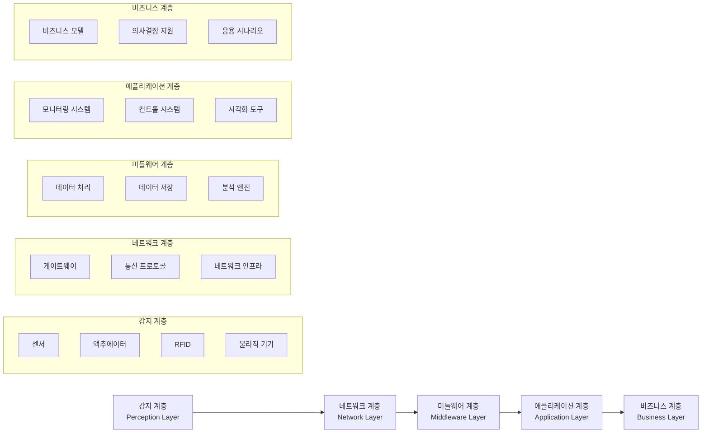

# 사물인터넷 (IoT): 모든 것이 연결된 지능형 네트워크 생태계

<!-- mtoc-start -->

- [정의 및 개념](#정의-및-개념)
- [주요 특징](#주요-특징)
- [IoT 아키텍처](#iot-아키텍처)
- [통신 프로토콜](#통신-프로토콜)
- [활용 사례](#활용-사례)
- [보안 및 프라이버시 고려사항](#보안-및-프라이버시-고려사항)
- [기대 효과 및 필요성](#기대-효과-및-필요성)
- [마무리](#마무리)
- [Keywords](#keywords)

<!-- mtoc-end -->

사물인터넷(Internet of Things, IoT)은 물리적 객체들이 센서, 소프트웨어 및 기타 기술과 결합하여 인터넷을 통해 다른 기기 및 시스템과 데이터를 교환할 수 있게 하는 혁신적인 패러다임입니다. 스마트홈의 가전제품부터 산업용 장비까지, IoT는 우리 주변의 일상적인 물건들을 지능형 네트워크로 변화시키고 있으며, 에지 컴퓨팅과의 결합을 통해 실시간 제어 및 분석이 가능한 새로운 기술 환경을 조성하고 있습니다.

## 정의 및 개념

- 사물인터넷: 센서와 액추에이터가 내장된 물리적 객체들이 인터넷에 연결되어 데이터를 수집, 교환, 분석하는 네트워크 환경.
- 핵심 요소: 센서, 연결성, 데이터 처리, 사용자 인터페이스, 액션 디바이스의 유기적 결합으로 구성.

## 주요 특징

- **초연결성(Hyper-connectivity)**: 수십억 개의 기기가 인터넷에 연결되어 상시적으로 통신하며, 2025년까지 약 300억 개 이상의 IoT 기기가 배포될 것으로 예상됨
- **데이터 중심성**: 센서를 통해 실시간으로 방대한 양의 데이터를 수집하여 가치 있는 인사이트 도출 가능
- **자율 운영**: 인공지능 및 머신러닝과 결합하여 인간의 개입 없이 상황을 인식하고 대응하는 자율적 의사결정 지원
- **에지 컴퓨팅 결합**: 클라우드로 데이터를 전송하기 전 기기 자체에서 처리함으로써 지연 시간 감소 및 대역폭 효율성 증대

## IoT 아키텍처

IoT 시스템은 감지 계층부터 비즈니스 계층까지 다섯 개의 주요 계층으로 구성됩니다. 각 계층은 데이터의 수집, 전송, 처리, 응용 및 비즈니스 가치 창출이라는 고유한 역할을 담당하며 상호 유기적으로 작동합니다.

## 통신 프로토콜

- **근거리 통신**: Bluetooth, Zigbee, Z-Wave, Wi-Fi - 가정 및 사무실 환경에서 저전력 기기 간 연결에 활용
- **원거리 통신**: NB-IoT, LoRaWAN, Sigfox - 광범위한 영역에서 저전력, 저대역폭 연결 지원
- **유선 통신**: Ethernet, Modbus - 안정적인 연결이 필요한 산업용 IoT 환경에서 활용
- **표준화 노력**: OneM2M, OCF(Open Connectivity Foundation) 등의 단체를 통한 상호운용성 표준 개발

## 활용 사례

- **스마트 홈**: 조명, 보안 시스템, 온도 제어 등 가정 내 기기들의 자동화 및 원격 제어
- **스마트 시티**: 교통 관리, 에너지 사용 최적화, 공기질 모니터링, 쓰레기 관리 등 도시 인프라의 효율성 향상
- **산업용 IoT(IIoT)**: 생산 라인 모니터링, 예측 유지보수, 자산 추적을 통한 제조 공정 최적화
- **헬스케어**: 웨어러블 기기를 통한 환자 모니터링, 약물 복용 관리, 원격 의료 서비스 제공
- **농업**: 스마트 관개 시스템, 토양 상태 모니터링, 가축 관리를 통한 정밀 농업 실현

## 보안 및 프라이버시 고려사항

- **엔드포인트 보안**: 리소스가 제한된 IoT 기기에 적합한 경량 암호화 및 인증 메커니즘 구현
- **네트워크 보안**: 세그멘테이션, 암호화된 통신 채널, 침입 탐지 시스템을 통한 데이터 전송 보호
- **데이터 프라이버시**: 사용자 동의 기반 데이터 수집 및 최소 권한 원칙 적용
- **규제 준수**: GDPR, CCPA 등 데이터 보호 규정에 따른 개인정보 처리 관행 채택

## 기대 효과 및 필요성

- **운영 효율성**: 실시간 모니터링 및 자동화를 통한 프로세스 최적화로 비용 절감 및 생산성 향상
- **데이터 기반 의사결정**: 다양한 소스에서 수집된 데이터 분석을 통한 인사이트 도출 및 전략적 결정 지원
- **새로운 비즈니스 모델**: 제품 중심에서 서비스 중심으로의 전환을 통한 수익 창출 기회 발굴
- **지속가능성**: 에너지, 물, 기타 자원의 효율적 사용을 통한 환경 영향 최소화
- **사용자 경험 개선**: 개인화된 서비스 및 직관적인 인터페이스를 통한 고객 만족도 향상

## 마무리

사물인터넷은 단순한 기술 트렌드를 넘어 우리 삶과 비즈니스 방식을 근본적으로 변화시키는 디지털 혁신의 핵심 동력입니다. 초연결성, 실시간 데이터 분석, 자율 운영 능력을 갖춘 IoT 시스템은 산업 효율성 향상부터 스마트 시티 구현까지 다양한 영역에서 새로운 가능성을 열어가고 있습니다. 하지만 이러한 잠재력을 온전히 실현하기 위해서는 보안, 프라이버시, 상호운용성 등의 도전과제를 체계적으로 해결해 나가는 노력이 필수적입니다.

## Keywords

Internet of Things, 사물인터넷, Edge Computing, 에지 컴퓨팅, Connected Devices, 초연결성, Industrial IoT, 산업용 IoT, Smart Home, 스마트홈, Sensor Networks, 센서 네트워크, M2M Communication, 사물간 통신
