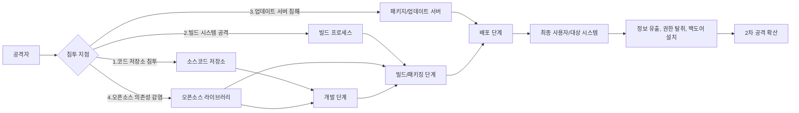

# 소프트웨어 공급망 공격: 진화하는 사이버 위협의 새로운 패러다임

<!-- mtoc-start -->

- [정의 및 개념](#정의-및-개념)
- [주요 특징](#주요-특징)
- [공격 메커니즘](#공격-메커니즘)
- [취약 지점 유형](#취약-지점-유형)
  - [1. 소스코드 단계 공격](#1-소스코드-단계-공격)
  - [2. 빌드 프로세스 공격](#2-빌드-프로세스-공격)
  - [3. 배포 단계 공격](#3-배포-단계-공격)
  - [4. 의존성 기반 공격](#4-의존성-기반-공격)
- [주요 사례](#주요-사례)
- [방어 전략](#방어-전략)
  - [기술적 대응](#기술적-대응)
  - [프로세스 대응](#프로세스-대응)
- [기대 효과 및 필요성](#기대-효과-및-필요성)
- [마무리](#마무리)
- [Keywords](#keywords)

<!-- mtoc-end -->

소프트웨어 공급망 공격(Software Supply Chain Attack)은 소프트웨어 개발 및 배포 과정에서 발생하는 취약점을 악용하여 최종 사용자를 공격하는 사이버 공격 방식입니다. 전통적인 직접 공격 방식과 달리, 신뢰할 수 있는 소프트웨어 공급자를 통해 악성코드를 전파함으로써 보안 시스템을 우회하는 고도화된 공격 전략입니다.

## 정의 및 개념

- 소프트웨어 공급망 공격: 소프트웨어 개발, 배포, 업데이트 프로세스 상의 취약점을 악용하여 합법적인 소프트웨어에 악성코드를 삽입하는 공격 기법.
- 신뢰 관계 악용: 사용자와 소프트웨어 공급자 간의 신뢰 관계를 악용하여 보안 장벽을 우회하는 특성.

- 목적: 대규모 사용자 기반을 가진 소프트웨어를 통해 광범위한 시스템 접근 및 정보 탈취
- 특징: 탐지 어려움, 광범위한 영향력, 지속적인 위협 가능성

## 주요 특징

- **권한 확장**: 신뢰받는 소프트웨어의 권한을 활용하여 보안 시스템 우회 및 높은 수준의 시스템 접근 가능
- **은닉성**: 정상적인 소프트웨어 업데이트나 배포 과정에 숨겨져 기존 보안 솔루션으로 탐지 어려움
- **범위 확장성**: 단일 공급망 취약점을 통해 수천, 수만 개의 조직에 동시 영향 가능
- **지속성**: 한번 침투하면 장기간 탐지되지 않고 지속적인 침해 활동 수행 가능
- **표적화**: 특정 산업이나 조직을 대상으로 정교하게 설계된 공격 가능

## 공격 메커니즘

소프트웨어 공급망 공격은 개발 단계부터 최종 사용자까지 이어지는 전체 소프트웨어 생명주기의 다양한 지점을 통해 침투합니다. 공격자는 코드 저장소, 빌드 시스템, 배포 서버 또는 의존성 라이브러리를 감염시켜 최종 사용자에게 악성코드를 전달합니다.

## 취약 지점 유형

### 1. 소스코드 단계 공격

- **코드 저장소 침투**: GitHub, GitLab 등의 소스 코드 관리 시스템 계정 탈취
- **개발자 환경 감염**: 개발자 시스템에 악성코드 설치하여 코드 작성 과정에서 악성 코드 삽입
- **악의적인 코드 기여**: 오픈소스 프로젝트에 의도적으로 악성 코드 기여

### 2. 빌드 프로세스 공격

- **빌드 서버 침해**: 빌드 프로세스 중 악성코드 삽입
- **CI/CD 파이프라인 취약점**: 자동화된 빌드 및 배포 시스템의 보안 취약점 악용
- **빌드 도구 감염**: 컴파일러나 빌드 도구 자체를 감염시켜 정상 코드를 악성코드로 변환

### 3. 배포 단계 공격

- **패키지 저장소 침해**: NPM, PyPI 등 패키지 관리 시스템 침투
- **업데이트 서버 감염**: 소프트웨어 업데이트 배포 시스템 해킹
- **인증서 탈취**: 코드 서명 인증서 탈취를 통한 악성 코드 서명

### 4. 의존성 기반 공격

- **타이포스쿼팅(Typosquatting)**: 인기 있는 라이브러리와 유사한 이름의 악성 패키지 배포
- **의존성 혼동**: 라이브러리 의존성 참조 혼란을 이용한 악성 패키지 주입
- **알려진 의존성 취약점 악용**: 패치되지 않은 라이브러리 취약점 활용

## 주요 사례

- **SolarWinds 공격(2020)**: 업데이트 서버를 통해 악성코드가 포함된 정상 업데이트를 배포하여 18,000개 이상의 기관 감염
- **Kaseya VSA 공격(2021)**: IT 관리 소프트웨어의 취약점을 이용해 랜섬웨어 배포, 1,500개 이상 기업 피해
- **Log4j 취약점(2021)**: 널리 사용되는 Java 로깅 라이브러리의 취약점을 이용한 대규모 공격
- **NPM 패키지 감염 사례**: ua-parser-js, coa, rc 등 인기 있는 NPM 패키지의 계정 탈취를 통한 악성코드 배포

## 방어 전략

### 기술적 대응

- **소프트웨어 구성 분석(SCA)**: 사용 중인 모든 소프트웨어 컴포넌트 및 의존성 식별 및 관리
- **SBOM(Software Bill of Materials)**: 소프트웨어 구성요소 목록 생성 및 관리
- **코드 서명**: 모든 코드 및 업데이트에 대한 디지털 서명 검증
- **무결성 검증**: 소프트웨어 무결성 검사를 위한 해시 검증 메커니즘 구현

### 프로세스 대응

- **공급망 위험 평가**: 소프트웨어 공급업체 보안 평가 및 모니터링
- **제로 트러스트 모델**: 모든 접근에 대한 지속적인 인증 및 권한 검증
- **최소 권한 원칙**: 소프트웨어에 필요한 최소한의 시스템 접근 권한만 부여
- **지속적인 모니터링**: 비정상적인 소프트웨어 동작 및 네트워크 활동 실시간 모니터링

## 기대 효과 및 필요성

- **보안 인식 확대**: 개발 및 배포 전 과정에서의 보안 중요성 인식 확산
- **공급망 투명성 강화**: 소프트웨어 컴포넌트 및 의존성에 대한 가시성 확보
- **사이버 회복탄력성 향상**: 공급망 위협에 대한 탐지 및 대응 능력 강화
- **비즈니스 연속성 보장**: 소프트웨어 공급망 공격으로 인한 서비스 중단 최소화
- **고객 신뢰 유지**: 소프트웨어 제품의 보안성 강화를 통한 사용자 신뢰 확보

## 마무리

소프트웨어 공급망 공격은 디지털 시대의 새로운 보안 위협으로, 단일 공격으로 광범위한 피해를 줄 수 있는 효율적인 공격 벡터입니다. 조직은 소프트웨어 개발 및 조달 전 과정에서 보안을 핵심 요소로 고려하고, 공급망 가시성 확보와 지속적인 위험 평가를 통해 이러한 위협에 대비해야 합니다. 개발자, 공급업체, 사용자 모두가 협력하여 소프트웨어 생태계의 보안을 강화하는 것이 필수적입니다.

## Keywords

Software Supply Chain Attack, 소프트웨어 공급망 공격, Code Repository Breach, 의존성 감염, SBOM (Software Bill of Materials), 타이포스쿼팅, 코드 서명, 무결성 검증, Supply Chain Risk Management, 제로 트러스트
