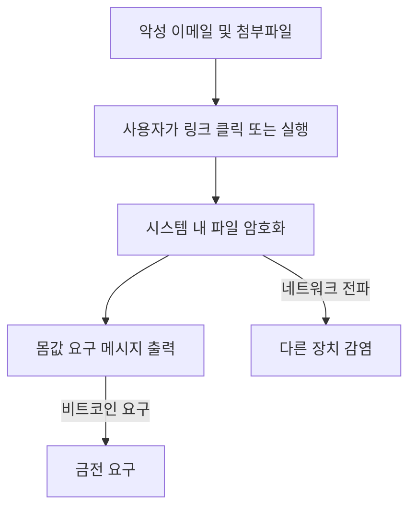

# 랜섬웨어(Ransomware): 데이터 인질극과 보안 위협

<!-- mtoc-start -->

- [정의 및 개념](#정의-및-개념)
- [주요 특징](#주요-특징)
  - [1. 파일 암호화 및 접근 차단](#1-파일-암호화-및-접근-차단)
  - [2. 금전 요구 및 협박](#2-금전-요구-및-협박)
  - [3. 네트워크 확산 가능](#3-네트워크-확산-가능)
  - [4. 데이터 유출 위험](#4-데이터-유출-위험)
  - [5. 자동화 및 변종 진화](#5-자동화-및-변종-진화)
- [감염 방식](#감염-방식)
- [주요 랜섬웨어 유형](#주요-랜섬웨어-유형)
  - [1. 암호화형 랜섬웨어 (Crypto Ransomware)](#1-암호화형-랜섬웨어-crypto-ransomware)
  - [2. 락스크린형 랜섬웨어 (Locker Ransomware)](#2-락스크린형-랜섬웨어-locker-ransomware)
  - [3. 이중 협박 랜섬웨어 (Double Extortion)](#3-이중-협박-랜섬웨어-double-extortion)
  - [4. 서비스형 랜섬웨어 (Ransomware-as-a-Service, RaaS)](#4-서비스형-랜섬웨어-ransomware-as-a-service-raas)
- [예방 및 대응 방법](#예방-및-대응-방법)
  - [1. 예방 조치](#1-예방-조치)
  - [2. 감염 후 대응](#2-감염-후-대응)
- [기대 효과 및 필요성](#기대-효과-및-필요성)
- [마무리](#마무리)
- [Keywords](#keywords)

<!-- mtoc-end -->

랜섬웨어(Ransomware)는 악성코드의 한 종류로, 감염된 시스템의 파일을 암호화하여 사용자가 접근할 수 없도록 만든 뒤 금전을 요구하는 사이버 공격 방식이다. 최근 기업 및 기관을 대상으로 한 공격이 증가하면서, 랜섬웨어 대응 전략과 예방 조치의 중요성이 커지고 있다.

## 정의 및 개념

- **랜섬웨어**: 시스템을 감염시키고 파일을 암호화하여 사용자의 접근을 차단한 후, 복구를 대가로 금전을 요구하는 악성코드
- **특징**: 파일 암호화, 금전 요구, 데이터 탈취, 네트워크 확산
- **필요성**: 기업과 개인의 데이터 보호, 보안 취약점 개선, 피해 최소화

## 주요 특징

### 1. 파일 암호화 및 접근 차단

랜섬웨어는 감염된 시스템의 중요한 파일을 암호화하고, 사용자에게 복호화 키를 제공하는 대가로 몸값(Ransom)을 요구한다.

### 2. 금전 요구 및 협박

공격자는 암호화된 파일을 복구할 수 있도록 암호 해독 키를 제공하겠다며, 일반적으로 비트코인 같은 암호화폐를 요구한다.

### 3. 네트워크 확산 가능

일부 랜섬웨어는 감염된 시스템에서 네트워크를 통해 다른 장치로 확산되며, 조직 전체를 마비시킬 수도 있다.

### 4. 데이터 유출 위험

최근에는 단순한 파일 암호화뿐만 아니라, 데이터를 탈취하여 공개 협박을 하는 **이중 협박(Double Extortion)** 기법이 증가하고 있다.

### 5. 자동화 및 변종 진화

랜섬웨어 공격 방식이 자동화되고, 새로운 변종이 지속적으로 등장하여 기존 보안 시스템을 우회하는 사례가 늘어나고 있다.

## 감염 방식

랜섬웨어는 주로 이메일 피싱, 악성 웹사이트, 소프트웨어 취약점 등을 통해 유입되며, 감염 후 파일 암호화 및 네트워크 확산이 진행된다.

## 주요 랜섬웨어 유형

### 1. 암호화형 랜섬웨어 (Crypto Ransomware)

파일을 암호화하여 사용자가 접근할 수 없도록 만든 후 복호화 키를 제공하는 대가로 금전을 요구

- 예시: WannaCry, Locky, REvil

### 2. 락스크린형 랜섬웨어 (Locker Ransomware)

파일을 암호화하지 않고, 운영체제 또는 특정 프로그램을 잠가 사용자의 접근을 차단

- 예시: Winlocker, Police Ransomware

### 3. 이중 협박 랜섬웨어 (Double Extortion)

파일을 암호화한 후, 피해자의 데이터를 유출하겠다고 협박하는 방식

- 예시: Maze, Conti

### 4. 서비스형 랜섬웨어 (Ransomware-as-a-Service, RaaS)

공격자들이 랜섬웨어를 서비스 형태로 제공하여 누구나 쉽게 공격을 실행할 수 있도록 지원

- 예시: DarkSide, Babuk

## 예방 및 대응 방법

### 1. 예방 조치

- **정기적인 백업 수행**: 오프라인 및 클라우드 백업을 유지하여 감염 시 데이터 복구 가능
- **보안 업데이트 적용**: 운영체제 및 소프트웨어를 최신 상태로 유지하여 취약점 제거
- **이메일 보안 강화**: 출처가 불분명한 이메일 및 첨부파일 실행 금지
- **강력한 보안 솔루션 사용**: 안티바이러스 및 엔드포인트 보호 솔루션 도입
- **사용자 교육**: 피싱 공격 및 악성 파일에 대한 인식 제고

### 2. 감염 후 대응

- **몸값 지불 금지**: 랜섬웨어 공격자에게 돈을 지불하면 추가 공격 대상이 될 가능성이 높음
- **격리 및 네트워크 차단**: 감염된 시스템을 즉시 네트워크에서 분리하여 확산 방지
- **보안 기관 및 전문가 문의**: 사이버 보안 전문가 또는 기관(KISA, FBI 등)과 협력하여 복구 방안 모색
- **데이터 복구 시도**: 백업 데이터 활용 및 복구 도구 사용

## 기대 효과 및 필요성

- **기업 및 개인의 데이터 보호**: 중요한 정보를 안전하게 유지하여 피해 최소화
- **비즈니스 연속성 확보**: 보안 강화로 랜섬웨어 공격으로 인한 업무 중단 방지
- **경제적 손실 예방**: 몸값 지불 및 데이터 유출로 인한 경제적 손실 방지
- **보안 인식 개선**: 사용자 및 조직의 보안 교육 강화로 사이버 공격 대응 능력 향상
- **랜섬웨어 발전에 대한 선제적 대응**: 새로운 위협에 대비한 보안 기술 연구 및 정책 강화

## 마무리

랜섬웨어는 현대 사이버 보안 환경에서 가장 큰 위협 중 하나이며, 기업과 개인 모두 철저한 예방 조치와 대응 전략을 마련해야 한다. 정기적인 백업, 보안 업데이트, 사용자 교육 등을 통해 랜섬웨어 공격을 사전에 차단하고, 피해를 최소화할 수 있도록 대비하는 것이 중요하다.

## Keywords

Ransomware, 랜섬웨어, 사이버 보안, 데이터 암호화 공격, WannaCry, REvil, Double Extortion, Ransomware-as-a-Service, 보안 솔루션, 악성코드 대응
