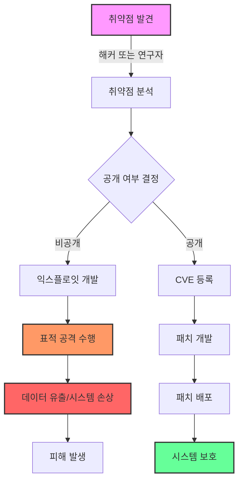

# 제로데이 취약점: 알려지지 않은 보안 위협의 실체

<!-- mtoc-start -->

- [정의 및 개념](#정의-및-개념)
- [주요 특징](#주요-특징)
- [공격 메커니즘](#공격-메커니즘)
- [활용 사례](#활용-사례)
- [기대 효과 및 필요성](#기대-효과-및-필요성)
- [마무리](#마무리)
- [Keywords](#keywords)

<!-- mtoc-end -->

기업과 조직의 디지털 인프라가 확장되면서 제로데이 취약점(Zero-day Vulnerability)에 대한 위협이 점점 커지고 있습니다. 특히 지난 한 달 동안에도 기업용 VPN이나 협업 툴에서 발견된 제로데이 취약점이 패치 전에 악용되는 사례가 증가하고 있어 보안 담당자들의 우려가 깊어지고 있습니다.

## 정의 및 개념

- 제로데이 취약점: 소프트웨어 개발사나 보안 전문가가 인지하지 못한 상태에서 발견되어 공식적인 보안 패치가 제공되기 전에 악용될 수 있는 소프트웨어, 하드웨어 또는 펌웨어의 보안 취약점.
- 특징: 알려지지 않은 취약점을 이용한 공격, 패치 배포 이전 악용 가능성, 고도의 표적 공격에 주로 활용.

## 주요 특징

- **발견 시점 기준:** 제로데이라는 명칭은 개발자에게 알려진 지 '0일'이 경과했음을 의미하며, 이는 방어 측이 대응할 시간이 없음을 의미합니다.
- **고가치 표적:** 주로 정부 기관, 주요 기업, 핵심 인프라 등 고가치 표적을 대상으로 하는 APT(Advanced Persistent Threat) 공격에 활용됩니다.
- **공격 벡터 다양성:** 웹 브라우저, 운영체제, 네트워크 장비, 응용 프로그램 등 다양한 경로를 통해 발생할 수 있습니다.
- **복합적 영향력:** 데이터 유출, 시스템 장악, 랜섬웨어 배포 등 다양한 형태의 피해를 초래할 수 있습니다.
- **높은 거래 가치:** 다크웹에서 수백만 달러에 거래되는 등 해킹 시장에서 매우 높은 가치를 지닙니다.

## 공격 메커니즘

제로데이 공격 메커니즘은 취약점 발견부터 익스플로잇 개발, 표적 공격 실행까지의 과정을 보여줍니다. 제로데이 취약점은 공식 패치가 배포되기 전에 악용되어 시스템이 방어할 시간적 여유가 없는 것이 가장 큰 위험 요소입니다.

## 활용 사례

- **Stuxnet 사례:** 이란 원자력 시설을 대상으로 한 공격에서 Windows 및 Siemens PLC 시스템의 제로데이 취약점을 활용하여 물리적 인프라를 손상시켰습니다.
- **기업용 VPN 취약점:** 최근 주요 VPN 솔루션의 제로데이 취약점이 발견되어 원격 근무 환경의 보안이 위협받고 있습니다.
- **협업 툴 표적 공격:** 팬데믹 이후 급증한 화상회의 및 협업 플랫폼의 취약점을 이용한 기업 정보 탈취 사례가 증가하고 있습니다.
- **산업제어시스템 공격:** SCADA 시스템의 제로데이 취약점을 이용한 주요 인프라 공격이 국가 지원 해킹 그룹에 의해 시도되고 있습니다.

## 기대 효과 및 필요성

- **선제적 보안 강화:** 제로데이 취약점에 대한 이해를 통해 공격 표면을 최소화하고 방어 전략을 수립할 수 있습니다.
- **대응 시간 확보:** 취약점 정보 공유 체계를 구축하여 피해 확산을 방지하고 효율적인 대응이 가능합니다.
- **보안 투자 정당화:** 실제 사례 기반의 위험 평가를 통해 조직 내 보안 예산 및 인력 투자의 필요성을 설득할 수 있습니다.
- **디지털 신뢰성 확보:** 제로데이 대응 체계 구축을 통해 고객과 파트너사에게 강화된 보안 신뢰성을 제공할 수 있습니다.
- **규제 준수:** 주요 데이터 보호 규정(GDPR, CCPA 등)의 보안 요구사항 준수에 도움이 됩니다.

## 마무리

제로데이 취약점은 현대 사이버 보안 환경에서 가장 위험한 위협 중 하나로, 알려지지 않은 취약점을 이용한다는 특성상 전통적인 보안 도구로는 방어하기 어렵습니다. 따라서 조직은 다층적 방어 전략, 행위 기반 탐지, 제로 트러스트 아키텍처 등 혁신적인 보안 접근법을 도입하여 제로데이 공격의 영향을 최소화해야 합니다. 또한 보안 커뮤니티와의 적극적인 정보 공유와 지속적인 보안 업데이트 관리가 필수적입니다.

## Keywords

Zero-day Vulnerability, Advanced Persistent Threat, 취약점 공개, 익스플로잇, 패치 관리, 제로 트러스트, 행위 기반 탐지, 악성코드 분석, 위협 인텔리전스, 사이버 공격
